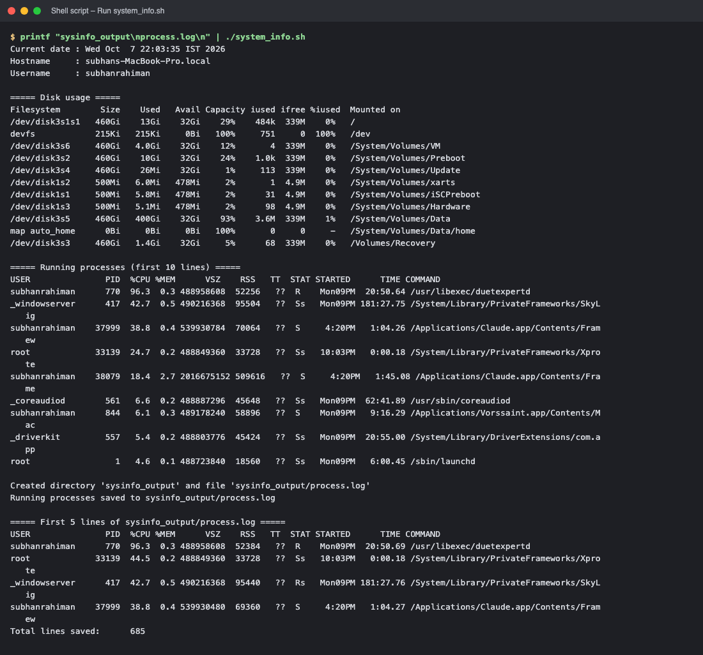
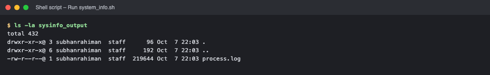

# Session 3 – Shell Scripting: System Information Script

## Task
Write a shell script that prints the date, hostname, username, disk usage and running processes; uses variables; takes input with `read -p`; creates a directory (`mkdir`) and a file (`touch`); and stores the running-process information in that file with `>` redirection.

## Commands used
| Command | Purpose in the script |
|---|---|
| `date`, `hostname`, `whoami` | Collected into variables with `$(...)` command substitution |
| `df -h` | Disk usage in human-readable form |
| `ps aux` | Running processes |
| `read -p` | Prompts the user for the directory and file name |
| `mkdir -p` | Creates the directory entered by the user |
| `touch` | Creates the (empty) file inside that directory |
| `echo` | Prints labels / messages |
| `>` | Redirects `ps aux` output into the file (overwrites) |
| Variables | `current_date`, `host_name`, `user_name`, `dir_name`, `file_name` |

## Script – [`system_info.sh`](system_info.sh)
```bash
#!/bin/bash
# System Information Script
# Prints date, hostname, user, disk usage and running processes,
# then stores the process list in a file inside a user-named directory.

current_date=$(date)
host_name=$(hostname)
user_name=$(whoami)

echo "Current date : $current_date"
echo "Hostname     : $host_name"
echo "Username     : $user_name"

echo
echo "===== Disk usage ====="
df -h

echo
echo "===== Running processes (first 10 lines) ====="
ps aux | head -n 10

echo
read -p "Enter directory name to create: " dir_name
read -p "Enter file name to create: " file_name

mkdir -p "$dir_name"
touch "$dir_name/$file_name"
echo "Created directory '$dir_name' and file '$dir_name/$file_name'"

# store running processes in the file using > redirection
ps aux > "$dir_name/$file_name"
echo "Running processes saved to $dir_name/$file_name"

echo
echo "===== First 5 lines of $dir_name/$file_name ====="
head -n 5 "$dir_name/$file_name"
echo "Total lines saved: $(wc -l < "$dir_name/$file_name")"
```

## How to run
```bash
chmod +x system_info.sh
./system_info.sh
```

## Output
(The two prompts were answered with `sysinfo_output` and `process.log`.)

```text
Current date : Wed Oct  7 22:03:35 IST 2026
Hostname     : subhans-MacBook-Pro.local
Username     : subhanrahiman

===== Disk usage =====
Filesystem        Size    Used   Avail Capacity iused ifree %iused  Mounted on
/dev/disk3s1s1   460Gi    13Gi    32Gi    29%    484k  339M    0%   /
devfs            215Ki   215Ki     0Bi   100%     751     0  100%   /dev
/dev/disk3s6     460Gi   4.0Gi    32Gi    12%       4  339M    0%   /System/Volumes/VM
/dev/disk3s2     460Gi    10Gi    32Gi    24%    1.0k  339M    0%   /System/Volumes/Preboot
/dev/disk3s4     460Gi    26Mi    32Gi     1%     113  339M    0%   /System/Volumes/Update
/dev/disk1s2     500Mi   6.0Mi   478Mi     2%       1  4.9M    0%   /System/Volumes/xarts
/dev/disk1s1     500Mi   5.8Mi   478Mi     2%      31  4.9M    0%   /System/Volumes/iSCPreboot
/dev/disk1s3     500Mi   5.1Mi   478Mi     2%      98  4.9M    0%   /System/Volumes/Hardware
/dev/disk3s5     460Gi   400Gi    32Gi    93%    3.6M  339M    1%   /System/Volumes/Data
map auto_home      0Bi     0Bi     0Bi   100%       0     0     -   /System/Volumes/Data/home
/dev/disk3s3     460Gi   1.4Gi    32Gi     5%      68  339M    0%   /Volumes/Recovery

===== Running processes (first 10 lines) =====
USER               PID  %CPU %MEM      VSZ    RSS   TT  STAT STARTED      TIME COMMAND
subhanrahiman      770  96.3  0.3 488958608  52256   ??  R    Mon09PM  20:50.64 /usr/libexec/duetexpertd
_windowserver      417  42.7  0.5 490216368  95504   ??  Ss   Mon09PM 181:27.75 /System/Library/PrivateFrameworks/SkyLight.framewo
subhanrahiman    37999  38.8  0.4 539930784  70064   ??  S     4:20PM   1:04.26 /Applications/Claude.app/Contents/Frameworks/Claud
root             33139  24.7  0.2 488849360  33728   ??  Ss   10:03PM   0:00.18 /System/Library/PrivateFrameworks/XprotectFramewor
subhanrahiman    38079  18.4  2.7 2016675152 509616   ??  S     4:20PM   1:45.08 /Applications/Claude.app/Contents/Frameworks/Clau
_coreaudiod        561   6.6  0.2 488887296  45648   ??  Ss   Mon09PM  62:41.89 /usr/sbin/coreaudiod
subhanrahiman      844   6.1  0.3 489178240  58896   ??  S    Mon09PM   9:16.29 /Applications/Vorssaint.app/Contents/MacOS/Vorssai
_driverkit         557   5.4  0.2 488803776  45424   ??  Ss   Mon09PM  20:55.00 /System/Library/DriverExtensions/com.apple.DriverK
root                 1   4.6  0.1 488723840  18560   ??  Ss   Mon09PM   6:00.45 /sbin/launchd

Created directory 'sysinfo_output' and file 'sysinfo_output/process.log'
Running processes saved to sysinfo_output/process.log

===== First 5 lines of sysinfo_output/process.log =====
USER               PID  %CPU %MEM      VSZ    RSS   TT  STAT STARTED      TIME COMMAND
subhanrahiman      770  96.3  0.3 488958608  52384   ??  R    Mon09PM  20:50.69 /usr/libexec/duetexpertd
root             33139  44.5  0.2 488849360  33728   ??  Ss   10:03PM   0:00.18 /System/Library/PrivateFrameworks/XprotectFramewor
_windowserver      417  42.7  0.5 490216368  95440   ??  Rs   Mon09PM 181:27.76 /System/Library/PrivateFrameworks/SkyLight.framewo
subhanrahiman    37999  38.8  0.4 539930480  69360   ??  S     4:20PM   1:04.27 /Applications/Claude.app/Contents/Frameworks/Claud
Total lines saved:      685
```

## Verification
```text
$ ls -la sysinfo_output
drwxr-xr-x@ 3 subhanrahiman  staff      96 Oct  7 22:03 .
drwxr-xr-x@ 6 subhanrahiman  staff     192 Oct  7 22:03 ..
-rw-r--r--@ 1 subhanrahiman  staff  219644 Oct  7 22:03 process.log
```
The file `process.log` was created by `touch` and then filled with the output of `ps aux` using `>`. It is excluded from Git (`.gitignore`) because it is a machine-specific dump of every process on the computer; the first lines are shown above.

## What I learned
* `$(command)` stores a command's output in a variable.
* `read -p "prompt" var` asks the user for input.
* `>` overwrites a file with a command's output (`>>` appends).
* `mkdir -p` avoids an error if the directory already exists.

<!-- screenshots:start -->

## Screenshots (terminal output of the live run)

> Each image shows the real output of the commands run for this task (rendered from the captured terminal output of the actual run).

### Run system_info.sh



*Commands: `printf "sysinfo_output\nprocess.log\n" | ./system_info.sh`*



*Commands: `ls -la sysinfo_output`*

<!-- screenshots:end -->
