# Session 4 – Networking Homework

**Task 1:** practice the commands and the repos shared in the devops-hero course repo (`session4-networking/resources.md`).
**Task 2:** execute the networking commands and put the output/screenshots **and a short explanation of each command** into a Markdown file (this README).

All commands were run for real on **Ubuntu 24.04** (a Docker container with systemd, on macOS/Apple Silicon) with real internet access; the screenshots at the end of each part show the live output.

## The repos from `resources.md` and what I practised from each
| # | Repo | What it teaches | What I practised (section) |
|---|---|---|---|
| 1 | [Network-Troubleshooting](https://github.com/Nency-Ravaliya/Network-Troubleshooting) | 10 commands to find why `google.com` is unreachable | **all 10 commands in the repo's order** (A1–A10) |
| 2 | [Subnetting](https://github.com/Nency-Ravaliya/Subnetting) | split `192.168.1.0/24` into 4 subnets (/26) | computed and verified every subnet with `ipcalc` (B) |
| 3 | [IP-quest](https://github.com/Nency-Ravaliya/IP-quest) | 4 subnet-mask questions | answered and verified with Python `ipaddress` (C) |
| 4 | [How-DHCP-Works](https://github.com/Nency-Ravaliya/How-DHCP-Works) + [Networking](https://github.com/Nency-Ravaliya/Networking) (step 1) | DHCP Discover → Offer → Request → ACK | **built a real DHCP server + client and captured the 4 messages** (D) |
| 5 | [OSI-Network-devices](https://github.com/Nency-Ravaliya/OSI-Network-devices) + [Networking](https://github.com/Nency-Ravaliya/Networking) (steps 2–3) | switch (MAC table, Layer 2), router (Layer 3), hops | **Linux bridge as a switch, MAC-table learning, ARP, routing/forwarding** (E) |
| 6 | [IPFIX-NETFLOW-NTP](https://github.com/Nency-Ravaliya/IPFIX-NETFLOW-NTP) | flows, NetFlow/IPFIX, NTP time sync | **active flows (5-tuple + counters) and an NTP query** (F) |

Class notes (`ip.md`): IP classes A `1–126`, B `128–191`, C `192–223`, D `224–239`; private ranges `10/8`, `172.16/12`, `192.168/16`; `/8` = 8 network + 24 host bits → 2²⁴−2 usable hosts. These are used in B and C below.

---
# A. Network-Troubleshooting – the 10 commands (diagnosing connectivity to google.com)
Method from the repo: run the commands **in sequence** to find *where* the problem is. Everything worked here, so each result is the "healthy" reference.

| # | Command | Purpose (from the repo) | What I understood / observed |
|---|---|---|---|
| 1 | `ping google.com` | reachability + latency | 4/4 replies, 0 % loss, avg 57 ms, `ttl=63` → the network path to Google works. No reply would mean no route/firewall/DNS problem. |
| 2 | `traceroute google.com` | the route (hops) and where delays/failures happen | hop 1 = `172.17.0.1` (my default gateway/router). `* * *` after it = those routers do not answer probes (common behind NAT/Docker); it does **not** mean the connection is broken since ping/curl work. |
| 3 | `netstat -tuln` | local listening ports/services | `:80` (nginx) and `:53` (local DNS resolver) are listening; shows nothing unexpected blocks the ports. |
| 4 | `telnet google.com 80` | can I open a TCP connection to a port? | `Connected to google.com.` → port 80 reachable (a failure here = firewall/port blocked). |
| 5 | `tcpdump -i eth0 host google.com` | see the packets on the wire | shows the TCP handshake `[S]`, `[S.]`, `[.]` (SYN, SYN-ACK, ACK), then data `[P.]` and close `[F.]` between `172.17.0.2` and Google. |
| 6 | `nslookup google.com` | does DNS resolve the name? | DNS server `192.168.65.7` answered with 6 A records (Google's IPs). |
| 7 | `dig google.com` | detailed DNS info | `ANSWER SECTION` with the A records, TTL (108 s) and `Query time: 4 msec`. |
| 8 | `curl -I https://www.google.com` | HTTP(S) connectivity | `HTTP/2 200` + headers → the web layer works end to end. |
| 9 | `arp -a` | IP → MAC mapping of neighbours | gateway `172.17.0.1` at MAC `82:c9:8d:6b:1e:53` (learned after pinging it). |
| 10 | `systemctl status NetworkManager` | is the network service running? | `Unit NetworkManager.service could not be found` – this server image has no NetworkManager (it uses systemd-networkd/resolved), so I also checked `systemd-resolved` → `active (running)`. |

**Troubleshooting order:** ping (path) → traceroute (where) → netstat (local ports) → telnet (remote port) → tcpdump (packets) → nslookup/dig (DNS) → curl (HTTP) → arp (L2) → systemctl (services).

```text
$ ping -c 4 google.com
PING google.com (142.250.146.139) 56(84) bytes of data.
64 bytes from pu-in-f139.1e100.net (142.250.146.139): icmp_seq=1 ttl=63 time=30.1 ms
64 bytes from pu-in-f139.1e100.net (142.250.146.139): icmp_seq=2 ttl=63 time=52.3 ms
64 bytes from pu-in-f139.1e100.net (142.250.146.139): icmp_seq=3 ttl=63 time=82.1 ms
64 bytes from pu-in-f139.1e100.net (142.250.146.139): icmp_seq=4 ttl=63 time=63.9 ms

--- google.com ping statistics ---
4 packets transmitted, 4 received, 0% packet loss, time 3280ms
rtt min/avg/max/mdev = 30.080/57.111/82.123/18.878 ms

$ traceroute -m 8 google.com
traceroute to google.com (142.250.146.139), 8 hops max, 60 byte packets
 1  172.17.0.1 (172.17.0.1)  0.046 ms  0.006 ms  0.003 ms
 2  * * *
 3  * * *
 4  * * *
 5  * * *
 6  * * *
 7  * * *
 8  * * *

$ netstat -tuln
Active Internet connections (only servers)
Proto Recv-Q Send-Q Local Address           Foreign Address         State      
tcp        0      0 127.0.0.54:53           0.0.0.0:*               LISTEN     
tcp        0      0 0.0.0.0:80              0.0.0.0:*               LISTEN     
tcp        0      0 127.0.0.53:53           0.0.0.0:*               LISTEN     
tcp6       0      0 :::80                   :::*                    LISTEN     
udp        0      0 127.0.0.54:53           0.0.0.0:*                          
udp        0      0 127.0.0.53:53           0.0.0.0:*

$ (sleep 2; echo quit) | telnet google.com 80
Trying 142.250.146.139...
Connected to google.com.
Escape character is '^]'.
Connection closed by foreign host.

$ timeout 12 tcpdump -i eth0 -n -c 12 host google.com 2>&1 & sleep 2; curl -s -o /dev/null http://google.com; wait
tcpdump: verbose output suppressed, use -v[v]... for full protocol decode
listening on eth0, link-type EN10MB (Ethernet), snapshot length 262144 bytes
20:18:38.856258 IP 142.250.146.139.80 > 172.17.0.2.36610: Flags [P.], seq 3606706043:3606707755, ack 3968858246, win 4096, options [nop,nop,TS val 1610538085 ecr 2521346973], length 1712: HTTP: HTTP/1.0 400 Bad Request
20:18:38.856263 IP 172.17.0.2.36610 > 142.250.146.139.80: Flags [R], seq 3968858246, win 0, length 0
20:18:38.856267 IP 142.250.146.139.80 > 172.17.0.2.36610: Flags [F.], seq 1712, ack 1, win 4096, options [nop,nop,TS val 1610538085 ecr 2521346973], length 0
20:18:38.856268 IP 172.17.0.2.36610 > 142.250.146.139.80: Flags [R], seq 3968858246, win 0, length 0
20:18:40.846283 IP 172.17.0.2.36624 > 142.250.146.139.80: Flags [S], seq 2038708780, win 65495, options [mss 65495,sackOK,TS val 2521349018 ecr 0,nop,wscale 7], length 0
20:18:40.935693 IP 142.250.146.139.80 > 172.17.0.2.36624: Flags [S.], seq 3497842520, ack 2038708781, win 65408, options [mss 65495,sackOK,TS val 1610540164 ecr 2521349018,nop,wscale 7], length 0
20:18:40.935749 IP 172.17.0.2.36624 > 142.250.146.139.80: Flags [.], ack 1, win 512, options [nop,nop,TS val 2521349108 ecr 1610540164], length 0
20:18:40.935909 IP 172.17.0.2.36624 > 142.250.146.139.80: Flags [P.], seq 1:74, ack 1, win 512, options [nop,nop,TS val 2521349108 ecr 1610540164], length 73: HTTP: GET / HTTP/1.1
20:18:40.936190 IP 142.250.146.139.80 > 172.17.0.2.36624: Flags [.], ack 74, win 510, options [nop,nop,TS val 1610540164 ecr 2521349108], length 0
20:18:41.031610 IP 142.250.146.139.80 > 172.17.0.2.36624: Flags [P.], seq 1:774, ack 74, win 4096, options [nop,nop,TS val 1610540260 ecr 2521349108], length 773: HTTP: HTTP/1.1 301 Moved Permanently
20:18:41.031668 IP 172.17.0.2.36624 > 142.250.146.139.80: Flags [.], ack 774, win 506, options [nop,nop,TS val 2521349204 ecr 1610540260], length 0
20:18:41.032105 IP 172.17.0.2.36624 > 142.250.146.139.80: Flags [F.], seq 74, ack 774, win 506, options [nop,nop,TS val 2521349204 ecr 1610540260], length 0
12 packets captured
19 packets received by filter
0 packets dropped by kernel

$ nslookup google.com
Server:		192.168.65.7
Address:	192.168.65.7#53

Non-authoritative answer:
Name:	google.com
Address: 142.250.146.139
Name:	google.com
Address: 142.250.146.100
Name:	google.com
Address: 142.250.146.113
Name:	google.com
Address: 142.250.146.102
Name:	google.com
Address: 142.250.146.101
Name:	google.com
Address: 142.250.146.138

$ dig google.com | sed -n "/QUESTION SECTION/,/Query time/p"
;; QUESTION SECTION:
;google.com.			IN	A

;; ANSWER SECTION:
google.com.		108	IN	A	142.250.146.139
google.com.		108	IN	A	142.250.146.100
google.com.		108	IN	A	142.250.146.113
google.com.		108	IN	A	142.250.146.102
google.com.		108	IN	A	142.250.146.101
google.com.		108	IN	A	142.250.146.138

;; Query time: 4 msec

$ curl -sI https://www.google.com        # (-s hides the progress meter; same as the repo's curl -I)
HTTP/2 200 
content-type: text/html; charset=ISO-8859-1
content-security-policy-report-only: object-src 'none';base-uri 'self';script-src 'nonce-QSa42jCTEXzMxC-s5O3l6g' 'strict
accept-ch: Sec-CH-Prefers-Color-Scheme
p3p: CP="This is not a P3P policy! See g.co/p3phelp for more info."
date: Wed, 07 Oct 2026 20:27:17 GMT

$ ping -c 1 -W 2 172.17.0.1 >/dev/null; arp -a
? (172.17.0.1) at 82:c9:8d:6b:1e:53 [ether] on eth0

$ systemctl status NetworkManager --no-pager | head -n 3
Unit NetworkManager.service could not be found.

$ systemctl status systemd-resolved --no-pager | head -n 4
● systemd-resolved.service - Network Name Resolution
     Loaded: loaded (/usr/lib/systemd/system/systemd-resolved.service; enabled; preset: enabled)
     Active: active (running) since Wed 2026-10-07 16:35:09 UTC; 3h 43min ago
       Docs: man:systemd-resolved.service(8)
```

---
# B. Subnetting repo – `192.168.1.0/24` into 4 subnets
Steps from the repo: 4 subnets → borrow 2 bits (2² = 4) → new mask `/26` (255.255.255.192) → 2⁶ = 64 addresses per subnet → 62 usable (minus network and broadcast). Verified with `ipcalc`:

| Subnet | Network | Usable range | Broadcast |
|---|---|---|---|
| 1 | 192.168.1.0/26 | .1 – .62 | .63 |
| 2 | 192.168.1.64/26 | .65 – .126 | .127 |
| 3 | 192.168.1.128/26 | .129 – .190 | .191 |
| 4 | 192.168.1.192/26 | .193 – .254 | .255 |

```text
$ ipcalc 192.168.1.0/24 --split 62 62 62 62 2>/dev/null | head -n 40 || true
Address:   192.168.1.0          11000000.10101000.00000001. 00000000
Netmask:   255.255.255.0 = 24   11111111.11111111.11111111. 00000000
Wildcard:  0.0.0.255            00000000.00000000.00000000. 11111111
=>
Network:   192.168.1.0/24       11000000.10101000.00000001. 00000000
HostMin:   192.168.1.1          11000000.10101000.00000001. 00000001
HostMax:   192.168.1.254        11000000.10101000.00000001. 11111110
Broadcast: 192.168.1.255        11000000.10101000.00000001. 11111111
Hosts/Net: 254                   Class C, Private Internet

1. Requested size: 62 hosts
Netmask:   255.255.255.192 = 26 11111111.11111111.11111111.11 000000
Network:   192.168.1.0/26       11000000.10101000.00000001.00 000000
HostMin:   192.168.1.1          11000000.10101000.00000001.00 000001
HostMax:   192.168.1.62         11000000.10101000.00000001.00 111110
Broadcast: 192.168.1.63         11000000.10101000.00000001.00 111111
Hosts/Net: 62                    Class C, Private Internet

2. Requested size: 62 hosts
Netmask:   255.255.255.192 = 26 11111111.11111111.11111111.11 000000
Network:   192.168.1.64/26      11000000.10101000.00000001.01 000000
HostMin:   192.168.1.65         11000000.10101000.00000001.01 000001
HostMax:   192.168.1.126        11000000.10101000.00000001.01 111110
Broadcast: 192.168.1.127        11000000.10101000.00000001.01 111111
Hosts/Net: 62                    Class C, Private Internet

3. Requested size: 62 hosts
Netmask:   255.255.255.192 = 26 11111111.11111111.11111111.11 000000
Network:   192.168.1.128/26     11000000.10101000.00000001.10 000000
HostMin:   192.168.1.129        11000000.10101000.00000001.10 000001
HostMax:   192.168.1.190        11000000.10101000.00000001.10 111110
Broadcast: 192.168.1.191        11000000.10101000.00000001.10 111111
Hosts/Net: 62                    Class C, Private Internet

4. Requested size: 62 hosts
Netmask:   255.255.255.192 = 26 11111111.11111111.11111111.11 000000
Network:   192.168.1.192/26     11000000.10101000.00000001.11 000000
HostMin:   192.168.1.193        11000000.10101000.00000001.11 000001
HostMax:   192.168.1.254        11000000.10101000.00000001.11 111110
Broadcast: 192.168.1.255        11000000.10101000.00000001.11 111111

$ for n in 0 64 128 192; do ipcalc 192.168.1.$n/26 | grep -E "^(Address|Netmask|Broadcast|HostMin|HostMax|Hosts)"; echo; done
Address:   192.168.1.0          11000000.10101000.00000001.00 000000
Netmask:   255.255.255.192 = 26 11111111.11111111.11111111.11 000000
HostMin:   192.168.1.1          11000000.10101000.00000001.00 000001
HostMax:   192.168.1.62         11000000.10101000.00000001.00 111110
Broadcast: 192.168.1.63         11000000.10101000.00000001.00 111111
Hosts/Net: 62                    Class C, Private Internet

Address:   192.168.1.64         11000000.10101000.00000001.01 000000
Netmask:   255.255.255.192 = 26 11111111.11111111.11111111.11 000000
HostMin:   192.168.1.65         11000000.10101000.00000001.01 000001
HostMax:   192.168.1.126        11000000.10101000.00000001.01 111110
Broadcast: 192.168.1.127        11000000.10101000.00000001.01 111111
Hosts/Net: 62                    Class C, Private Internet

Address:   192.168.1.128        11000000.10101000.00000001.10 000000
Netmask:   255.255.255.192 = 26 11111111.11111111.11111111.11 000000
HostMin:   192.168.1.129        11000000.10101000.00000001.10 000001
HostMax:   192.168.1.190        11000000.10101000.00000001.10 111110
Broadcast: 192.168.1.191        11000000.10101000.00000001.10 111111
Hosts/Net: 62                    Class C, Private Internet

Address:   192.168.1.192        11000000.10101000.00000001.11 000000
Netmask:   255.255.255.192 = 26 11111111.11111111.11111111.11 000000
HostMin:   192.168.1.193        11000000.10101000.00000001.11 000001
HostMax:   192.168.1.254        11000000.10101000.00000001.11 111110
Broadcast: 192.168.1.255        11000000.10101000.00000001.11 111111
Hosts/Net: 62                    Class C, Private Internet
```

# C. IP-quest – the 4 questions
| Q | Question | Answer (matches the repo) | How |
|---|---|---|---|
| 1 | highest host address in `192.168.0.0/24` | **192.168.0.254** | `.255` is the broadcast |
| 2 | host bits in mask `255.255.252.0` | **10** | 22 network bits → 32 − 22 |
| 3 | total host addresses with `255.255.248.0` | **2048** (2046 usable) | 21 network bits → 2¹¹ |
| 4 | usable IPs in a `/21` | **2046** | 2¹¹ − 2 |

```text
$ python3 - <<PY
import ipaddress as ip
n=ip.ip_network("192.168.0.0/24"); print("Q1 highest host address in 192.168.0.0/24 :", list(n.hosts())[-1])
m=ip.ip_network("0.0.0.0/255.255.252.0"); print("Q2 host bits in mask 255.255.252.0       :", 32-m.prefixlen, "(prefix /%d)"%m.prefixlen)
m=ip.ip_network("0.0.0.0/255.255.248.0"); print("Q3 total addresses with mask 255.255.248.0:", m.num_addresses, "(usable", m.num_addresses-2, ")")
m=ip.ip_network("0.0.0.0/21"); print("Q4 usable IPs in a /21                    :", m.num_addresses-2)
PY
Q1 highest host address in 192.168.0.0/24 : 192.168.0.254
Q2 host bits in mask 255.255.252.0       : 10 (prefix /22)
Q3 total addresses with mask 255.255.248.0: 2048 (usable 2046 )
Q4 usable IPs in a /21                    : 2046
```

---
# D. DHCP – How-DHCP-Works / Networking (step 1)
A *laptop* (client) and a *router* (DHCP server) were built as two network namespaces connected by a virtual cable; the server is `dnsmasq` (pool 192.168.50.50–100, gateway 192.168.50.1, DNS 8.8.8.8), the client runs `dhclient -v`, and `tcpdump` captured the exchange.

| Step | Message | Sent by → to | What it carries (seen in the capture) |
|---|---|---|---|
| 1 | **DHCP Discover** | client `0.0.0.0:68` → broadcast `255.255.255.255:67` | "I need an IP"; parameter request list (mask, gateway, DNS…) |
| 2 | **DHCP Offer** | server `192.168.50.1` → client | proposed `Your-IP 192.168.50.97`, mask `255.255.255.0`, lease time 43200 s, DNS `8.8.8.8` |
| 3 | **DHCP Request** | client → broadcast | "I accept 192.168.50.97 from Server-ID 192.168.50.1" |
| 4 | **DHCP ACK** | server → client | confirmation + lease parameters |

Result: the client had **no IPv4 address** before and **`192.168.50.97/24`**, default route via `192.168.50.1` after; the server stored the lease (MAC ↔ IP). The capture also shows the first Discover **retransmitted after 3 s** (dhclient retries until the server answers), hence a second Discover/Offer pair – normal DHCP behaviour. `bad udp cksum` warnings are only a virtual-network-card checksum-offload artefact of capturing on a veth. The transaction ID (`xid`) ties the messages together; the first and third are broadcasts because the client has no IP yet (as the repo explains).

```text
$ ip netns add dhcp-server; ip netns add dhcp-client; ip link add veth-s type veth peer name veth-c; ip link set veth-s netns dhcp-server; ip link set veth-c netns dhcp-client
ip -n dhcp-server addr add 192.168.50.1/24 dev veth-s; ip -n dhcp-server link set veth-s up; ip -n dhcp-client link set veth-c up
ip netns list; echo "--- client before DHCP (no IPv4 address):"; ip -n dhcp-client -4 addr show veth-c | grep -c inet
dhcp-client (id: 2)
dhcp-server (id: 1)
--- client before DHCP (no IPv4 address):
0

$ ip netns exec dhcp-server dnsmasq --interface=veth-s --bind-interfaces --port=0 --dhcp-range=192.168.50.50,192.168.50.100,255.255.255.0,12h --dhcp-option=option:router,192.168.50.1 --dhcp-option=option:dns-server,8.8.8.8 --dhcp-leasefile=/tmp/leases --log-dhcp --log-facility=/tmp/dnsmasq.log; sleep 1; echo "DHCP server (dnsmasq) started: pool 192.168.50.50-100, router 192.168.50.1, DNS 8.8.8.8"
DHCP server (dnsmasq) started: pool 192.168.50.50-100, router 192.168.50.1, DNS 8.8.8.8

$ rm -f /tmp/dhclient.leases; ip netns exec dhcp-client timeout 25 dhclient -v -1 -lf /tmp/dhclient.leases -pf /tmp/dhclient.pid veth-c 2>&1 | grep -E "DHCP|bound|Listening|Sending|reading"
Internet Systems Consortium DHCP Client 4.4.3-P1
Listening on LPF/veth-c/ae:48:c8:45:1c:fb
Sending on   LPF/veth-c/ae:48:c8:45:1c:fb
Sending on   Socket/fallback
DHCPDISCOVER on veth-c to 255.255.255.255 port 67 interval 3 (xid=0xb19c4234)
DHCPDISCOVER on veth-c to 255.255.255.255 port 67 interval 6 (xid=0xb19c4234)
DHCPOFFER of 192.168.50.97 from 192.168.50.1
DHCPREQUEST for 192.168.50.97 on veth-c to 255.255.255.255 port 67 (xid=0x34429cb1)
DHCPACK of 192.168.50.97 from 192.168.50.1 (xid=0xb19c4234)
bound to 192.168.50.97 -- renewal in 18069 seconds.

$ echo "--- client AFTER DHCP:"; ip -n dhcp-client -4 addr show veth-c | grep -E "inet |veth"; ip -n dhcp-client route; ip netns exec dhcp-client cat /etc/resolv.conf 2>/dev/null | grep nameserver; echo "(DNS from the DHCP server is delivered in the DHCP ACK; dhclient hands it to resolvconf)"
--- client AFTER DHCP:
54: veth-c@if55: <BROADCAST,MULTICAST,UP,LOWER_UP> mtu 1500 qdisc noqueue state UP group default qlen 1000 link-netns dhcp-server
    inet 192.168.50.97/24 brd 192.168.50.255 scope global dynamic veth-c
default via 192.168.50.1 dev veth-c 
192.168.50.0/24 dev veth-c proto kernel scope link src 192.168.50.97 
nameserver 192.168.65.7
(DNS from the DHCP server is delivered in the DHCP ACK; dhclient hands it to resolvconf)

$ echo "--- the four DHCP messages captured on the wire (DORA):"; grep -E "DHCP-Message|Discover|Offer|Request|ACK|BOOTP|Your-IP|Client-IP|Server-ID|Subnet-Mask|Router|Domain-Name-Server|Lease-Time" /tmp/dhcp_capture.txt | sed -E "s/^[0-9:.]+ //" | cut -c1-150 | head -n 40
--- the four DHCP messages captured on the wire (DORA):
    0.0.0.0.68 > 255.255.255.255.67: [udp sum ok] BOOTP/DHCP, Request from ae:48:c8:45:1c:fb, length 300, xid 0xb19c4234, Flags [none] (0x0000)
	    DHCP-Message (53), length 1: Discover
	    Parameter-Request (55), length 13: 
	      Subnet-Mask (1), BR (28), Time-Zone (2), Default-Gateway (3)
	      Domain-Name (15), Domain-Name-Server (6), Unknown (119), Hostname (12)
    0.0.0.0.68 > 255.255.255.255.67: [udp sum ok] BOOTP/DHCP, Request from ae:48:c8:45:1c:fb, length 300, xid 0xb19c4234, secs 3, Flags [none] (0x0000
	    DHCP-Message (53), length 1: Discover
	    Parameter-Request (55), length 13: 
	      Subnet-Mask (1), BR (28), Time-Zone (2), Default-Gateway (3)
	      Domain-Name (15), Domain-Name-Server (6), Unknown (119), Hostname (12)
    192.168.50.1.67 > 192.168.50.97.68: [bad udp cksum 0xe6f8 -> 0xbbd9!] BOOTP/DHCP, Reply, length 300, xid 0xb19c4234, Flags [none] (0x0000)
	  Your-IP 192.168.50.97
	    DHCP-Message (53), length 1: Offer
	    Server-ID (54), length 4: 192.168.50.1
	    Lease-Time (51), length 4: 43200
	    Subnet-Mask (1), length 4: 255.255.255.0
	    Domain-Name-Server (6), length 4: 8.8.8.8
    0.0.0.0.68 > 255.255.255.255.67: [udp sum ok] BOOTP/DHCP, Request from ae:48:c8:45:1c:fb, length 300, xid 0xb19c4234, secs 3, Flags [none] (0x0000
	    DHCP-Message (53), length 1: Request
	    Server-ID (54), length 4: 192.168.50.1
	    Requested-IP (50), length 4: 192.168.50.97
	    Parameter-Request (55), length 13: 
	      Subnet-Mask (1), BR (28), Time-Zone (2), Default-Gateway (3)
	      Domain-Name (15), Domain-Name-Server (6), Unknown (119), Hostname (12)
    192.168.50.1.67 > 192.168.50.97.68: [bad udp cksum 0xe6f8 -> 0xbbd6!] BOOTP/DHCP, Reply, length 300, xid 0xb19c4234, secs 3, Flags [none] (0x0000)
	  Your-IP 192.168.50.97
	    DHCP-Message (53), length 1: Offer
	    Server-ID (54), length 4: 192.168.50.1
	    Lease-Time (51), length 4: 43200
	    Subnet-Mask (1), length 4: 255.255.255.0
	    Domain-Name-Server (6), length 4: 8.8.8.8
    192.168.50.1.67 > 192.168.50.97.68: [bad udp cksum 0xe6fe -> 0x15f5!] BOOTP/DHCP, Reply, length 306, xid 0xb19c4234, secs 3, Flags [none] (0x0000)
	  Your-IP 192.168.50.97
	    DHCP-Message (53), length 1: ACK
	    Server-ID (54), length 4: 192.168.50.1
	    Lease-Time (51), length 4: 43200
	    Subnet-Mask (1), length 4: 255.255.255.0
	    Domain-Name-Server (6), length 4: 8.8.8.8

$ echo "--- lease stored by the DHCP server:"; cat /tmp/leases; echo "--- server log:"; grep -E "DHCP(DISCOVER|OFFER|REQUEST|ACK)" /tmp/dnsmasq.log | sed -E "s/^[A-Za-z]+ +[0-9]+ [0-9:]+ //"
--- lease stored by the DHCP server:
1791448131 ae:48:c8:45:1c:fb 192.168.50.97 d8030a91edf4 *
--- server log:
dnsmasq-dhcp[2629]: 2979807796 DHCPDISCOVER(veth-s) ae:48:c8:45:1c:fb 
dnsmasq-dhcp[2629]: 2979807796 DHCPOFFER(veth-s) 192.168.50.97 ae:48:c8:45:1c:fb 
dnsmasq-dhcp[2629]: 2979807796 DHCPDISCOVER(veth-s) ae:48:c8:45:1c:fb 
dnsmasq-dhcp[2629]: 2979807796 DHCPOFFER(veth-s) 192.168.50.97 ae:48:c8:45:1c:fb 
dnsmasq-dhcp[2629]: 2979807796 DHCPREQUEST(veth-s) 192.168.50.97 ae:48:c8:45:1c:fb 
dnsmasq-dhcp[2629]: 2979807796 DHCPACK(veth-s) 192.168.50.97 ae:48:c8:45:1c:fb d8030a91edf4
```

# E. Switch and router – OSI-Network-devices / Networking (steps 2–3)
* **Switch (Layer 2)** – a Linux bridge `br0` with two ports. Before any traffic its MAC table was empty; after `h1` pinged `h2` the switch **learned which MAC address is behind which port** and then forwards frames only to that port.
* **ARP** – before sending to `10.99.0.2`, h1 asked "who has this IP?" and stored `10.99.0.2 → 82:77:fb:be:37:0f` (IP ↔ MAC).
* **Router (Layer 3)** – forwards packets between networks using the routing table; here the default route `via 172.17.0.1` is the first hop (the router) for everything outside the local network, which is the first hop seen by `traceroute` in A2.

```text
$ ip link add br0 type bridge; ip link set br0 up
for h in h1 h2; do ip netns add $h; ip link add v-$h type veth peer name p-$h; ip link set v-$h netns $h; ip link set p-$h master br0; ip link set p-$h up; ip -n $h link set v-$h up; ip -n $h link set lo up; done
ip -n h1 addr add 10.99.0.1/24 dev v-h1; ip -n h2 addr add 10.99.0.2/24 dev v-h2
echo "--- bridge ports (the switch ports):"; bridge link | grep br0
--- bridge ports (the switch ports):
57: p-h1@if58: <BROADCAST,MULTICAST,UP,LOWER_UP> mtu 1500 master br0 state forwarding priority 32 cost 2 
59: p-h2@if60: <BROADCAST,MULTICAST,UP,LOWER_UP> mtu 1500 master br0 state forwarding priority 32 cost 2 

$ echo "--- remove the MAC addresses the switch already learned from IPv6 start-up traffic:"; for m in $(bridge fdb show br br0 | grep -E "dev p-h[12] master" | grep -v permanent | awk "{print \$1\" \"\$3}" | tr " " ","); do mac=${m%%,*}; dev=${m##*,}; bridge fdb del $mac dev $dev master 2>/dev/null; done; echo "--- MAC table BEFORE traffic (learned entries only):"; bridge fdb show br br0 | grep -E "dev p-h[12] master" | grep -v permanent || echo "(empty - the switch does not know any host yet)"
--- remove the MAC addresses the switch already learned from IPv6 start-up traffic:
--- MAC table BEFORE traffic (learned entries only):
(empty - the switch does not know any host yet)

$ ip netns exec h1 ping -c 2 10.99.0.2 | grep -E "bytes from|transmitted"; echo "--- ARP table of h1 (IP -> MAC of h2):"; ip -n h1 neigh show | grep 10.99.0.2; echo "--- MAC table AFTER the ping (the switch learned which MAC is behind which port):"; bridge fdb show br br0 | grep -E "dev p-h[12] master" | grep -v permanent; echo "--- MACs of the hosts (compare):"; ip -n h1 link show v-h1 | grep link/ether | awk "{print \"h1 \"\$2}"; ip -n h2 link show v-h2 | grep link/ether | awk "{print \"h2 \"\$2}"
64 bytes from 10.99.0.2: icmp_seq=1 ttl=64 time=0.070 ms
64 bytes from 10.99.0.2: icmp_seq=2 ttl=64 time=0.126 ms
2 packets transmitted, 2 received, 0% packet loss, time 1033ms
--- ARP table of h1 (IP -> MAC of h2):
10.99.0.2 dev v-h1 lladdr 82:77:fb:be:37:0f REACHABLE 
--- MAC table AFTER the ping (the switch learned which MAC is behind which port):
92:6e:7d:77:8e:4c dev p-h1 master br0 
82:77:fb:be:37:0f dev p-h2 master br0 
--- MACs of the hosts (compare):
h1 92:6e:7d:77:8e:4c
h2 82:77:fb:be:37:0f

$ echo "--- Router role (Layer 3): forwarding between two networks"; sysctl net.ipv4.ip_forward; ip route; echo "--- the first hop of the path to the internet is this container's default gateway (the router):"; ip route | grep default
--- Router role (Layer 3): forwarding between two networks
net.ipv4.ip_forward = 1
default via 172.17.0.1 dev eth0 
172.17.0.0/16 dev eth0 proto kernel scope link src 172.17.0.2 
--- the first hop of the path to the internet is this container's default gateway (the router):
default via 172.17.0.1 dev eth0
```

# F. IPFIX / NetFlow / NTP – IPFIX-NETFLOW-NTP
* A **flow** = packets sharing the same 5-tuple (source IP, destination IP, source port, destination port, protocol). A NetFlow/IPFIX exporter on a router/switch counts bytes/packets per flow and sends the records to a collector. The commands below show live flows and their counters (what an exporter would record).
* **NTP** keeps clocks accurate so that flow records and logs from different devices can be correlated. `ntpdate -q` queried `pool.ntp.org` and reported this machine's offset from real time (a few milliseconds – the container clock follows the host).

```text
$ (curl -s -o /dev/null --max-time 8 --limit-rate 20k http://speedtest.tele2.net/10MB.zip &) ; sleep 3; echo "--- an active flow = the raw material of NetFlow/IPFIX (5-tuple: src ip, dst ip, src port, dst port, protocol=TCP):"; ss -tn state established | grep -v Recv-Q
--- an active flow = the raw material of NetFlow/IPFIX (5-tuple: src ip, dst ip, src port, dst port, protocol=TCP):
98736  0         172.17.0.2:51032 90.130.70.73:80         

$ echo "--- per-flow records (protocol, src ip:port -> dst ip:port, rtt, bytes sent) - what a NetFlow/IPFIX exporter sends to a collector:"; (curl -s -o /dev/null --max-time 6 --limit-rate 20k http://speedtest.tele2.net/10MB.zip &); sleep 3; /tmp/flows.sh
--- per-flow records (protocol, src ip:port -> dst ip:port, rtt, bytes sent) - what a NetFlow/IPFIX exporter sends to a collector:
TCP  172.17.0.2:51036 -> 90.130.70.73:80   rtt:146.058/86.033  bytes_sent:90
TCP  172.17.0.2:51032 -> 90.130.70.73:80   rtt:145.899/85.913  bytes_sent:90

$ echo "--- NTP: query a time server (offset = how wrong this clock is):"; ntpdate -q pool.ntp.org 2>&1 | tail -n 4; echo "--- local clock:"; date -u; timedatectl 2>/dev/null | grep -E "Local time|synchronized|NTP service" || true
--- NTP: query a time server (offset = how wrong this clock is):
2026-10-07 20:29:00.735198 (+0000) +0.036461 +/- 0.059679 pool.ntp.org 172.235.18.237 s2 no-leap
--- local clock:
Wed Oct  7 20:29:00 UTC 2026
               Local time: Wed 2026-10-07 20:29:00 UTC
System clock synchronized: no
              NTP service: inactive
```

---
# Appendix – additional general commands I also ran
These earlier results (my own set of commands) are kept for completeness: `hostname -I`, `ip addr`, `ip route`, `ip neigh`, `resolv.conf`, `ping`, `traceroute`, `nslookup`, `dig`, `curl`, `ss`, `nc -zv` (port check), `whois`, `ip -s link`, `getent hosts`. The public IP is redacted.

```text
$ hostname; hostname -I
d8030a91edf4
172.17.0.2 

$ ip addr show eth0
11: eth0@if21: <BROADCAST,MULTICAST,UP,LOWER_UP> mtu 65535 qdisc noqueue state UP group default 
    link/ether ca:0f:e7:62:d2:52 brd ff:ff:ff:ff:ff:ff link-netnsid 0
    inet 172.17.0.2/16 brd 172.17.255.255 scope global eth0
       valid_lft forever preferred_lft forever

$ ip route
default via 172.17.0.1 dev eth0 
172.17.0.0/16 dev eth0 proto kernel scope link src 172.17.0.2 

$ ip neigh
172.17.0.1 dev eth0 lladdr 82:c9:8d:6b:1e:53 REACHABLE 

$ cat /etc/resolv.conf | grep -v "^#"

nameserver 192.168.65.7


$ ping -c 4 8.8.8.8
PING 8.8.8.8 (8.8.8.8) 56(84) bytes of data.
64 bytes from 8.8.8.8: icmp_seq=1 ttl=63 time=13.4 ms
64 bytes from 8.8.8.8: icmp_seq=2 ttl=63 time=12.7 ms
64 bytes from 8.8.8.8: icmp_seq=3 ttl=63 time=46.5 ms
64 bytes from 8.8.8.8: icmp_seq=4 ttl=63 time=12.1 ms

--- 8.8.8.8 ping statistics ---
4 packets transmitted, 4 received, 0% packet loss, time 3021ms
rtt min/avg/max/mdev = 12.126/21.176/46.482/14.617 ms

$ ping -c 3 google.com
PING google.com (192.178.174.138) 56(84) bytes of data.
64 bytes from 192.178.174.138: icmp_seq=1 ttl=63 time=29.5 ms
64 bytes from 192.178.174.138: icmp_seq=2 ttl=63 time=31.3 ms
64 bytes from 192.178.174.138: icmp_seq=3 ttl=63 time=28.3 ms

--- google.com ping statistics ---
3 packets transmitted, 3 received, 0% packet loss, time 11058ms
rtt min/avg/max/mdev = 28.317/29.691/31.281/1.219 ms

$ traceroute -n -m 6 8.8.8.8
traceroute to 8.8.8.8 (8.8.8.8), 6 hops max, 60 byte packets
 1  172.17.0.1  0.159 ms  0.019 ms  0.020 ms
 2  * * *
 3  * * *
 4  * * *
 5  * * *
 6  * * *

$ nslookup google.com
Server:		192.168.65.7
Address:	192.168.65.7#53

Non-authoritative answer:
Name:	google.com
Address: 192.178.174.138
Name:	google.com
Address: 192.178.174.100
Name:	google.com
Address: 192.178.174.139
Name:	google.com
Address: 192.178.174.102
Name:	google.com
Address: 192.178.174.113
Name:	google.com
Address: 192.178.174.101


$ dig +short google.com A; dig +short MX gmail.com | head -n 2
192.178.174.138
192.178.174.100
192.178.174.139
192.178.174.102
192.178.174.113
192.178.174.101
10 alt1.gmail-smtp-in.l.google.com.
20 alt2.gmail-smtp-in.l.google.com.

$ dig github.com +noall +answer +stats | head -n 6
github.com.		47	IN	A	20.207.73.82
;; Query time: 5 msec
;; SERVER: 192.168.65.7#53(192.168.65.7) (UDP)
;; WHEN: Wed Oct 07 16:37:49 UTC 2026
;; MSG SIZE  rcvd: 54


$ curl -sI https://www.google.com | head -n 5
HTTP/2 200 
content-type: text/html; charset=ISO-8859-1
content-security-policy-report-only: object-src 'none';base-uri 'self';script-src 'nonce-xxxx' 'strict-dynamic' 'report-sample' 'unsafe-eval' 'unsafe-
accept-ch: Sec-CH-Prefers-Color-Scheme
p3p: CP="This is not a P3P policy! See g.co/p3phelp for more info."

$ curl -s -o /dev/null -w "HTTP %{http_code}, time %{time_total}s\n" https://github.com
HTTP 200, time 0.396237s

$ curl -s https://ifconfig.me; echo
<your-public-ip-redacted>

$ ss -tuln | head -n 6
Netid State  Recv-Q Send-Q Local Address:Port Peer Address:PortProcess
udp   UNCONN 0      0         127.0.0.54:53        0.0.0.0:*          
udp   UNCONN 0      0      127.0.0.53%lo:53        0.0.0.0:*          
tcp   LISTEN 0      4096      127.0.0.54:53        0.0.0.0:*          
tcp   LISTEN 0      511          0.0.0.0:80        0.0.0.0:*          
tcp   LISTEN 0      4096   127.0.0.53%lo:53        0.0.0.0:*          

$ netstat -tulnp 2>/dev/null | head -n 5
Active Internet connections (only servers)
Proto Recv-Q Send-Q Local Address           Foreign Address         State       PID/Program name    
tcp        0      0 127.0.0.54:53           0.0.0.0:*               LISTEN      72/systemd-resolved 
tcp        0      0 0.0.0.0:80              0.0.0.0:*               LISTEN      231/nginx: master p 
tcp        0      0 127.0.0.53:53           0.0.0.0:*               LISTEN      72/systemd-resolved 

$ nc -zv github.com 443; nc -zv -w 2 github.com 81
Connection to github.com (20.207.73.82) 443 port [tcp/https] succeeded!
nc: connect to github.com (20.207.73.82) port 81 (tcp) timed out: Operation now in progress

$ netstat -rn
Kernel IP routing table
Destination     Gateway         Genmask         Flags   MSS Window  irtt Iface
0.0.0.0         172.17.0.1      0.0.0.0         UG        0 0          0 eth0
172.17.0.0      0.0.0.0         255.255.0.0     U         0 0          0 eth0

$ cat /etc/hosts | head -n 4
127.0.0.1	localhost
::1	localhost ip6-localhost ip6-loopback
fe00::	ip6-localnet
ff00::	ip6-mcastprefix

$ ping -c 2 localhost | head -n 3
PING localhost (::1) 56 data bytes
64 bytes from localhost (::1): icmp_seq=1 ttl=64 time=0.088 ms
64 bytes from localhost (::1): icmp_seq=2 ttl=64 time=0.089 ms

$ whois google.com | grep -iE "^(Domain Name|Registrar:|Creation Date)" | head -n 3
domain names or modify existing registrations. VeriSign reserves the right
Domain Name: google.com
Creation Date: 1997-09-15T07:00:00+0000

$ ip -s link show eth0 | head -n 6
11: eth0@if21: <BROADCAST,MULTICAST,UP,LOWER_UP> mtu 65535 qdisc noqueue state UP mode DEFAULT group default 
    link/ether ca:0f:e7:62:d2:52 brd ff:ff:ff:ff:ff:ff link-netnsid 0
    RX:  bytes packets errors dropped  missed   mcast           
      46219195    2497      0       0       0       0 
    TX:  bytes packets errors dropped carrier collsns           
        111595    1505      0       0       0       0 

$ getent hosts example.com
104.20.23.154   example.com
172.66.147.243  example.com
```

# Summary
* Practised **all 10 troubleshooting commands** from *Network-Troubleshooting* in order, with explanations of what each tells you.
* Solved and verified the **Subnetting** example and the 4 **IP-quest** questions.
* Reproduced **DHCP (DORA)**, a **Layer-2 switch learning MAC addresses**, **ARP/routing**, and looked at **flows and NTP** with real commands.

<!-- screenshots:start -->


## Screenshots (terminal output of the live run)

> Each image shows the real output of the commands run for this task (rendered from the captured terminal output of the actual run).

### A1 ping (repo: Network-Troubleshooting step 1)

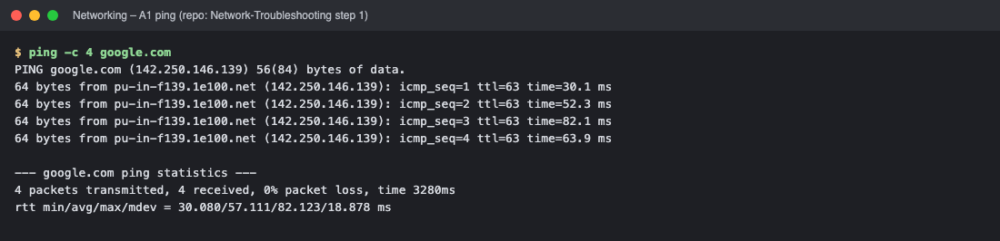

*Commands: `ping -c 4 google.com`*

### A2 traceroute (step 2)

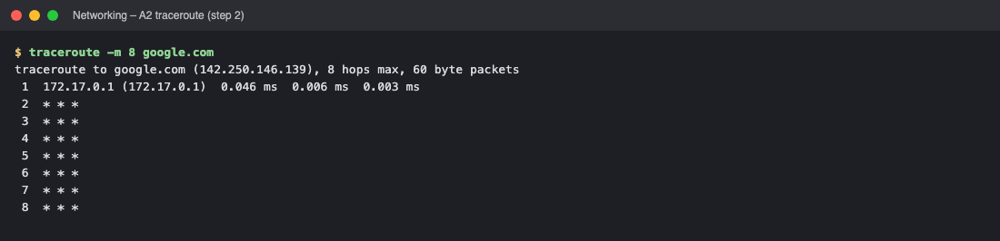

*Commands: `traceroute -m 8 google.com`*

### A3 netstat (step 3)

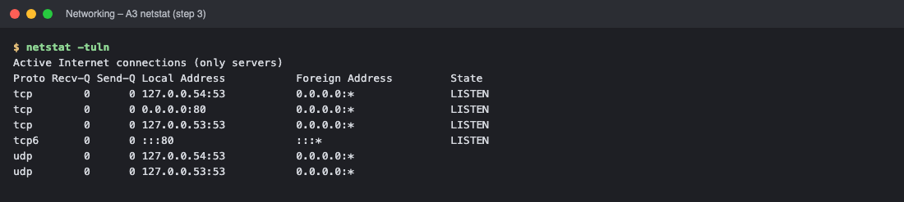

*Commands: `netstat -tuln`*

### A4 telnet (step 4)

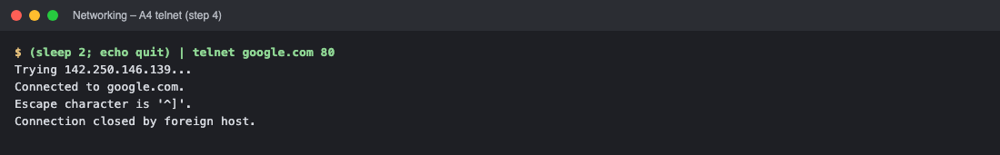

*Commands: `(sleep 2`*

### A5 tcpdump (step 5)

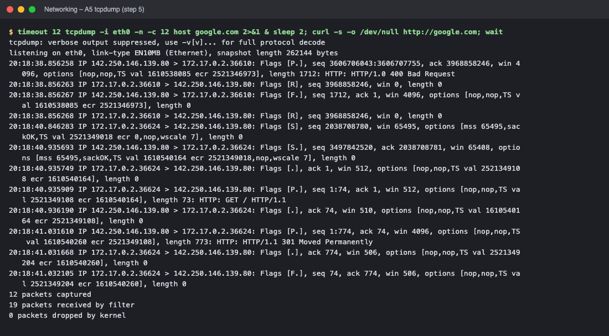

*Commands: `timeout 12 tcpdump -i eth0 -n -c 12 host google.com 2>&1 & sleep 2`*

### A6 nslookup (step 6)

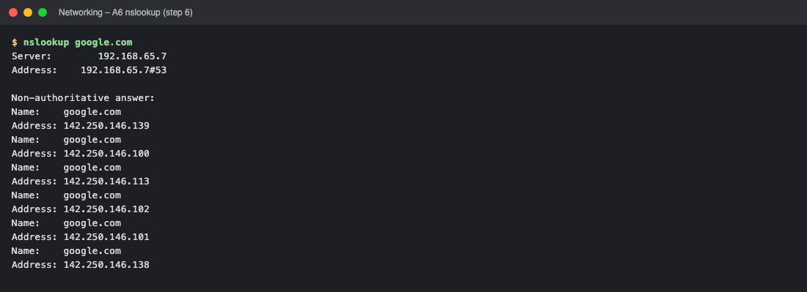

*Commands: `nslookup google.com`*

### A7 dig (step 7)

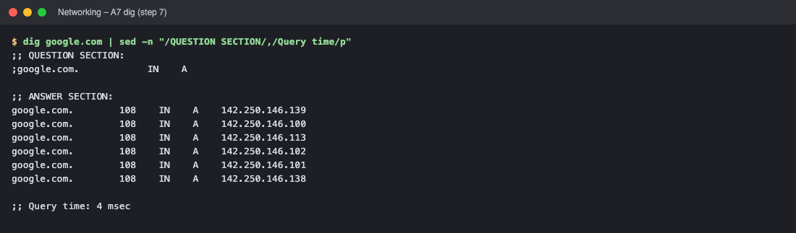

*Commands: `dig google.com | sed -n "/QUESTION SECTION/,/Query time/p"`*

### A8 curl (step 8)

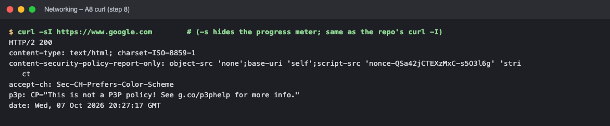

*Commands: `curl -sI https://www.google.com        # (-s hides the progress meter`*

### A9 arp (step 9)

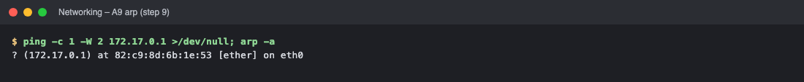

*Commands: `ping -c 1 -W 2 172.17.0.1 >/dev/null`*

### A10 systemctl (step 10)

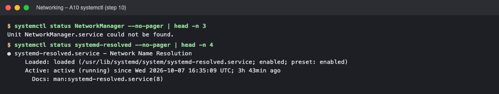

*Commands: `systemctl status NetworkManager --no-pager | head -n 3` · `systemctl status systemd-resolved --no-pager | head -n 4`*

### B Subnetting repo: 192.168.1.0/24 into 4 subnets (/26)

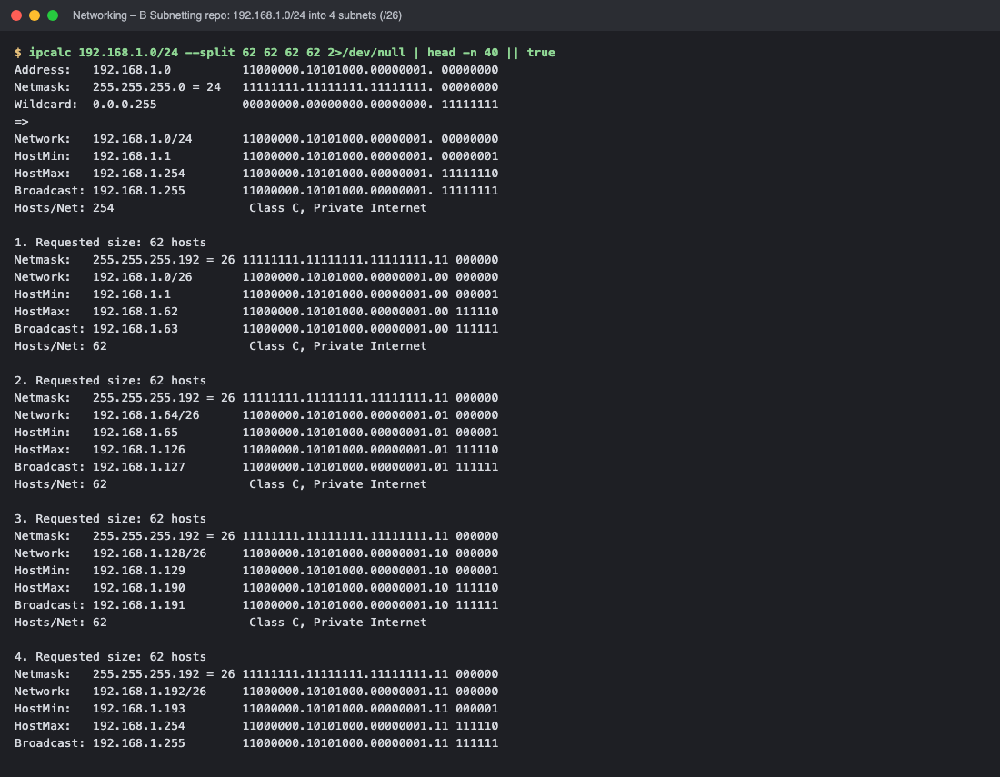

*Commands: `ipcalc 192.168.1.0/24 --split 62 62 62 62 2>/dev/null | head -n 40 || `*

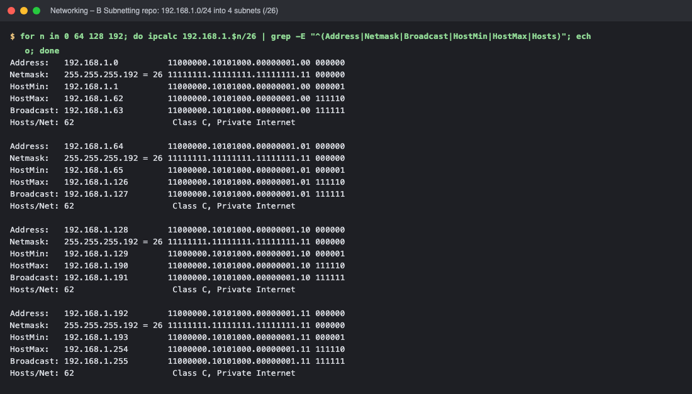

*Commands: `for n in 0 64 128 192`*

### C IP-quest questions (answers verified with Python ipaddress)

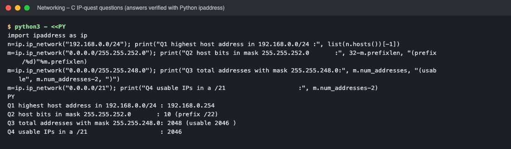

*Commands: `python3 - <<PY`*

### D DHCP (repos: How-DHCP-Works + Networking step 1) - a laptop (client) and a router (DHCP server) in two network namespaces

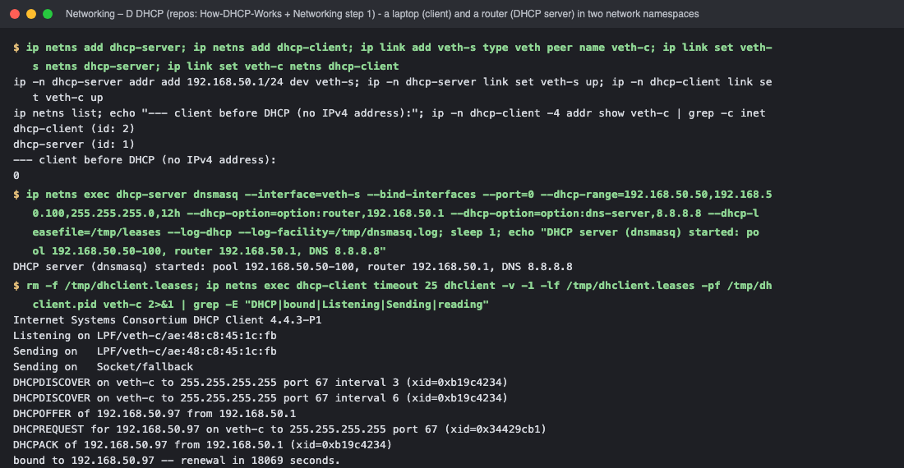

*Commands: `ip netns add dhcp-server` · `ip netns exec dhcp-server dnsmasq --interface=veth-s --bind-interfaces` · `rm -f /tmp/dhclient.leases`*

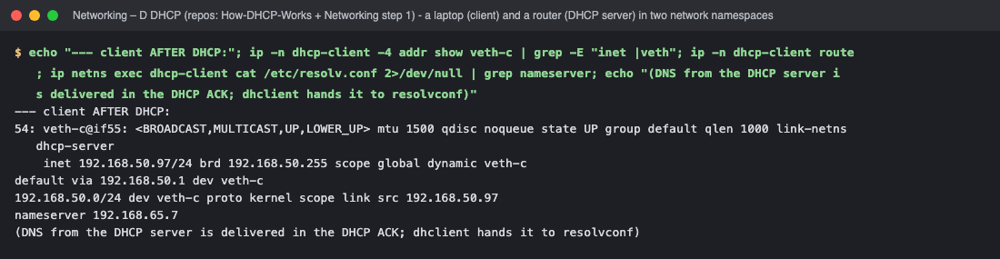

*Commands: `echo "--- client AFTER DHCP:"`*

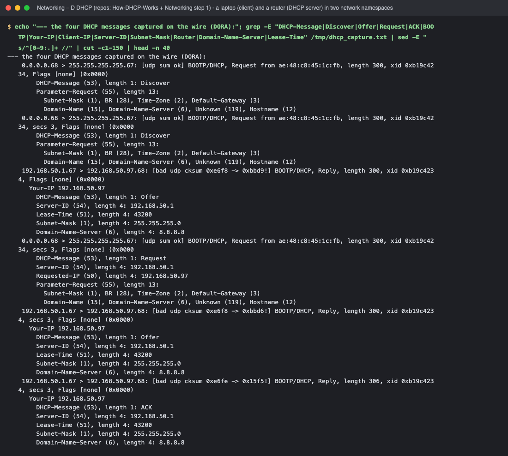

*Commands: `echo "--- the four DHCP messages captured on the wire (DORA):"`*

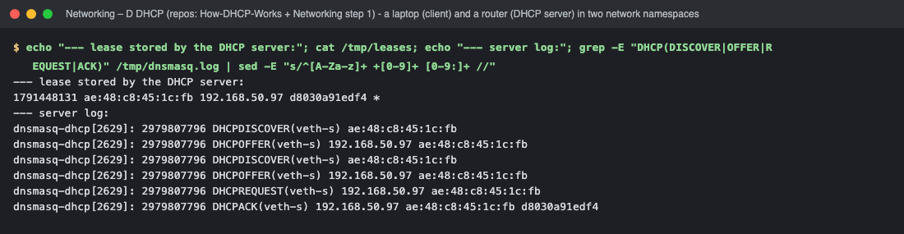

*Commands: `echo "--- lease stored by the DHCP server:"`*

### E Layer 2 switch and router roles (repos: OSI-Network-devices + Networking) - Linux bridge = switch, MAC address table

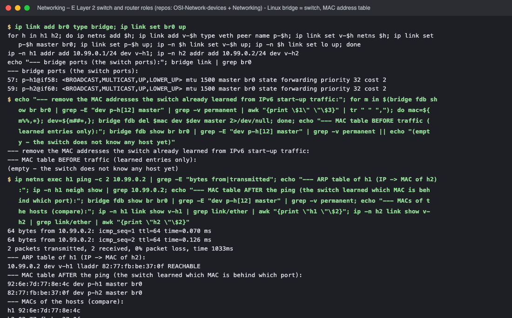

*Commands: `ip link add br0 type bridge` · `echo "--- remove the MAC addresses the switch already learned from IPv` · `ip netns exec h1 ping -c 2 10.99.0.2 | grep -E "bytes from|transmitted`*

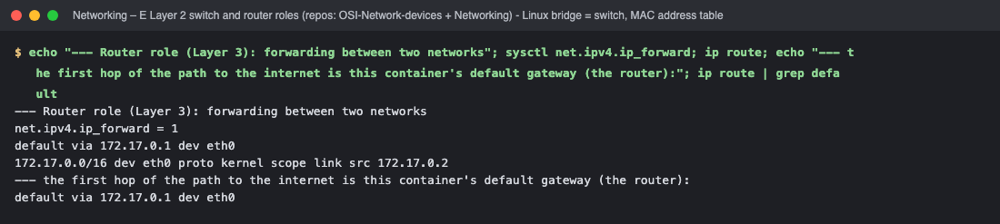

*Commands: `echo "--- Router role (Layer 3): forwarding between two networks"`*

### F IPFIX / NetFlow / NTP (repo: IPFIX-NETFLOW-NTP) - flows and time

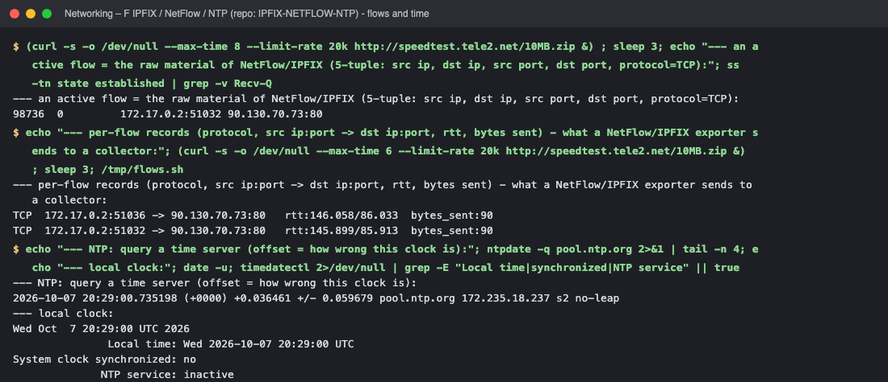

*Commands: `(curl -s -o /dev/null --max-time 8 --limit-rate 20k http://speedtest.t` · `echo "--- per-flow records (protocol, src ip:port -> dst ip:port, rtt,` · `echo "--- NTP: query a time server (offset = how wrong this clock is):`*

### G Appendix - additional general commands

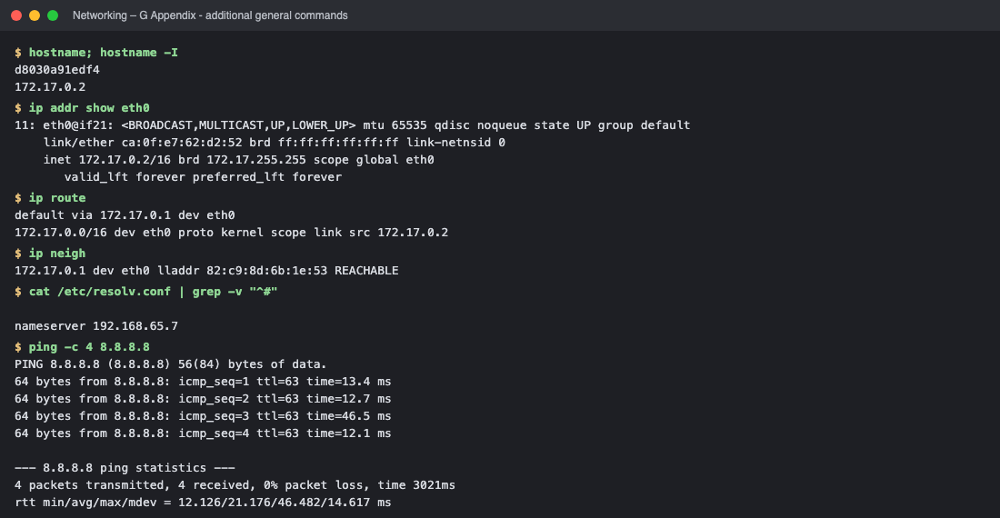

*Commands: `hostname` · `ip addr show eth0` · `ip route` · `ip neigh`*

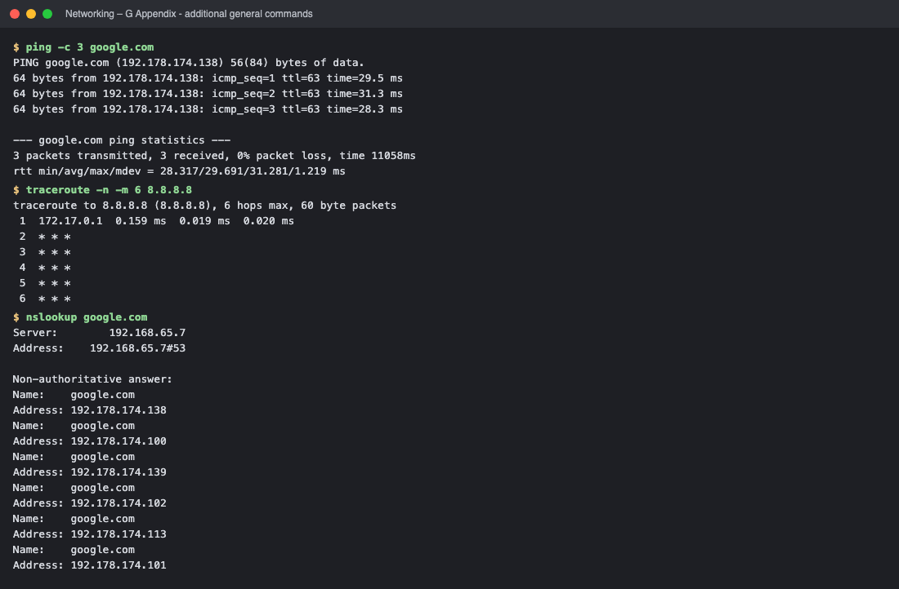

*Commands: `ping -c 3 google.com` · `traceroute -n -m 6 8.8.8.8` · `nslookup google.com`*

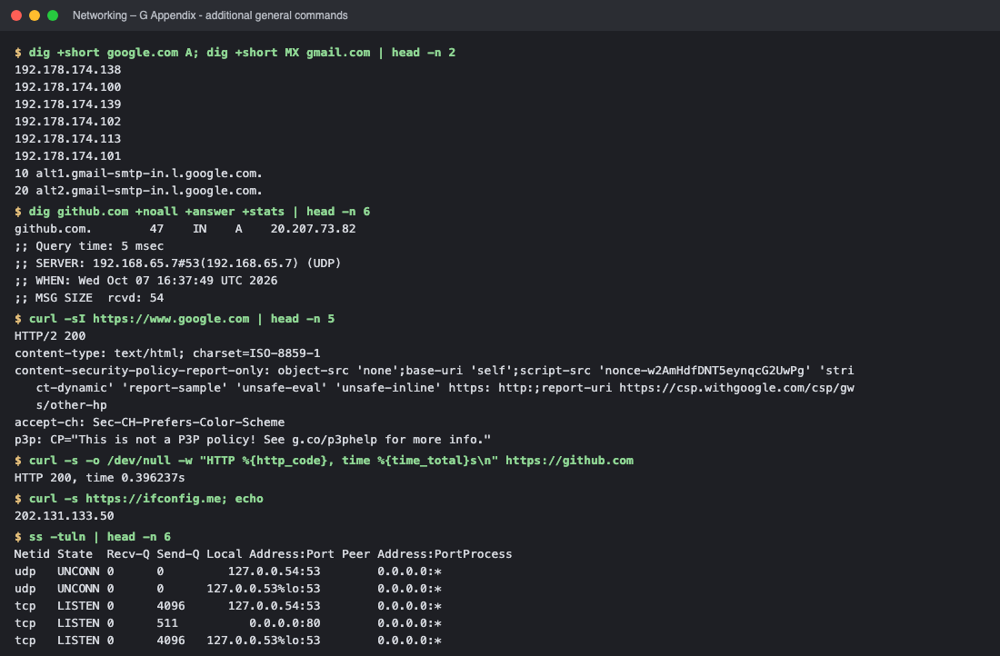

*Commands: `dig +short google.com A` · `dig github.com +noall +answer +stats | head -n 6` · `curl -sI https://www.google.com | head -n 5` · `curl -s -o /dev/null -w "HTTP %{http_code}, time %{time_total}s\n" htt`*

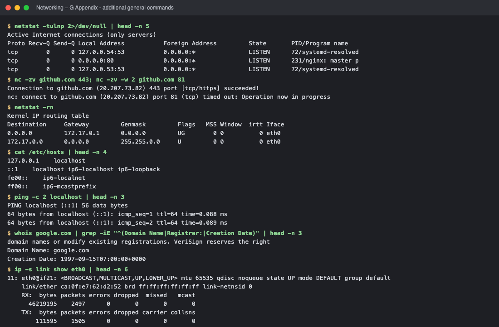

*Commands: `netstat -tulnp 2>/dev/null | head -n 5` · `nc -zv github.com 443` · `netstat -rn` · `cat /etc/hosts | head -n 4`*

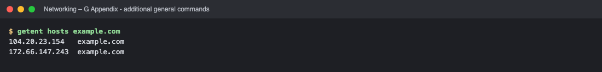

*Commands: `getent hosts example.com`*

<!-- screenshots:end -->

