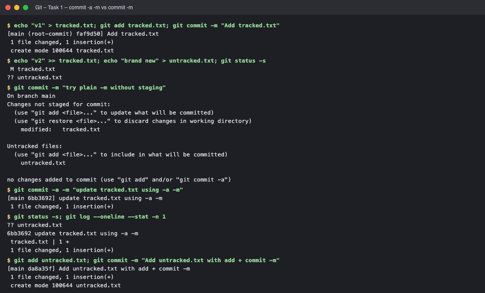
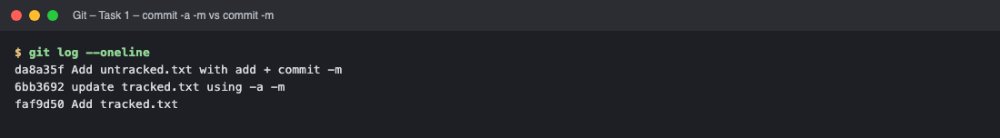
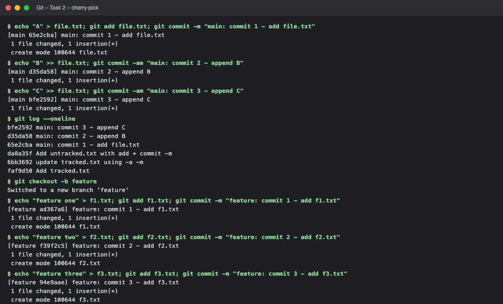
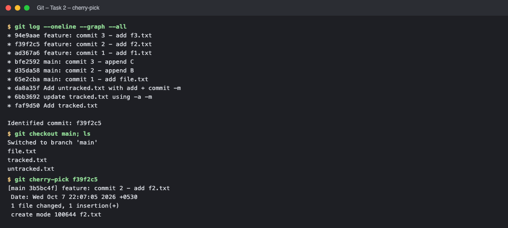
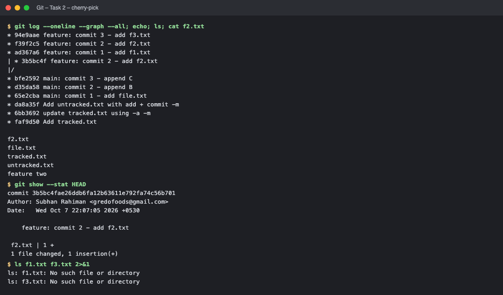

# Session 5 – Git Homework

> Both tasks were executed in a fresh local repository (`git init -b main`). Real commit hashes are shown in the output.

## Task 1 – `git commit -a -m` vs `git commit -m`

| | `git commit -m "msg"` | `git commit -a -m "msg"` |
|---|---|---|
| Commits | Only what is already **staged** (`git add`) | All **modified/deleted tracked** files automatically (stages them for you) |
| New (untracked) files | Need `git add` first | **Not** included – `-a` never adds untracked files |
| If nothing staged | "no changes added to commit" error | Works if tracked files changed |

```text
$ echo "v1" > tracked.txt; git add tracked.txt; git commit -m "Add tracked.txt"
[main (root-commit) faf9d50] Add tracked.txt
 1 file changed, 1 insertion(+)
 create mode 100644 tracked.txt

$ echo "v2" >> tracked.txt; echo "brand new" > untracked.txt; git status -s
 M tracked.txt
?? untracked.txt

$ git commit -m "try plain -m without staging"
On branch main
Changes not staged for commit:
  (use "git add <file>..." to update what will be committed)
  (use "git restore <file>..." to discard changes in working directory)
	modified:   tracked.txt

Untracked files:
  (use "git add <file>..." to include in what will be committed)
	untracked.txt

no changes added to commit (use "git add" and/or "git commit -a")

$ git commit -a -m "update tracked.txt using -a -m"
[main 6bb3692] update tracked.txt using -a -m
 1 file changed, 1 insertion(+)

$ git status -s; git log --oneline --stat -n 1
?? untracked.txt
6bb3692 update tracked.txt using -a -m
 tracked.txt | 1 +
 1 file changed, 1 insertion(+)

$ git add untracked.txt; git commit -m "Add untracked.txt with add + commit -m"
[main da8a35f] Add untracked.txt with add + commit -m
 1 file changed, 1 insertion(+)
 create mode 100644 untracked.txt

$ git log --oneline
da8a35f Add untracked.txt with add + commit -m
6bb3692 update tracked.txt using -a -m
faf9d50 Add tracked.txt
```
**Observation:**
1. `git commit -m` with a modified but unstaged `tracked.txt` → **failed** ("no changes added to commit").
2. `git commit -a -m` → committed `tracked.txt` without `git add`, but `untracked.txt` stayed untracked (`?? untracked.txt`).
3. The new file needed `git add` + `git commit -m`.

## Task 2 – Git Cherry-Pick

Steps: 3 commits on `main` → `git log` → create branch `feature` → 3 commits on it → `git log --graph --all` to find the commit hash → switch to `main` → `git cherry-pick <hash>` → verify.

```text
$ echo "A" > file.txt; git add file.txt; git commit -m "main: commit 1 - add file.txt"
[main 65e2cba] main: commit 1 - add file.txt
 1 file changed, 1 insertion(+)
 create mode 100644 file.txt

$ echo "B" >> file.txt; git commit -am "main: commit 2 - append B"
[main d35da58] main: commit 2 - append B
 1 file changed, 1 insertion(+)

$ echo "C" >> file.txt; git commit -am "main: commit 3 - append C"
[main bfe2592] main: commit 3 - append C
 1 file changed, 1 insertion(+)

$ git log --oneline
bfe2592 main: commit 3 - append C
d35da58 main: commit 2 - append B
65e2cba main: commit 1 - add file.txt
da8a35f Add untracked.txt with add + commit -m
6bb3692 update tracked.txt using -a -m
faf9d50 Add tracked.txt

$ git checkout -b feature
Switched to a new branch 'feature'

$ echo "feature one" > f1.txt; git add f1.txt; git commit -m "feature: commit 1 - add f1.txt"
[feature ad367a6] feature: commit 1 - add f1.txt
 1 file changed, 1 insertion(+)
 create mode 100644 f1.txt

$ echo "feature two" > f2.txt; git add f2.txt; git commit -m "feature: commit 2 - add f2.txt"
[feature f39f2c5] feature: commit 2 - add f2.txt
 1 file changed, 1 insertion(+)
 create mode 100644 f2.txt

$ echo "feature three" > f3.txt; git add f3.txt; git commit -m "feature: commit 3 - add f3.txt"
[feature 94e9aae] feature: commit 3 - add f3.txt
 1 file changed, 1 insertion(+)
 create mode 100644 f3.txt

$ git log --oneline --graph --all
* 94e9aae feature: commit 3 - add f3.txt
* f39f2c5 feature: commit 2 - add f2.txt
* ad367a6 feature: commit 1 - add f1.txt
* bfe2592 main: commit 3 - append C
* d35da58 main: commit 2 - append B
* 65e2cba main: commit 1 - add file.txt
* da8a35f Add untracked.txt with add + commit -m
* 6bb3692 update tracked.txt using -a -m
* faf9d50 Add tracked.txt

Identified commit: f39f2c5

$ git checkout main; ls
Switched to branch 'main'
file.txt
tracked.txt
untracked.txt

$ git cherry-pick f39f2c5
[main 3b5bc4f] feature: commit 2 - add f2.txt
 Date: Wed Oct 7 22:07:05 2026 +0530
 1 file changed, 1 insertion(+)
 create mode 100644 f2.txt

$ git log --oneline --graph --all; echo; ls; cat f2.txt
* 94e9aae feature: commit 3 - add f3.txt
* f39f2c5 feature: commit 2 - add f2.txt
* ad367a6 feature: commit 1 - add f1.txt
| * 3b5bc4f feature: commit 2 - add f2.txt
|/  
* bfe2592 main: commit 3 - append C
* d35da58 main: commit 2 - append B
* 65e2cba main: commit 1 - add file.txt
* da8a35f Add untracked.txt with add + commit -m
* 6bb3692 update tracked.txt using -a -m
* faf9d50 Add tracked.txt

f2.txt
file.txt
tracked.txt
untracked.txt
feature two

$ git show --stat HEAD
commit 3b5bc4fae26ddb6fa12b63611e792fa74c56b701
Author: Subhan Rahiman <gredofoods@gmail.com>
Date:   Wed Oct 7 22:07:05 2026 +0530

    feature: commit 2 - add f2.txt

 f2.txt | 1 +
 1 file changed, 1 insertion(+)

$ ls f1.txt f3.txt 2>&1
ls: f1.txt: No such file or directory
ls: f3.txt: No such file or directory
```
**Observation:** Only commit "feature: commit 2" (`f2.txt`) was copied onto `main` as a **new commit with a new hash** (the graph shows it on main while the feature branch is unchanged). `f1.txt` and `f3.txt` are **not** in `main`, proving cherry-pick applies just the selected change. `git show --stat HEAD` and `ls`/`cat f2.txt` confirm the change is available in `main`.

### Useful commands
`git cherry-pick <sha>`, `git cherry-pick A B`, `git cherry-pick --continue / --abort` (when conflicts occur), `git log --oneline --graph --all`.

<!-- screenshots:start -->

## Screenshots (terminal output of the live run)

> Each image shows the real output of the commands run for this task (rendered from the captured terminal output of the actual run).

### Task 1 – commit -a -m vs commit -m



*Commands: `echo "v1" > tracked.txt` · `echo "v2" >> tracked.txt` · `git commit -m "try plain -m without staging"` · `git commit -a -m "update tracked.txt using -a -m"`*



*Commands: `git log --oneline`*

### Task 2 – cherry-pick



*Commands: `echo "A" > file.txt` · `echo "B" >> file.txt` · `echo "C" >> file.txt` · `git log --oneline`*



*Commands: `git log --oneline --graph --all` · `git checkout main` · `git cherry-pick f39f2c5`*



*Commands: `git log --oneline --graph --all` · `git show --stat HEAD` · `ls f1.txt f3.txt 2>&1`*

<!-- screenshots:end -->
