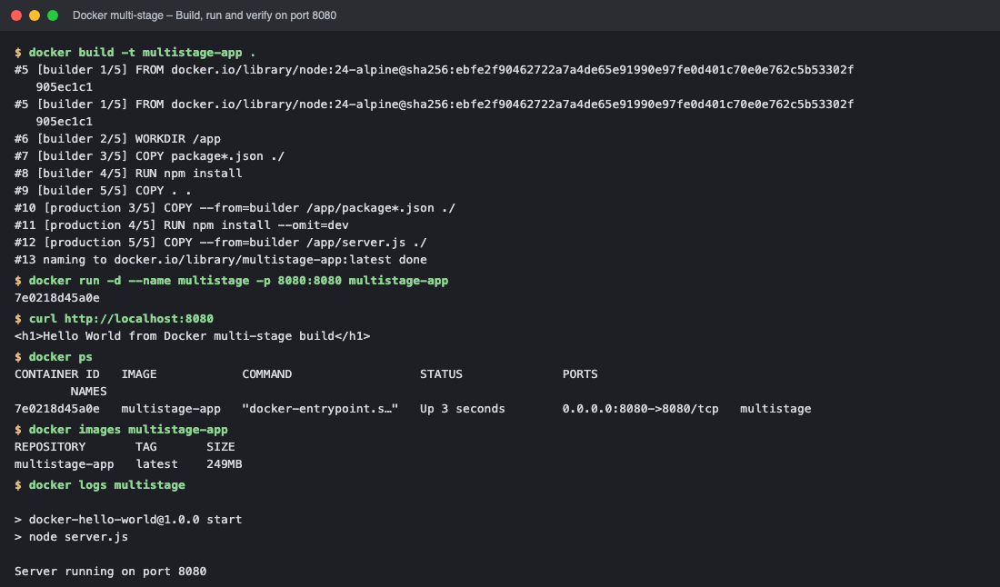
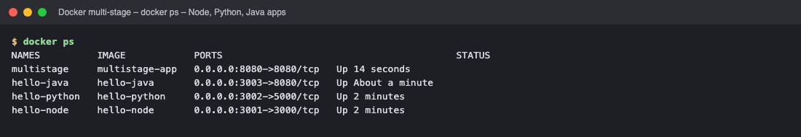

# Session 7 – Docker Multi-Stage Build

| | |
|---|---|
| **Name** | Subhan Rahiman |
| **Enrollment number** | `<ENROLLMENT-NUMBER>` |

## Task 1 – Run the multi-stage Dockerfile
The multi-stage Dockerfile comes from the course repository (`session6-7-docker/multi-stage-dockerfile`). I adjusted it so the app prints exactly **"Hello World from Docker multi-stage build"** and listens on **port 8080**. Code: [`multistage-app/`](multistage-app/).

### `Dockerfile` (2 stages)
```dockerfile
# -------------------------
# Stage 1: Build
# -------------------------
FROM node:24-alpine AS builder
WORKDIR /app
COPY package*.json ./
RUN npm install
COPY . .

# -------------------------
# Stage 2: Production
# -------------------------
FROM node:24-alpine AS production
WORKDIR /app
COPY --from=builder /app/package*.json ./
RUN npm install --omit=dev
COPY --from=builder /app/server.js ./
EXPOSE 8080
CMD ["npm", "start"]
```
* **Stage 1 `builder`** installs *all* dependencies and copies the source.
* **Stage 2 `production`** starts from a clean `node:24-alpine`, installs only production dependencies and copies just `server.js` → smaller, cleaner final image (build tooling/dev dependencies are left behind).

### `server.js`
```javascript
const express = require("express");

const app = express();
const PORT = 8080;

app.get("/", (req, res) => {
  res.send("<h1>Hello World from Docker multi-stage build</h1>");
});

app.listen(PORT, () => {
  console.log(`Server running on port ${PORT}`);
});
```

### Build, run, verify
```text
$ docker build -t multistage-app .
#5 [builder 1/5] FROM docker.io/library/node:24-alpine@sha256:ebfe2f90462722a7a4de65e91990e97fe0d401c70e0e762c5b53302f905ec1c1
#5 [builder 1/5] FROM docker.io/library/node:24-alpine@sha256:ebfe2f90462722a7a4de65e91990e97fe0d401c70e0e762c5b53302f905ec1c1
#6 [builder 2/5] WORKDIR /app
#7 [builder 3/5] COPY package*.json ./
#8 [builder 4/5] RUN npm install
#9 [builder 5/5] COPY . .
#10 [production 3/5] COPY --from=builder /app/package*.json ./
#11 [production 4/5] RUN npm install --omit=dev
#12 [production 5/5] COPY --from=builder /app/server.js ./
#13 naming to docker.io/library/multistage-app:latest done

$ docker run -d --name multistage -p 8080:8080 multistage-app
7e0218d45a0e

$ curl http://localhost:8080
<h1>Hello World from Docker multi-stage build</h1>

$ docker ps
CONTAINER ID   IMAGE            COMMAND                  STATUS              PORTS                                         NAMES
7e0218d45a0e   multistage-app   "docker-entrypoint.s…"   Up 3 seconds        0.0.0.0:8080->8080/tcp   multistage

$ docker images multistage-app
REPOSITORY       TAG       SIZE
multistage-app   latest    249MB

$ docker logs multistage

> docker-hello-world@1.0.0 start
> node server.js

Server running on port 8080
```

* ✅ Application displays **Hello World from Docker multi-stage build**
* ✅ `docker ps` shows container `multistage` running with `0.0.0.0:8080->8080/tcp` (port 8080)

## Task 2 – Documentation
Name, enrollment number, the application output (`curl http://localhost:8080`) and the `docker ps` output on port 8080 are all included above.

## Task 3 – Deploy 3 different application types with Docker
Node.js, Python and Java applications were built from their own Dockerfiles and deployed as containers (code and Dockerfiles in [`../session06-docker-hello-world`](../session06-docker-hello-world/)), alongside the multi-stage app:

| Type | Folder | Container port → host port |
|---|---|---|
| Node.js | `nodejs-app` | 3000 → 3001 |
| Python | `python-app` | 5000 → 3002 |
| Java | `java-app` | 8080 → 3003 |

```text
NAMES          IMAGE            PORTS                                         STATUS
multistage     multistage-app   0.0.0.0:8080->8080/tcp   Up 14 seconds
hello-java     hello-java       0.0.0.0:3003->8080/tcp   Up About a minute
hello-python   hello-python     0.0.0.0:3002->5000/tcp   Up 2 minutes
hello-node     hello-node       0.0.0.0:3001->3000/tcp   Up 2 minutes
```
```text
$ curl localhost:3001 ; curl localhost:3002 ; curl localhost:3003
<h1>Hello World from Node.js in Docker!</h1>
<h1>Hello World from Python in Docker!</h1>
<h1>Hello World from Java in Docker!</h1>
```

<!-- screenshots:start -->

## Screenshots (terminal output of the live run)

> Each image shows the real output of the commands run for this task (rendered from the captured terminal output of the actual run).

### Build, run and verify on port 8080



*Commands: `docker build -t multistage-app .` · `docker run -d --name multistage -p 8080:8080 multistage-app` · `curl http://localhost:8080` · `docker ps`*

### docker ps – Node, Python, Java apps



*Commands: `docker ps`*

<!-- screenshots:end -->

## Screenshots (browser)

**Multi-stage app – http://localhost:8080 ("Hello World from Docker multi-stage build")**


<!-- web:end -->
