# Session 11 – Kubernetes Networking & Services (Task 1)

All five Service types were deployed on Minikube (namespace `s11`) and tested from a client Pod inside the cluster. YAML for each type is in the numbered sub-folders.

| # | Type | Reachable from | Typical use | Folder |
|---|---|---|---|---|
| 1 | **ClusterIP** (default) | inside the cluster only | internal service-to-service traffic | [`01-clusterip/`](01-clusterip/) |
| 2 | **NodePort** | `NodeIP:30000-32767` | quick external access / dev | [`02-nodeport/`](02-nodeport/) |
| 3 | **LoadBalancer** | cloud load balancer (external IP) | production internet exposure | [`03-loadbalancer/`](03-loadbalancer/) |
| 4 | **ExternalName** | DNS alias (CNAME) to an external host | point in-cluster name to an external service | [`04-externalname/`](04-externalname/) |
| 5 | **Headless** (`clusterIP: None`) | DNS returns Pod IPs directly | StatefulSets, per-Pod addressing | [`05-headless/`](05-headless/) |

Other tasks: [Object comparison](object-comparison/README.md) · [FQDN](fqdn/README.md) · [CoreDNS](coredns/README.md)

---
## 1. ClusterIP
```yaml
apiVersion: v1
kind: Service
metadata:
  name: web-service-clusterip
  labels:
    app: web-clusterip
spec:
  type: ClusterIP
  selector:
    app: web-clusterip
  ports:
    - name: http
      port: 8080
      targetPort: 80
      protocol: TCP
```
Gives the Pods a single stable virtual IP and DNS name; kube-proxy load-balances to the 3 Pod endpoints. Not reachable from outside the cluster.
```text
$ kubectl -n s11 apply -f 01-clusterip/
deployment.apps/web-app-clusterip created
pod/curl-client created
service/web-service-clusterip created

$ kubectl -n s11 rollout status deploy/web-app-clusterip --timeout=120s; kubectl -n s11 wait --for=condition=Ready pod/curl-client --timeout=90s
deployment "web-app-clusterip" successfully rolled out
pod/curl-client condition met

$ kubectl -n s11 get svc web-service-clusterip -o wide; kubectl -n s11 get endpoints web-service-clusterip
NAME                    TYPE        CLUSTER-IP      EXTERNAL-IP   PORT(S)    AGE   SELECTOR
web-service-clusterip   ClusterIP   10.110.106.98   <none>        8080/TCP   1s    app=web-clusterip
NAME                    ENDPOINTS                                         AGE
web-service-clusterip   10.244.0.112:80,10.244.0.113:80,10.244.0.115:80   1s

$ kubectl -n s11 exec curl-client -- curl -s -o /dev/null -w "HTTP %{http_code} via ClusterIP service name\n" http://web-service-clusterip:8080
HTTP 200 via ClusterIP service name

$ kubectl -n s11 exec curl-client -- curl -s http://web-service-clusterip:8080 | grep -o "<title>.*</title>"
<title>Welcome to nginx!</title>

$ echo "--- from outside the cluster (macOS host) a ClusterIP is NOT reachable:"; curl -s -m 3 http://$(kubectl -n s11 get svc web-service-clusterip -o jsonpath="{.spec.clusterIP}"):8080 || echo "unreachable (as expected)"
--- from outside the cluster (macOS host) a ClusterIP is NOT reachable:
unreachable (as expected)
```

## 2. NodePort
```yaml
apiVersion: v1
kind: Service
metadata:
  name: web-service-nodeport
  labels:
    app: web-nodeport
spec:
  type: NodePort
  selector:
    app: web-nodeport
  ports:
    - name: http
      port: 80
      targetPort: 80
      nodePort: 30080
      protocol: TCP
```
Opens port `30080` on every node and forwards to the Service (a NodePort also creates a ClusterIP). Because Minikube runs in Docker on macOS, the node IP is not directly reachable from the Mac, so `minikube service --url` creates a tunnel (`127.0.0.1:<port>`).
```text
$ kubectl -n s11 apply -f 02-nodeport/
deployment.apps/web-app-nodeport created
service/web-service-nodeport created

$ kubectl -n s11 rollout status deploy/web-app-nodeport --timeout=120s; sleep 6; kubectl -n s11 get svc web-service-nodeport -o wide
deployment "web-app-nodeport" successfully rolled out
NAME                   TYPE       CLUSTER-IP      EXTERNAL-IP   PORT(S)        AGE   SELECTOR
web-service-nodeport   NodePort   10.110.37.198   <none>        80:30080/TCP   6s    app=web-nodeport

$ NP=$(kubectl -n s11 get svc web-service-nodeport -o jsonpath="{.spec.ports[0].nodePort}"); echo "nodePort=$NP"; kubectl -n s11 exec curl-client -- curl -s -o /dev/null -w "HTTP %{http_code} via NODE_IP:$NP\n" http://$(minikube ip):$NP
nodePort=30080
HTTP 200 via NODE_IP:30080

$ echo "--- reach the NodePort from the Mac through a minikube tunnel:"; (minikube service web-service-nodeport -n s11 --url > /tmp/np_url.txt 2>&1 &) ; sleep 6; U=$(grep -m1 http /tmp/np_url.txt); echo "URL: $U"; curl -s -o /dev/null -w "HTTP %{http_code}\n" $U; pkill -f "minikube service web-service-nodeport" || true
--- reach the NodePort from the Mac through a minikube tunnel:
URL: http://127.0.0.1:51001
HTTP 200
```

## 3. LoadBalancer
```yaml
apiVersion: v1
kind: Service
metadata:
  name: web-service-loadbalancer
  labels:
    app: web-loadbalancer
spec:
  type: LoadBalancer
  selector:
    app: web-loadbalancer
  ports:
    - name: http
      port: 80
      targetPort: 80
      protocol: TCP
```
A LoadBalancer asks the **cloud provider** (AWS ELB, GCP, Azure) for an external load balancer. Minikube has no cloud provider, so `EXTERNAL-IP` stays `<pending>` – the Service still works through its NodePort (`80:31696`). `minikube tunnel` (needs sudo) would assign `127.0.0.1` as external IP. On EKS/GKE the pending state is replaced by a public DNS/IP.
```text
$ kubectl -n s11 apply -f 03-loadbalancer/
deployment.apps/web-app-loadbalancer created
service/web-service-loadbalancer created

$ kubectl -n s11 rollout status deploy/web-app-loadbalancer --timeout=120s; kubectl -n s11 get svc web-service-loadbalancer -o wide
deployment "web-app-loadbalancer" successfully rolled out
NAME                       TYPE           CLUSTER-IP      EXTERNAL-IP   PORT(S)        AGE   SELECTOR
web-service-loadbalancer   LoadBalancer   10.106.130.67   <pending>     80:30939/TCP   1s    app=web-loadbalancer

$ kubectl -n s11 describe svc web-service-loadbalancer | grep -E "^Name|^Type|^IP:|LoadBalancer Ingress|^Port|NodePort|Endpoints|Events"
Name:                     web-service-loadbalancer
Namespace:                s11
Type:                     LoadBalancer
IP:                       10.106.130.67
Port:                     http  80/TCP
NodePort:                 http  30939/TCP
Endpoints:                10.244.0.118:80,10.244.0.119:80,10.244.0.120:80
Events:                   <none>
```

## 4. ExternalName
```yaml
apiVersion: v1
kind: Service
metadata:
  name: external-database-service
spec:
  type: ExternalName
  externalName: example.com
```
No selector, no proxying: DNS returns a **CNAME** (`external-database-service` → `example.com`). Apps inside the cluster can use a stable local name for an external database/API, and only the Service needs changing if the external host moves. (The course example used `nencyravaliya.me`; `example.com` was used here so the result is reproducible.) The remote site answered with the resolved IP of example.com.
```text
$ kubectl -n s11 apply -f 04-externalname/
pod/dns-test-client created
service/external-database-service created

$ kubectl -n s11 wait --for=condition=Ready pod/dns-test-client --timeout=90s; sleep 6; kubectl -n s11 get svc external-database-service
pod/dns-test-client condition met
NAME                        TYPE           CLUSTER-IP   EXTERNAL-IP   PORT(S)   AGE
external-database-service   ExternalName   <none>       example.com   <none>    6s

$ kubectl -n s11 exec dns-test-client -- nslookup external-database-service.s11.svc.cluster.local 2>&1 | head -n 6; kubectl -n s11 exec dns-test-client -- getent hosts external-database-service
Server:		10.96.0.10
Address:	10.96.0.10:53

external-database-service.s11.svc.cluster.local	canonical name = example.com

external-database-service.s11.svc.cluster.local	canonical name = example.com
104.20.23.154     example.com  example.com external-database-service

$ kubectl -n s11 exec dns-test-client -- curl -s -m 10 -o /dev/null -w "curl http://external-database-service -> resolved to %{remote_ip}, HTTP %{http_code}\n" -H "Host: example.com" http://external-database-service
curl http://external-database-service -> resolved to 104.20.23.154, HTTP 200
```

## 5. Headless Service
```yaml
apiVersion: v1
kind: Service
metadata:
  name: web-service-headless
  labels:
    app: web-headless
spec:
  clusterIP: None
  selector:
    app: web-headless
  ports:
    - name: web
      port: 80
      targetPort: 80
      protocol: TCP
```
With `clusterIP: None` there is no virtual IP: DNS returns the **IP of every Pod** and each StatefulSet Pod gets a stable name `<pod>.<service>.<ns>.svc.cluster.local`. Used by databases/clustered apps that must address individual replicas.
```text
$ kubectl -n s11 apply -f 05-headless/
statefulset.apps/web-stateful created
pod/headless-dns-client created
service/web-service-headless created

$ kubectl -n s11 rollout status statefulset/web-stateful --timeout=180s; kubectl -n s11 wait --for=condition=Ready pod/headless-dns-client --timeout=90s; kubectl -n s11 get svc web-service-headless; kubectl -n s11 get pods -l app=web-headless -o wide
Waiting for 3 pods to be ready...
Waiting for 2 pods to be ready...
Waiting for 2 pods to be ready...
Waiting for 1 pods to be ready...
Waiting for 1 pods to be ready...
partitioned roll out complete: 3 new pods have been updated...
pod/headless-dns-client condition met
NAME                   TYPE        CLUSTER-IP   EXTERNAL-IP   PORT(S)   AGE
web-service-headless   ClusterIP   None         <none>        80/TCP    2s
NAME             READY   STATUS    RESTARTS   AGE   IP             NODE       NOMINATED NODE   READINESS GATES
web-stateful-0   1/1     Running   0          2s    10.244.0.123   minikube   <none>           <none>
web-stateful-1   1/1     Running   0          1s    10.244.0.124   minikube   <none>           <none>
web-stateful-2   1/1     Running   0          1s    10.244.0.125   minikube   <none>           <none>

$ kubectl -n s11 exec headless-dns-client -- nslookup web-service-headless.s11.svc.cluster.local 2>&1 | tail -n 9


Name:	web-service-headless.s11.svc.cluster.local
Address: 10.244.0.123
Name:	web-service-headless.s11.svc.cluster.local
Address: 10.244.0.124
Name:	web-service-headless.s11.svc.cluster.local
Address: 10.244.0.125


$ kubectl -n s11 exec headless-dns-client -- nslookup web-stateful-0.web-service-headless.s11.svc.cluster.local 2>&1 | tail -n 4

Name:	web-stateful-0.web-service-headless.s11.svc.cluster.local
Address: 10.244.0.123


$ kubectl -n s11 exec headless-dns-client -- curl -s -o /dev/null -w "HTTP %{http_code} from web-stateful-1 (stable per-Pod DNS)\n" http://web-stateful-1.web-service-headless
HTTP 200 from web-stateful-1 (stable per-Pod DNS)

$ kubectl -n s11 get endpoints web-service-headless
NAME                   ENDPOINTS                                         AGE
web-service-headless   10.244.0.123:80,10.244.0.124:80,10.244.0.125:80   2s

$ kubectl -n s11 get svc -o wide
NAME                        TYPE           CLUSTER-IP      EXTERNAL-IP   PORT(S)        AGE   SELECTOR
external-database-service   ExternalName   <none>          example.com   <none>         9s    <none>
web-service-clusterip       ClusterIP      10.110.106.98   <none>        8080/TCP       28s   app=web-clusterip
web-service-headless        ClusterIP      None            <none>        80/TCP         2s    app=web-headless
web-service-loadbalancer    LoadBalancer   10.106.130.67   <pending>     80:30939/TCP   10s   app=web-loadbalancer
web-service-nodeport        NodePort       10.110.37.198   <none>        80:30080/TCP   23s   app=web-nodeport
```

## Result
All 5 Service types deployed and verified; output is shown above. Cleanup: `kubectl delete ns s11 s11-other`.

<!-- screenshots:start -->

## Screenshots (terminal output of the live run)

> Each image shows the real output of the commands run for this task (rendered from the captured terminal output of the actual run).

### Service – Clusterip

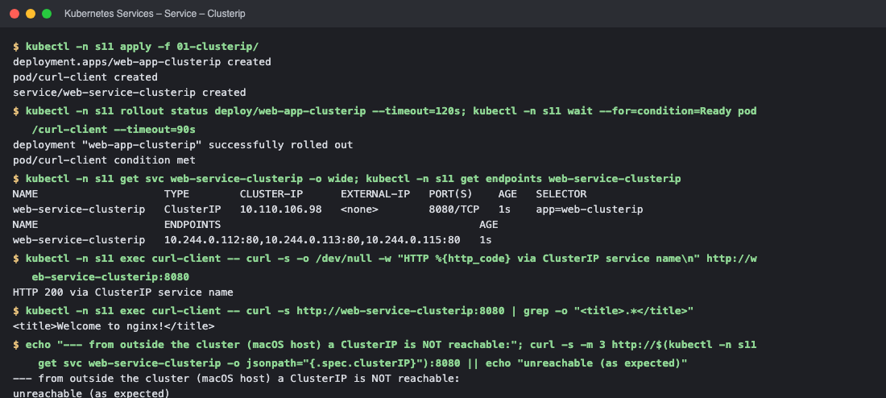

*Commands: `kubectl -n s11 apply -f 01-clusterip/` · `kubectl -n s11 rollout status deploy/web-app-clusterip --timeout=120s` · `kubectl -n s11 get svc web-service-clusterip -o wide` · `kubectl -n s11 exec curl-client -- curl -s -o /dev/null -w "HTTP %{htt`*

### Service – Nodeport

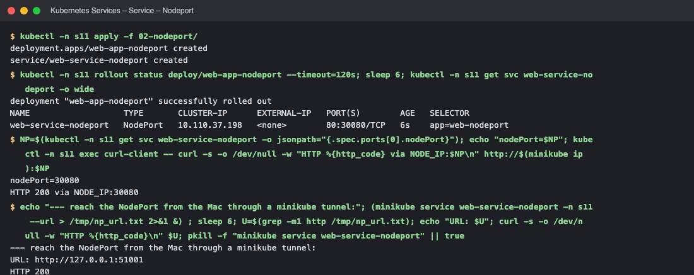

*Commands: `kubectl -n s11 apply -f 02-nodeport/` · `kubectl -n s11 rollout status deploy/web-app-nodeport --timeout=120s` · `NP=$(kubectl -n s11 get svc web-service-nodeport -o jsonpath="{.spec.p` · `echo "--- reach the NodePort from the Mac through a minikube tunnel:"`*

### Service – Loadbalancer

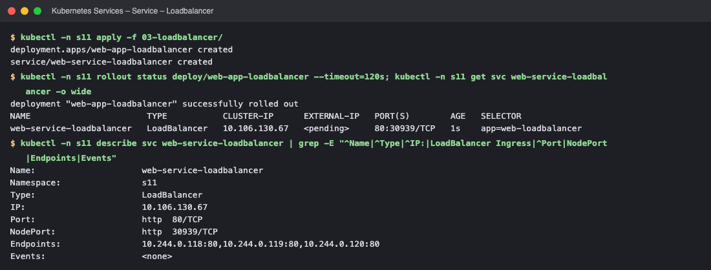

*Commands: `kubectl -n s11 apply -f 03-loadbalancer/` · `kubectl -n s11 rollout status deploy/web-app-loadbalancer --timeout=12` · `kubectl -n s11 describe svc web-service-loadbalancer | grep -E "^Name|`*

### Service – Externalname

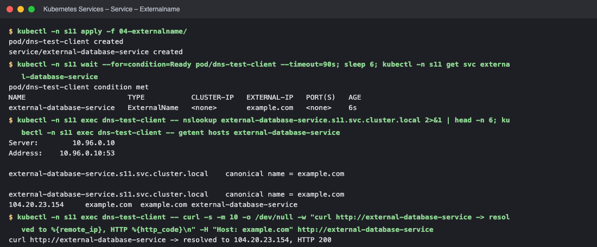

*Commands: `kubectl -n s11 apply -f 04-externalname/` · `kubectl -n s11 wait --for=condition=Ready pod/dns-test-client --timeou` · `kubectl -n s11 exec dns-test-client -- nslookup external-database-serv` · `kubectl -n s11 exec dns-test-client -- curl -s -m 10 -o /dev/null -w "`*

### Service – Headless

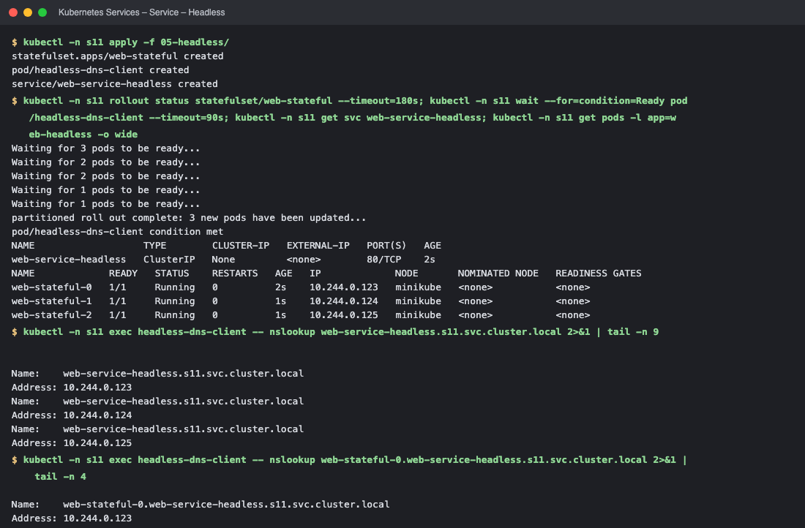

*Commands: `kubectl -n s11 apply -f 05-headless/` · `kubectl -n s11 rollout status statefulset/web-stateful --timeout=180s` · `kubectl -n s11 exec headless-dns-client -- nslookup web-service-headle` · `kubectl -n s11 exec headless-dns-client -- nslookup web-stateful-0.web`*

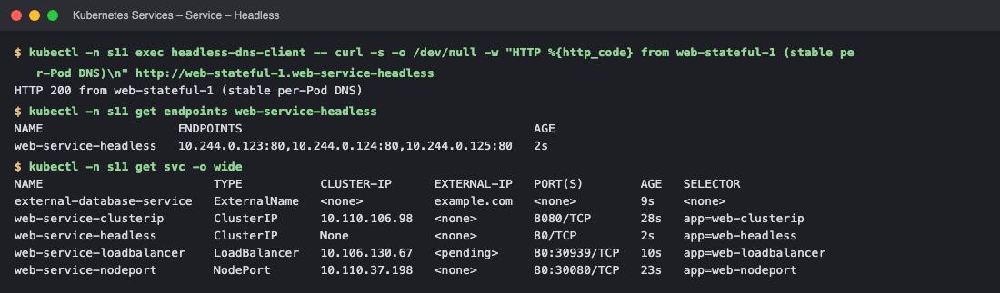

*Commands: `kubectl -n s11 exec headless-dns-client -- curl -s -o /dev/null -w "HT` · `kubectl -n s11 get endpoints web-service-headless` · `kubectl -n s11 get svc -o wide`*

### FQDN – DNS names

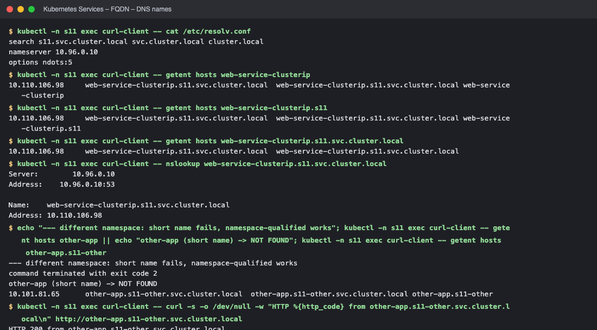

*Commands: `kubectl -n s11 exec curl-client -- cat /etc/resolv.conf` · `kubectl -n s11 exec curl-client -- getent hosts web-service-clusterip` · `kubectl -n s11 exec curl-client -- getent hosts web-service-clusterip.` · `kubectl -n s11 exec curl-client -- getent hosts web-service-clusterip.`*

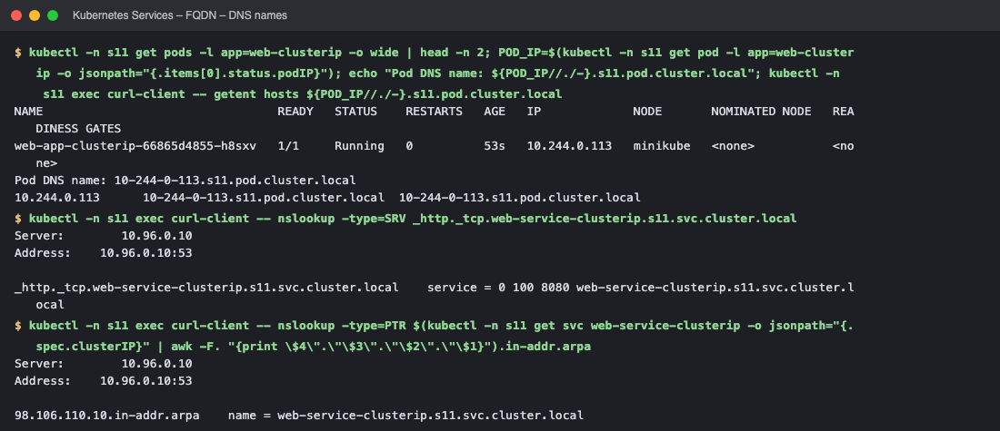

*Commands: `kubectl -n s11 get pods -l app=web-clusterip -o wide | head -n 2` · `kubectl -n s11 exec curl-client -- nslookup -type=SRV _http._tcp.web-s` · `kubectl -n s11 exec curl-client -- nslookup -type=PTR $(kubectl -n s11`*

### CoreDNS

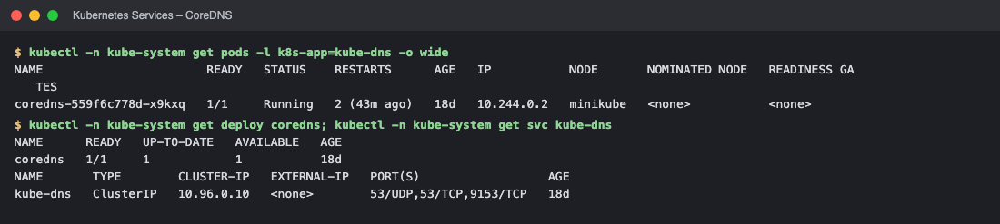

*Commands: `kubectl -n kube-system get pods -l k8s-app=kube-dns -o wide` · `kubectl -n kube-system get deploy coredns`*

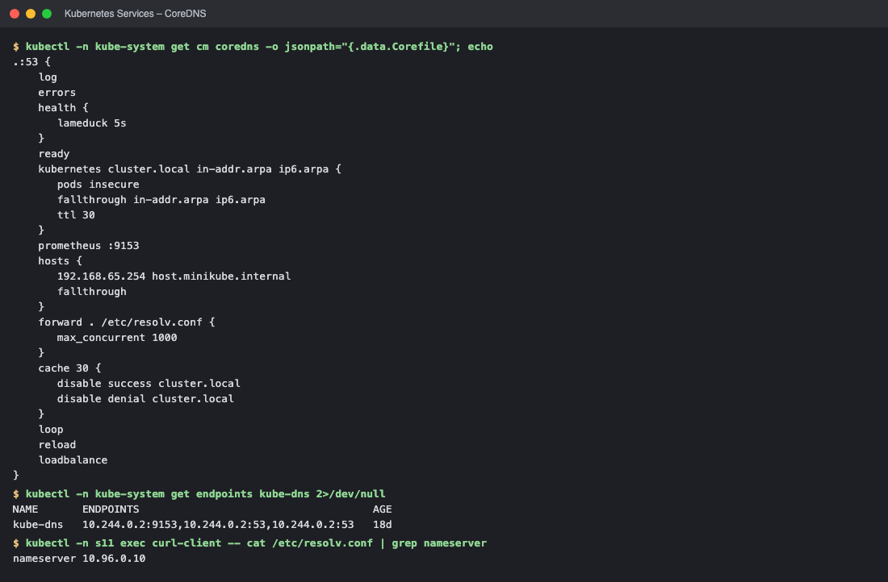

*Commands: `kubectl -n kube-system get cm coredns -o jsonpath="{.data.Corefile}"` · `kubectl -n kube-system get endpoints kube-dns 2>/dev/null` · `kubectl -n s11 exec curl-client -- cat /etc/resolv.conf | grep nameser`*

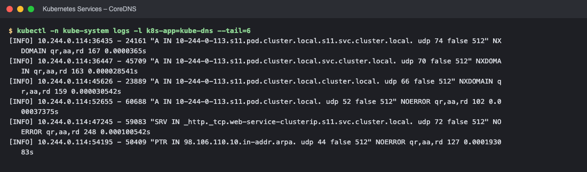

*Commands: `kubectl -n kube-system logs -l k8s-app=kube-dns --tail=6`*

### CoreDNS troubleshooting

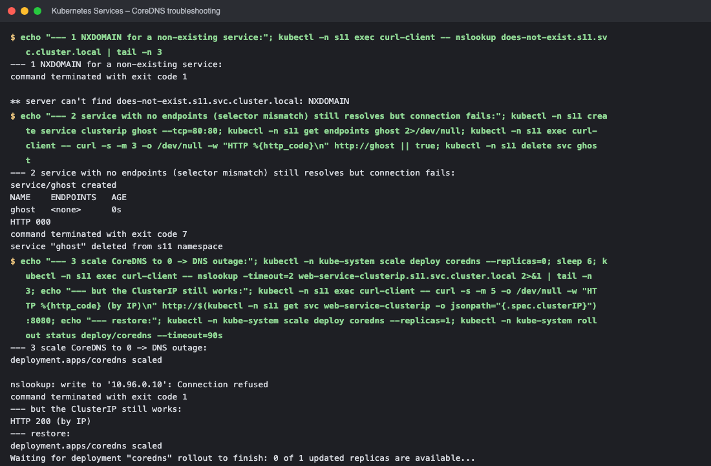

*Commands: `echo "--- 1 NXDOMAIN for a non-existing service:"` · `echo "--- 2 service with no endpoints (selector mismatch) still resolv` · `echo "--- 3 scale CoreDNS to 0 -> DNS outage:"`*

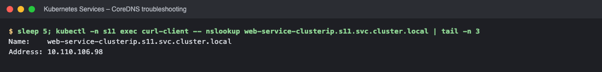

*Commands: `sleep 5`*

<!-- screenshots:end -->

## Screenshots (browser)

**ClusterIP Service (internal only) reached via kubectl port-forward → http://localhost:8106**


**NodePort Service 30080 through the minikube tunnel → http://127.0.0.1:53116**


<!-- web:end -->
