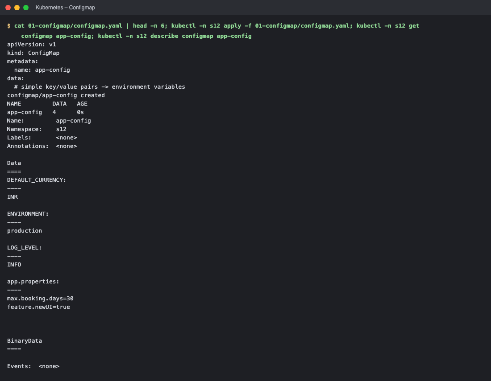
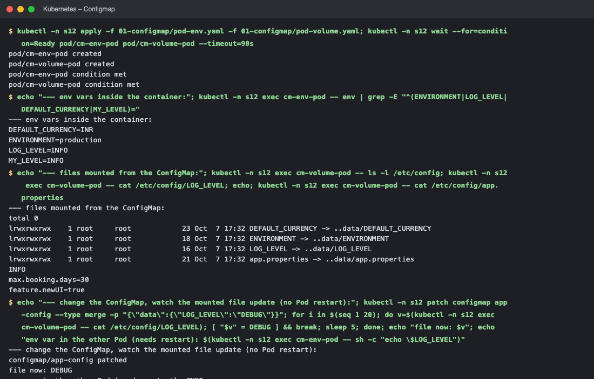
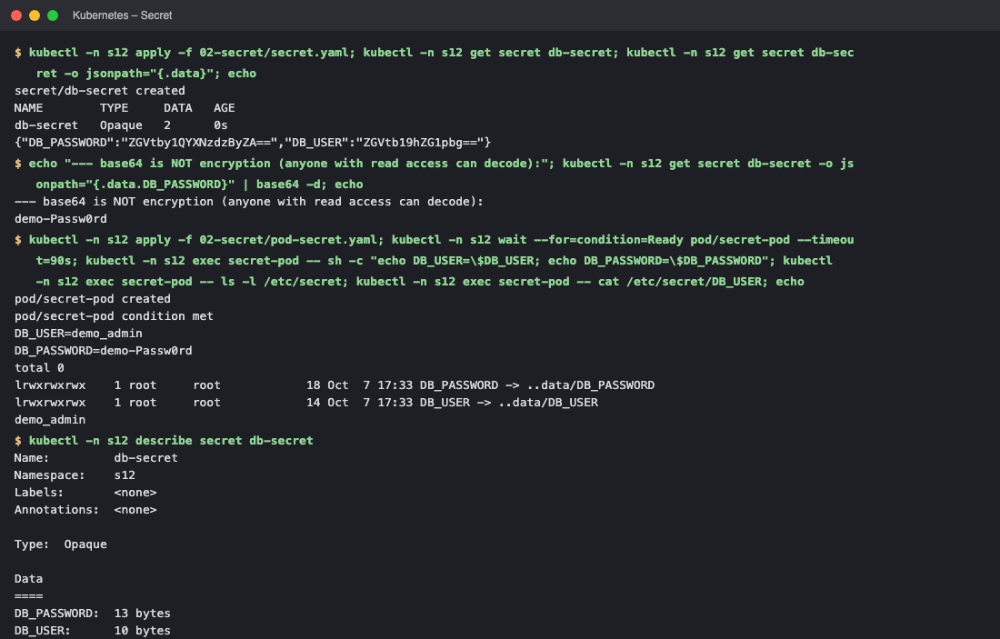
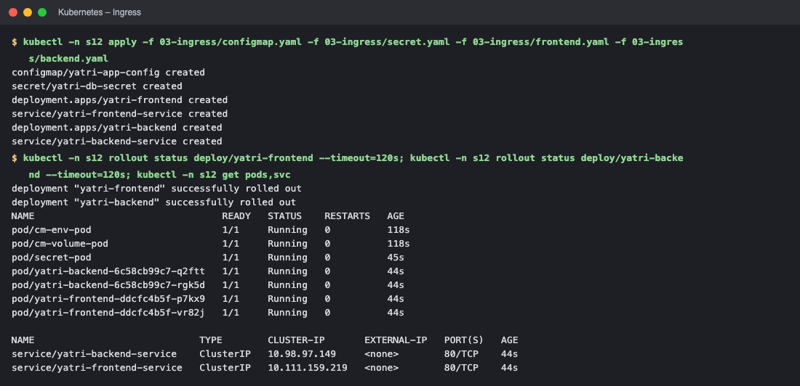
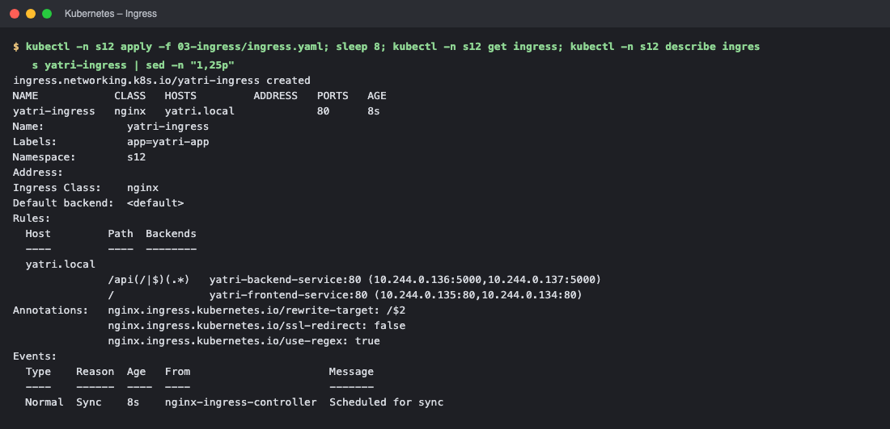
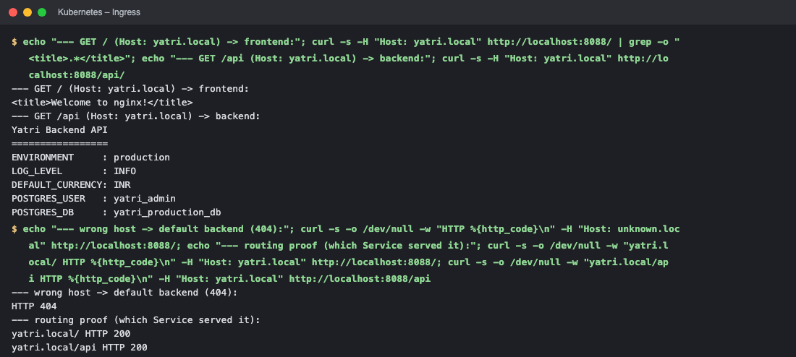
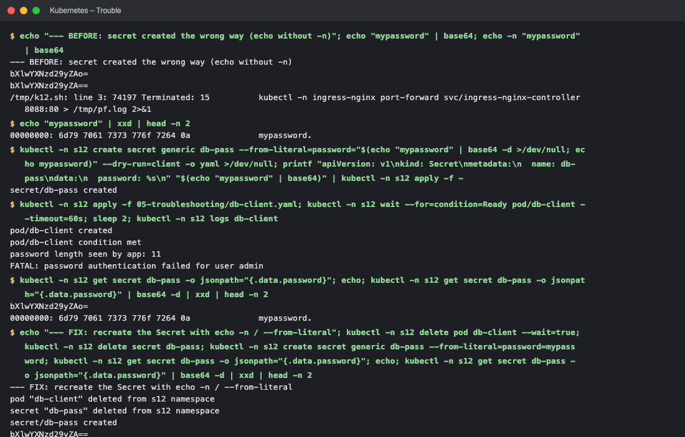
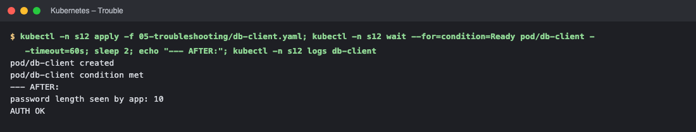
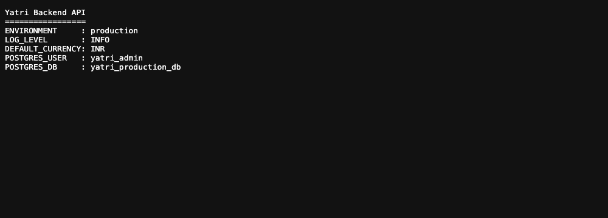

# Session 12 – Kubernetes Ingress, ConfigMaps & Secrets

Cluster: Minikube (arm64). Namespace `s12`. NGINX Ingress Controller enabled with `minikube addons enable ingress`. Manifests are in the sub-folders next to this README.

| Task | Folder |
|---|---|
| 1 ConfigMap | [`01-configmap/`](01-configmap/) |
| 2 Secret | [`02-secret/`](02-secret/) |
| 3 Ingress | [`03-ingress/`](03-ingress/) |
| 4 Ingress vs Ingress Controller | [section below](#task-4--ingress-vs-ingress-controller) |
| 5 Troubleshooting | [`05-troubleshooting/`](05-troubleshooting/) |

---
# Task 1 – ConfigMap
A **ConfigMap** stores non-sensitive configuration (key/value pairs or whole files) separately from the container image, so the same image runs in dev/test/prod.

```yaml
apiVersion: v1
kind: ConfigMap
metadata:
  name: app-config
data:
  # simple key/value pairs -> environment variables
  ENVIRONMENT: "production"
  LOG_LEVEL: "INFO"
  DEFAULT_CURRENCY: "INR"
  # a whole file -> mounted as a file
  app.properties: |
    max.booking.days=30
    feature.newUI=true
```
Two ways to inject it: **environment variables** (`envFrom` / `configMapKeyRef`, see `pod-env.yaml`) and a **mounted volume** (`pod-volume.yaml`, each key becomes a file).
```text
$ cat 01-configmap/configmap.yaml | head -n 6; kubectl -n s12 apply -f 01-configmap/configmap.yaml; kubectl -n s12 get configmap app-config; kubectl -n s12 describe configmap app-config
apiVersion: v1
kind: ConfigMap
metadata:
  name: app-config
data:
  # simple key/value pairs -> environment variables
configmap/app-config created
NAME         DATA   AGE
app-config   4      0s
Name:         app-config
Namespace:    s12
Labels:       <none>
Annotations:  <none>

Data
====
DEFAULT_CURRENCY:
----
INR

ENVIRONMENT:
----
production

LOG_LEVEL:
----
INFO

app.properties:
----
max.booking.days=30
feature.newUI=true


BinaryData
====

Events:  <none>

$ kubectl -n s12 apply -f 01-configmap/pod-env.yaml -f 01-configmap/pod-volume.yaml; kubectl -n s12 wait --for=condition=Ready pod/cm-env-pod pod/cm-volume-pod --timeout=90s
pod/cm-env-pod created
pod/cm-volume-pod created
pod/cm-env-pod condition met
pod/cm-volume-pod condition met

$ echo "--- env vars inside the container:"; kubectl -n s12 exec cm-env-pod -- env | grep -E "^(ENVIRONMENT|LOG_LEVEL|DEFAULT_CURRENCY|MY_LEVEL)="
--- env vars inside the container:
DEFAULT_CURRENCY=INR
ENVIRONMENT=production
LOG_LEVEL=INFO
MY_LEVEL=INFO

$ echo "--- files mounted from the ConfigMap:"; kubectl -n s12 exec cm-volume-pod -- ls -l /etc/config; kubectl -n s12 exec cm-volume-pod -- cat /etc/config/LOG_LEVEL; echo; kubectl -n s12 exec cm-volume-pod -- cat /etc/config/app.properties
--- files mounted from the ConfigMap:
total 0
lrwxrwxrwx    1 root     root            23 Oct  7 17:32 DEFAULT_CURRENCY -> ..data/DEFAULT_CURRENCY
lrwxrwxrwx    1 root     root            18 Oct  7 17:32 ENVIRONMENT -> ..data/ENVIRONMENT
lrwxrwxrwx    1 root     root            16 Oct  7 17:32 LOG_LEVEL -> ..data/LOG_LEVEL
lrwxrwxrwx    1 root     root            21 Oct  7 17:32 app.properties -> ..data/app.properties
INFO
max.booking.days=30
feature.newUI=true

$ echo "--- change the ConfigMap, watch the mounted file update (no Pod restart):"; kubectl -n s12 patch configmap app-config --type merge -p "{\"data\":{\"LOG_LEVEL\":\"DEBUG\"}}"; for i in $(seq 1 20); do v=$(kubectl -n s12 exec cm-volume-pod -- cat /etc/config/LOG_LEVEL); [ "$v" = DEBUG ] && break; sleep 5; done; echo "file now: $v"; echo "env var in the other Pod (needs restart): $(kubectl -n s12 exec cm-env-pod -- sh -c "echo \$LOG_LEVEL")"
--- change the ConfigMap, watch the mounted file update (no Pod restart):
configmap/app-config patched
file now: DEBUG
env var in the other Pod (needs restart): INFO
```
**Verified:** the values are visible inside the containers (env vars and files). After patching the ConfigMap, the **mounted file updated automatically** (`DEBUG`), while the **env var in the running Pod stayed `INFO`** – env vars are only read at container start, so they need a Pod restart.

---
# Task 2 – Secret
A **Secret** holds sensitive data (passwords, tokens, keys). It is injected like a ConfigMap (env var or volume).
```yaml
# DEMO VALUES ONLY (dummy credentials). Never commit real secrets to Git –
# base64 is encoding, NOT encryption. See README.
apiVersion: v1
kind: Secret
metadata:
  name: db-secret
type: Opaque
data:
  # echo -n "demo_admin" | base64
  DB_USER: ZGVtb19hZG1pbg==
  # echo -n "demo-Passw0rd" | base64
  DB_PASSWORD: ZGVtby1QYXNzdzByZA==
```
```text
$ kubectl -n s12 apply -f 02-secret/secret.yaml; kubectl -n s12 get secret db-secret; kubectl -n s12 get secret db-secret -o jsonpath="{.data}"; echo
secret/db-secret created
NAME        TYPE     DATA   AGE
db-secret   Opaque   2      0s
{"DB_PASSWORD":"ZGVtby1QYXNzdzByZA==","DB_USER":"ZGVtb19hZG1pbg=="}

$ echo "--- base64 is NOT encryption (anyone with read access can decode):"; kubectl -n s12 get secret db-secret -o jsonpath="{.data.DB_PASSWORD}" | base64 -d; echo
--- base64 is NOT encryption (anyone with read access can decode):
demo-Passw0rd

$ kubectl -n s12 apply -f 02-secret/pod-secret.yaml; kubectl -n s12 wait --for=condition=Ready pod/secret-pod --timeout=90s; kubectl -n s12 exec secret-pod -- sh -c "echo DB_USER=\$DB_USER; echo DB_PASSWORD=\$DB_PASSWORD"; kubectl -n s12 exec secret-pod -- ls -l /etc/secret; kubectl -n s12 exec secret-pod -- cat /etc/secret/DB_USER; echo
pod/secret-pod created
pod/secret-pod condition met
DB_USER=demo_admin
DB_PASSWORD=demo-Passw0rd
total 0
lrwxrwxrwx    1 root     root            18 Oct  7 17:33 DB_PASSWORD -> ..data/DB_PASSWORD
lrwxrwxrwx    1 root     root            14 Oct  7 17:33 DB_USER -> ..data/DB_USER
demo_admin

$ kubectl -n s12 describe secret db-secret
Name:         db-secret
Namespace:    s12
Labels:       <none>
Annotations:  <none>

Type:  Opaque

Data
====
DB_PASSWORD:  13 bytes
DB_USER:      10 bytes
```
**Verified:** the container sees `DB_USER` / `DB_PASSWORD`; `kubectl describe` hides the values (only byte sizes).

### Why Secrets must not be committed to Git
* Values in a Secret manifest are only **base64-encoded, not encrypted** – the demo above decodes the password with one command.
* Git history is permanent and widely copied: once pushed (even deleted later) the secret is exposed to everyone with repo access, forks, CI logs and scanners – it must then be treated as leaked and **rotated**.
* Instead: create Secrets out-of-band (`kubectl create secret …`), or keep them in a secret manager (AWS Secrets Manager, Vault) and sync via **External Secrets / CSI driver**, or commit only **encrypted** forms (**Sealed Secrets**, SOPS), enable etcd encryption at rest, restrict access with RBAC, and add secret scanning (Gitleaks – Session 17). The values in this repo are dummy demo values.

---
# Task 3 – Ingress
Full demo: frontend (nginx) + backend (Python API reading ConfigMap + Secret), a ClusterIP Service for each, and one **Ingress** with host `yatri.local`: `/` → frontend, `/api` → backend. Files: `configmap.yaml`, `secret.yaml`, `frontend.yaml`, `backend.yaml`, `ingress.yaml`.

```yaml
apiVersion: networking.k8s.io/v1
kind: Ingress
metadata:
  name: yatri-ingress
  labels:
    app: yatri-app
  annotations:
    # Do not force HTTP -> HTTPS redirect (no TLS cert in this demo)
    nginx.ingress.kubernetes.io/ssl-redirect: "false"
    # Allow regex capture groups in path rules
    nginx.ingress.kubernetes.io/use-regex: "true"
    # Strip /api prefix before forwarding to backend pods
    nginx.ingress.kubernetes.io/rewrite-target: /$2
spec:
  ingressClassName: nginx
  rules:
    - host: yatri.local
      http:
        paths:
          # Route /api/* to the backend Python service
          - path: /api(/|$)(.*)
            pathType: ImplementationSpecific
            backend:
              service:
                name: yatri-backend-service
                port:
                  number: 80
          # Route / (root) to the frontend Nginx service
          - path: /
            pathType: Prefix
            backend:
              service:
                name: yatri-frontend-service
                port:
                  number: 80
```
The Ingress is reached through the controller's Service. On macOS with the Docker driver the Minikube IP is not routable, so the controller was exposed with `kubectl port-forward svc/ingress-nginx-controller 8088:80` and the virtual host was selected with the `Host:` header (equivalent to an `/etc/hosts` entry for `yatri.local`).
```text
$ kubectl -n s12 apply -f 03-ingress/configmap.yaml -f 03-ingress/secret.yaml -f 03-ingress/frontend.yaml -f 03-ingress/backend.yaml
configmap/yatri-app-config created
secret/yatri-db-secret created
deployment.apps/yatri-frontend created
service/yatri-frontend-service created
deployment.apps/yatri-backend created
service/yatri-backend-service created

$ kubectl -n s12 rollout status deploy/yatri-frontend --timeout=120s; kubectl -n s12 rollout status deploy/yatri-backend --timeout=120s; kubectl -n s12 get pods,svc
deployment "yatri-frontend" successfully rolled out
deployment "yatri-backend" successfully rolled out
NAME                                 READY   STATUS    RESTARTS   AGE
pod/cm-env-pod                       1/1     Running   0          118s
pod/cm-volume-pod                    1/1     Running   0          118s
pod/secret-pod                       1/1     Running   0          45s
pod/yatri-backend-6c58cb99c7-q2ftt   1/1     Running   0          44s
pod/yatri-backend-6c58cb99c7-rgk5d   1/1     Running   0          44s
pod/yatri-frontend-ddcfc4b5f-p7kx9   1/1     Running   0          44s
pod/yatri-frontend-ddcfc4b5f-vr82j   1/1     Running   0          44s

NAME                             TYPE        CLUSTER-IP       EXTERNAL-IP   PORT(S)   AGE
service/yatri-backend-service    ClusterIP   10.98.97.149     <none>        80/TCP    44s
service/yatri-frontend-service   ClusterIP   10.111.159.219   <none>        80/TCP    44s

$ kubectl -n s12 apply -f 03-ingress/ingress.yaml; sleep 8; kubectl -n s12 get ingress; kubectl -n s12 describe ingress yatri-ingress | sed -n "1,25p"
ingress.networking.k8s.io/yatri-ingress created
NAME            CLASS   HOSTS         ADDRESS   PORTS   AGE
yatri-ingress   nginx   yatri.local             80      8s
Name:             yatri-ingress
Labels:           app=yatri-app
Namespace:        s12
Address:          
Ingress Class:    nginx
Default backend:  <default>
Rules:
  Host         Path  Backends
  ----         ----  --------
  yatri.local  
               /api(/|$)(.*)   yatri-backend-service:80 (10.244.0.136:5000,10.244.0.137:5000)
               /               yatri-frontend-service:80 (10.244.0.135:80,10.244.0.134:80)
Annotations:   nginx.ingress.kubernetes.io/rewrite-target: /$2
               nginx.ingress.kubernetes.io/ssl-redirect: false
               nginx.ingress.kubernetes.io/use-regex: true
Events:
  Type    Reason  Age   From                      Message
  ----    ------  ----  ----                      -------
  Normal  Sync    8s    nginx-ingress-controller  Scheduled for sync

$ echo "--- GET / (Host: yatri.local) -> frontend:"; curl -s -H "Host: yatri.local" http://localhost:8088/ | grep -o "<title>.*</title>"; echo "--- GET /api (Host: yatri.local) -> backend:"; curl -s -H "Host: yatri.local" http://localhost:8088/api/
--- GET / (Host: yatri.local) -> frontend:
<title>Welcome to nginx!</title>
--- GET /api (Host: yatri.local) -> backend:
Yatri Backend API
=================
ENVIRONMENT     : production
LOG_LEVEL       : INFO
DEFAULT_CURRENCY: INR
POSTGRES_USER   : yatri_admin
POSTGRES_DB     : yatri_production_db

$ echo "--- wrong host -> default backend (404):"; curl -s -o /dev/null -w "HTTP %{http_code}\n" -H "Host: unknown.local" http://localhost:8088/; echo "--- routing proof (which Service served it):"; curl -s -o /dev/null -w "yatri.local/ HTTP %{http_code}\n" -H "Host: yatri.local" http://localhost:8088/; curl -s -o /dev/null -w "yatri.local/api HTTP %{http_code}\n" -H "Host: yatri.local" http://localhost:8088/api
--- wrong host -> default backend (404):
HTTP 404
--- routing proof (which Service served it):
yatri.local/ HTTP 200
yatri.local/api HTTP 200
```
**Verified:** `Host: yatri.local` + `/` is served by the frontend, `/api/` by the backend (it prints values injected from the ConfigMap and Secret), and an unknown host returns the controller's default **404**.

---
# Task 4 – Ingress vs Ingress Controller

## What is Ingress?
An **Ingress** is a Kubernetes **API object** (`networking.k8s.io/v1`) that holds **HTTP/HTTPS routing rules**: which host and path should go to which Service, plus TLS settings. It is just configuration (data) – by itself it does nothing.

## What is an Ingress Controller?
An **Ingress Controller** is the **running software** (Pods) that watches Ingress objects and implements them – usually a reverse proxy/load balancer such as **NGINX**, Traefik, HAProxy, or a cloud controller (AWS ALB Controller, GCE). It receives external traffic and routes it according to the rules.

## Difference
| | Ingress | Ingress Controller |
|---|---|---|
| What | Kubernetes resource (YAML rules) | Application/Pods that enforce the rules |
| Role | *Defines* routing: host/path → Service, TLS | *Executes* routing: reverse proxy, terminates TLS |
| Created by | You (`kubectl apply -f ingress.yaml`) | Installed once (addon, Helm, manifest) |
| Without the other | Rules are ignored | Nothing to route – no rules |
| Example | `yatri.local /api → yatri-backend-service` | `ingress-nginx-controller` Pod in namespace `ingress-nginx` |

## Why both are required
Kubernetes only stores the Ingress object; it ships **no** built-in implementation. The controller turns the rules into real proxy configuration (NGINX `server`/`location` blocks) and reloads it when Ingress objects change. Together they replace one cloud LoadBalancer **per Service** with **one entry point** handling many hosts/paths, TLS, and rewrites – cheaper and easier to manage.

```text
Internet ─► LoadBalancer / NodePort ─► Ingress Controller (NGINX) ─┬─ host yatri.local, /     ─► frontend Service ─► Pods
                                              ▲ watches             └─ host yatri.local, /api ─► backend  Service ─► Pods
                                         Ingress objects (rules)
```

## Examples
```yaml
# Path based
rules:
- host: myapp.local
  http:
    paths:
    - {path: /,    pathType: Prefix, backend: {service: {name: frontend-service, port: {number: 80}}}}
    - {path: /api, pathType: Prefix, backend: {service: {name: backend-service,  port: {number: 80}}}}
# Host based: shop.example.com -> shop-svc, blog.example.com -> blog-svc
# TLS: spec.tls: [{hosts: [app.example.com], secretName: app-tls}]
```
Verification in the cluster:
```text
$ kubectl get pods -n ingress-nginx          # the controller (software)
$ kubectl get ingressclass                   # nginx  k8s.io/ingress-nginx
$ kubectl get ingress -n s12                 # the Ingress rules (config)
```

---
# Task 5 – Troubleshooting (`troubleshooting/secret-base64-gotcha`)
**Problem (from the course folder):** the database/app rejects the password with `FATAL: password authentication failed`, although the developer says *"I verified the password is correct – I created the Secret with `echo "mypassword" | base64`."*

**Investigation commands:** `kubectl logs db-client` → `kubectl get secret db-pass -o jsonpath='{.data.password}' | base64 -d | xxd` → compare the byte length with the expected password.

**Root cause:** plain `echo` appends a newline (`0a`). The Secret value is therefore `mypassword\n` (11 bytes, base64 `…Ao=`) instead of `mypassword` (10 bytes, base64 `…A==`).

**Fix:** use `echo -n` (or `kubectl create secret generic --from-literal=…`, `printf`) and recreate the Secret and Pod.

```text
$ echo "--- BEFORE: secret created the wrong way (echo without -n)"; echo "mypassword" | base64; echo -n "mypassword" | base64
--- BEFORE: secret created the wrong way (echo without -n)
bXlwYXNzd29yZAo=
bXlwYXNzd29yZA==

$ echo "mypassword" | xxd | head -n 2
00000000: 6d79 7061 7373 776f 7264 0a              mypassword.

$ printf '...data:
  password: %s
' "$(echo "mypassword" | base64)" | kubectl -n s12 apply -f -     # WRONG: echo adds a newline
secret/db-pass created

$ kubectl -n s12 apply -f 05-troubleshooting/db-client.yaml; kubectl -n s12 wait --for=condition=Ready pod/db-client --timeout=60s; sleep 2; kubectl -n s12 logs db-client
pod/db-client created
pod/db-client condition met
password length seen by app: 11
FATAL: password authentication failed for user admin

$ kubectl -n s12 get secret db-pass -o jsonpath="{.data.password}"; echo; kubectl -n s12 get secret db-pass -o jsonpath="{.data.password}" | base64 -d | xxd | head -n 2
bXlwYXNzd29yZAo=
00000000: 6d79 7061 7373 776f 7264 0a              mypassword.

$ echo "--- FIX: recreate the Secret with echo -n / --from-literal"; kubectl -n s12 delete pod db-client --wait=true; kubectl -n s12 delete secret db-pass; kubectl -n s12 create secret generic db-pass --from-literal=password=mypassword; kubectl -n s12 get secret db-pass -o jsonpath="{.data.password}"; echo; kubectl -n s12 get secret db-pass -o jsonpath="{.data.password}" | base64 -d | xxd | head -n 2
--- FIX: recreate the Secret with echo -n / --from-literal
pod "db-client" deleted from s12 namespace
secret "db-pass" deleted from s12 namespace
secret/db-pass created
bXlwYXNzd29yZA==
00000000: 6d79 7061 7373 776f 7264                 mypassword

$ kubectl -n s12 apply -f 05-troubleshooting/db-client.yaml; kubectl -n s12 wait --for=condition=Ready pod/db-client --timeout=60s; sleep 2; echo "--- AFTER:"; kubectl -n s12 logs db-client
pod/db-client created
pod/db-client condition met
--- AFTER:
password length seen by app: 10
AUTH OK
```
| | Before | After |
|---|---|---|
| base64 value | `bXlwYXNzd29yZAo=` | `bXlwYXNzd29yZA==` |
| hex of decoded value | `…7264 0a` (trailing newline) | `…7264` |
| length seen by the app | 11 | 10 |
| result | `FATAL: password authentication failed` | `AUTH OK` |

---
Cleanup: `kubectl delete ns s12` (the NGINX ingress addon was left enabled).

<!-- screenshots:start -->

## Screenshots (terminal output of the live run)

> Each image shows the real output of the commands run for this task (rendered from the captured terminal output of the actual run).

### Configmap



*Commands: `cat 01-configmap/configmap.yaml | head -n 6`*



*Commands: `kubectl -n s12 apply -f 01-configmap/pod-env.yaml -f 01-configmap/pod-` · `echo "--- env vars inside the container:"` · `echo "--- files mounted from the ConfigMap:"` · `echo "--- change the ConfigMap, watch the mounted file update (no Pod `*

### Secret



*Commands: `kubectl -n s12 apply -f 02-secret/secret.yaml` · `echo "--- base64 is NOT encryption (anyone with read access can decode` · `kubectl -n s12 apply -f 02-secret/pod-secret.yaml` · `kubectl -n s12 describe secret db-secret`*

### Ingress



*Commands: `kubectl -n s12 apply -f 03-ingress/configmap.yaml -f 03-ingress/secret` · `kubectl -n s12 rollout status deploy/yatri-frontend --timeout=120s`*



*Commands: `kubectl -n s12 apply -f 03-ingress/ingress.yaml`*



*Commands: `echo "--- GET / (Host: yatri.local) -> frontend:"` · `echo "--- wrong host -> default backend (404):"`*

### Trouble



*Commands: `echo "--- BEFORE: secret created the wrong way (echo without -n)"` · `echo "mypassword" | xxd | head -n 2` · `kubectl -n s12 create secret generic db-pass --from-literal=password="` · `kubectl -n s12 apply -f 05-troubleshooting/db-client.yaml`*



*Commands: `kubectl -n s12 apply -f 05-troubleshooting/db-client.yaml`*

<!-- screenshots:end -->

## Screenshots (browser)

**Ingress: http://yatri.local/ → frontend Service (nginx)**


**Ingress: http://yatri.local/api/ → backend Service (shows values injected from ConfigMap and Secret)**



<!-- web:end -->
