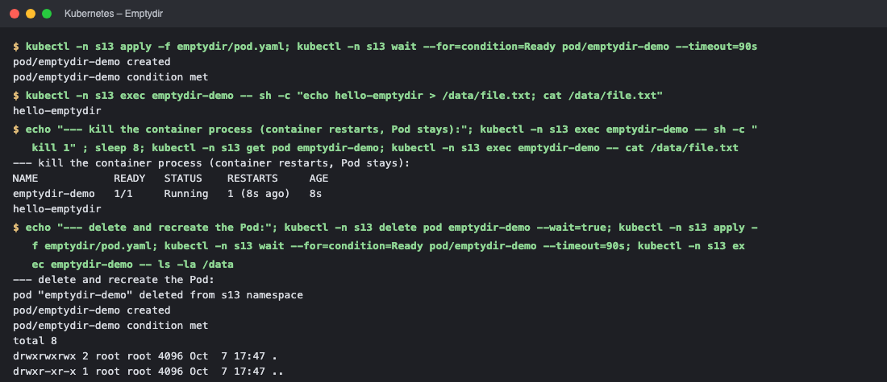
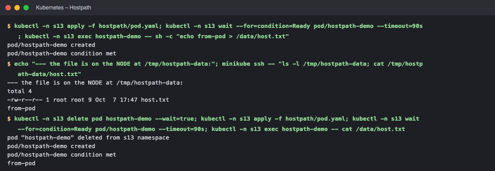
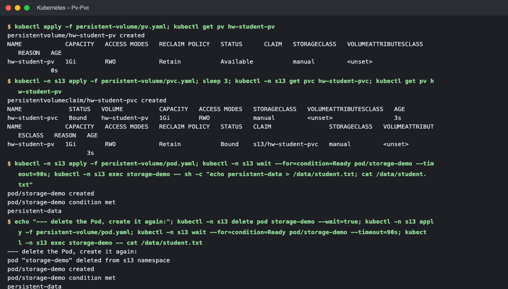
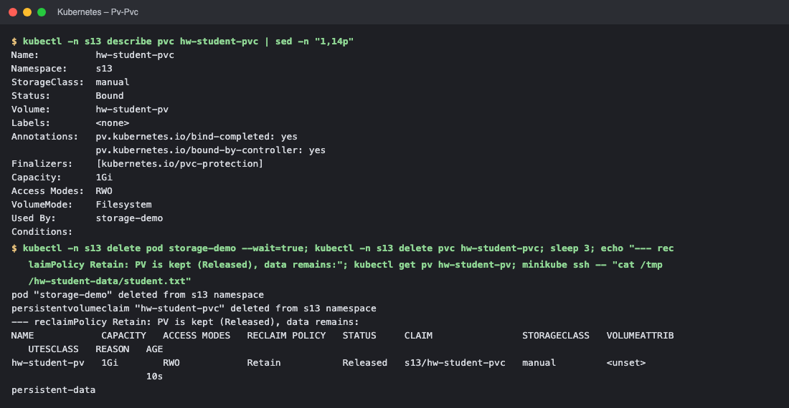
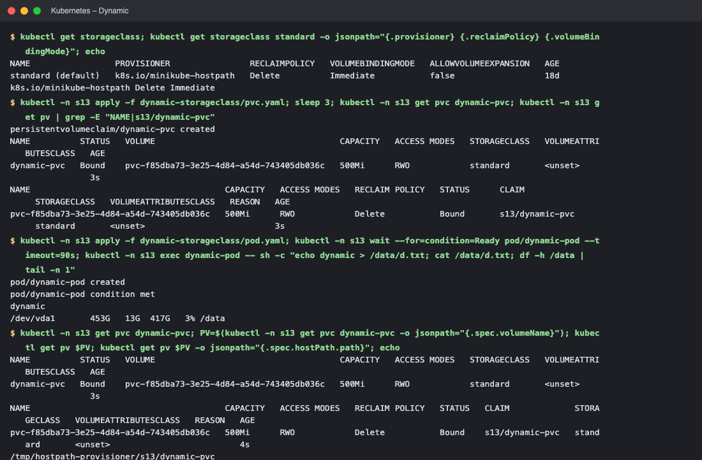
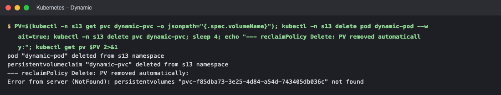

# Kubernetes Volumes (Session 13 – Task 1)

Containers have an **ephemeral filesystem**: when a container restarts, its files are lost. Kubernetes **volumes** give Pods storage that outlives a container (and, for persistent types, outlives the Pod). All examples below were executed on Minikube in namespace `s13`.

| Volume type | Lifetime | Where data lives | Typical use |
|---|---|---|---|
| [`emptyDir`](#1-emptydir) | life of the **Pod** | node disk/RAM, created empty with the Pod | scratch space, cache, sharing files between containers of one Pod |
| [`hostPath`](#2-hostpath) | life of the **node** | a directory on the node | node agents, logs, dev/test only (ties Pod to a node, security risk) |
| [PersistentVolume + PVC](#3-persistentvolume--persistentvolumeclaim) | independent of Pods | admin-provided storage (NFS, EBS, disk…) | databases, uploads – data must survive Pod deletion |
| [StorageClass + dynamic provisioning](#4-storageclass--dynamic-provisioning) | per `reclaimPolicy` | volume created on demand | normal cloud/prod usage |

---
## 1. emptyDir
Created empty when the Pod starts on a node and deleted when the Pod is removed. Survives **container** restarts but not **Pod** deletion.
```yaml
apiVersion: v1
kind: Pod
metadata:
  name: emptydir-demo
spec:
  containers:
    - name: app
      image: nginx:1.27
      volumeMounts:
        - name: app-storage
          mountPath: /data
  volumes:
    - name: app-storage
      emptyDir: {}
```
```text
$ kubectl -n s13 apply -f emptydir/pod.yaml; kubectl -n s13 wait --for=condition=Ready pod/emptydir-demo --timeout=90s
pod/emptydir-demo created
pod/emptydir-demo condition met

$ kubectl -n s13 exec emptydir-demo -- sh -c "echo hello-emptydir > /data/file.txt; cat /data/file.txt"
hello-emptydir

$ echo "--- kill the container process (container restarts, Pod stays):"; kubectl -n s13 exec emptydir-demo -- sh -c "kill 1" ; sleep 8; kubectl -n s13 get pod emptydir-demo; kubectl -n s13 exec emptydir-demo -- cat /data/file.txt
--- kill the container process (container restarts, Pod stays):
NAME            READY   STATUS    RESTARTS     AGE
emptydir-demo   1/1     Running   1 (8s ago)   8s
hello-emptydir

$ echo "--- delete and recreate the Pod:"; kubectl -n s13 delete pod emptydir-demo --wait=true; kubectl -n s13 apply -f emptydir/pod.yaml; kubectl -n s13 wait --for=condition=Ready pod/emptydir-demo --timeout=90s; kubectl -n s13 exec emptydir-demo -- ls -la /data
--- delete and recreate the Pod:
pod "emptydir-demo" deleted from s13 namespace
pod/emptydir-demo created
pod/emptydir-demo condition met
total 8
drwxrwxrwx 2 root root 4096 Oct  7 17:47 .
drwxr-xr-x 1 root root 4096 Oct  7 17:47 ..
```
**Result:** the file survived the container restart (`RESTARTS 1`) but the **recreated Pod's `/data` was empty**.

## 2. hostPath
Mounts a path from the **node's** filesystem into the Pod (`type: DirectoryOrCreate` creates it if missing).
```yaml
apiVersion: v1
kind: Pod
metadata:
  name: hostpath-demo
spec:
  containers:
    - name: app
      image: nginx:1.27
      volumeMounts:
        - name: host-storage
          mountPath: /data
  volumes:
    - name: host-storage
      hostPath:
        path: /tmp/hostpath-data
        type: DirectoryOrCreate
```
```text
$ kubectl -n s13 apply -f hostpath/pod.yaml; kubectl -n s13 wait --for=condition=Ready pod/hostpath-demo --timeout=90s; kubectl -n s13 exec hostpath-demo -- sh -c "echo from-pod > /data/host.txt"
pod/hostpath-demo created
pod/hostpath-demo condition met

$ echo "--- the file is on the NODE at /tmp/hostpath-data:"; minikube ssh -- "ls -l /tmp/hostpath-data; cat /tmp/hostpath-data/host.txt"
--- the file is on the NODE at /tmp/hostpath-data:
total 4
-rw-r--r-- 1 root root 9 Oct  7 17:47 host.txt
from-pod

$ kubectl -n s13 delete pod hostpath-demo --wait=true; kubectl -n s13 apply -f hostpath/pod.yaml; kubectl -n s13 wait --for=condition=Ready pod/hostpath-demo --timeout=90s; kubectl -n s13 exec hostpath-demo -- cat /data/host.txt
pod "hostpath-demo" deleted from s13 namespace
pod/hostpath-demo created
pod/hostpath-demo condition met
from-pod
```
**Result:** data exists on the node (`/tmp/hostpath-data`) and a **new Pod on the same node sees it**. Drawbacks: if the Pod lands on another node the data is not there, and hostPath exposes the node filesystem (avoid in production).

## 3. PersistentVolume & PersistentVolumeClaim
* **PersistentVolume (PV)** – a piece of storage in the cluster (cluster-scoped, provided by an admin or dynamically).
* **PersistentVolumeClaim (PVC)** – a *request* for storage by a user/namespace (size, access mode). Kubernetes **binds** a PVC to a matching PV; Pods reference the **PVC**, never the PV directly – this decouples developers from storage details.
* Access modes: `ReadWriteOnce` (one node), `ReadOnlyMany`, `ReadWriteMany`, `ReadWriteOncePod`. Reclaim policy: `Retain` (keep data) / `Delete` (remove volume).
```yaml
# pv.yaml
apiVersion: v1
kind: PersistentVolume
metadata:
  name: hw-student-pv
spec:
  capacity:
    storage: 1Gi
  accessModes:
    - ReadWriteOnce
  persistentVolumeReclaimPolicy: Retain
  storageClassName: manual
  hostPath:
    path: /tmp/hw-student-data
---
# pvc.yaml
apiVersion: v1
kind: PersistentVolumeClaim
metadata:
  name: hw-student-pvc
spec:
  storageClassName: manual   # must match the PV, otherwise the default StorageClass provisions a new volume
  accessModes:
    - ReadWriteOnce
  resources:
    requests:
      storage: 500Mi
---
# pod.yaml
apiVersion: v1
kind: Pod
metadata:
  name: storage-demo
spec:
  containers:
    - name: app
      image: nginx:1.27
      volumeMounts:
        - name: persistent-storage
          mountPath: /data
  volumes:
    - name: persistent-storage
      persistentVolumeClaim:
        claimName: hw-student-pvc
```
> **Gotcha:** the original PVC had no `storageClassName`; Minikube's *default* StorageClass would then provision a **new dynamic volume** instead of binding to the manual PV. Setting `storageClassName: manual` on both PV and PVC forces the static binding.

```text
$ kubectl apply -f persistent-volume/pv.yaml; kubectl get pv hw-student-pv
persistentvolume/hw-student-pv created
NAME            CAPACITY   ACCESS MODES   RECLAIM POLICY   STATUS      CLAIM   STORAGECLASS   VOLUMEATTRIBUTESCLASS   REASON   AGE
hw-student-pv   1Gi        RWO            Retain           Available           manual         <unset>                          0s

$ kubectl -n s13 apply -f persistent-volume/pvc.yaml; sleep 3; kubectl -n s13 get pvc hw-student-pvc; kubectl get pv hw-student-pv
persistentvolumeclaim/hw-student-pvc created
NAME             STATUS   VOLUME          CAPACITY   ACCESS MODES   STORAGECLASS   VOLUMEATTRIBUTESCLASS   AGE
hw-student-pvc   Bound    hw-student-pv   1Gi        RWO            manual         <unset>                 3s
NAME            CAPACITY   ACCESS MODES   RECLAIM POLICY   STATUS   CLAIM                STORAGECLASS   VOLUMEATTRIBUTESCLASS   REASON   AGE
hw-student-pv   1Gi        RWO            Retain           Bound    s13/hw-student-pvc   manual         <unset>                          3s

$ kubectl -n s13 apply -f persistent-volume/pod.yaml; kubectl -n s13 wait --for=condition=Ready pod/storage-demo --timeout=90s; kubectl -n s13 exec storage-demo -- sh -c "echo persistent-data > /data/student.txt; cat /data/student.txt"
pod/storage-demo created
pod/storage-demo condition met
persistent-data

$ echo "--- delete the Pod, create it again:"; kubectl -n s13 delete pod storage-demo --wait=true; kubectl -n s13 apply -f persistent-volume/pod.yaml; kubectl -n s13 wait --for=condition=Ready pod/storage-demo --timeout=90s; kubectl -n s13 exec storage-demo -- cat /data/student.txt
--- delete the Pod, create it again:
pod "storage-demo" deleted from s13 namespace
pod/storage-demo created
pod/storage-demo condition met
persistent-data

$ kubectl -n s13 describe pvc hw-student-pvc | sed -n "1,14p"
Name:          hw-student-pvc
Namespace:     s13
StorageClass:  manual
Status:        Bound
Volume:        hw-student-pv
Labels:        <none>
Annotations:   pv.kubernetes.io/bind-completed: yes
               pv.kubernetes.io/bound-by-controller: yes
Finalizers:    [kubernetes.io/pvc-protection]
Capacity:      1Gi
Access Modes:  RWO
VolumeMode:    Filesystem
Used By:       storage-demo
Conditions:

$ kubectl -n s13 delete pod storage-demo --wait=true; kubectl -n s13 delete pvc hw-student-pvc; sleep 3; echo "--- reclaimPolicy Retain: PV is kept (Released), data remains:"; kubectl get pv hw-student-pv; minikube ssh -- "cat /tmp/hw-student-data/student.txt"
pod "storage-demo" deleted from s13 namespace
persistentvolumeclaim "hw-student-pvc" deleted from s13 namespace
--- reclaimPolicy Retain: PV is kept (Released), data remains:
NAME            CAPACITY   ACCESS MODES   RECLAIM POLICY   STATUS     CLAIM                STORAGECLASS   VOLUMEATTRIBUTESCLASS   REASON   AGE
hw-student-pv   1Gi        RWO            Retain           Released   s13/hw-student-pvc   manual         <unset>                          10s
persistent-data
```
**Result:** PVC `Bound` to the PV; the file survived **deleting and recreating the Pod**; after deleting the PVC the PV became `Released` (policy `Retain`) and the data stayed on disk.

## 4. StorageClass & dynamic provisioning
A **StorageClass** describes a *kind* of storage (provisioner, reclaim policy, binding mode, parameters – e.g. AWS `gp3`, SSD vs HDD). With **dynamic provisioning** an admin does not pre-create PVs: when a PVC references a StorageClass, the provisioner **creates the PV (and underlying disk) automatically**, and removes it when the PVC is deleted (policy `Delete`). Minikube ships StorageClass `standard` (`k8s.io/minikube-hostpath`) as the default.
```yaml
apiVersion: v1
kind: PersistentVolumeClaim
metadata:
  name: dynamic-pvc
spec:
  accessModes:
    - ReadWriteOnce
  storageClassName: standard
  resources:
    requests:
      storage: 500Mi
```
```text
$ kubectl get storageclass; kubectl get storageclass standard -o jsonpath="{.provisioner} {.reclaimPolicy} {.volumeBindingMode}"; echo
NAME                 PROVISIONER                RECLAIMPOLICY   VOLUMEBINDINGMODE   ALLOWVOLUMEEXPANSION   AGE
standard (default)   k8s.io/minikube-hostpath   Delete          Immediate           false                  18d
k8s.io/minikube-hostpath Delete Immediate

$ kubectl -n s13 apply -f dynamic-storageclass/pvc.yaml; sleep 3; kubectl -n s13 get pvc dynamic-pvc; kubectl -n s13 get pv | grep -E "NAME|s13/dynamic-pvc"
persistentvolumeclaim/dynamic-pvc created
NAME          STATUS   VOLUME                                     CAPACITY   ACCESS MODES   STORAGECLASS   VOLUMEATTRIBUTESCLASS   AGE
dynamic-pvc   Bound    pvc-f85dba73-3e25-4d84-a54d-743405db036c   500Mi      RWO            standard       <unset>                 3s
NAME                                       CAPACITY   ACCESS MODES   RECLAIM POLICY   STATUS      CLAIM                 STORAGECLASS   VOLUMEATTRIBUTESCLASS   REASON   AGE
pvc-f85dba73-3e25-4d84-a54d-743405db036c   500Mi      RWO            Delete           Bound       s13/dynamic-pvc       standard       <unset>                          3s

$ kubectl -n s13 apply -f dynamic-storageclass/pod.yaml; kubectl -n s13 wait --for=condition=Ready pod/dynamic-pod --timeout=90s; kubectl -n s13 exec dynamic-pod -- sh -c "echo dynamic > /data/d.txt; cat /data/d.txt; df -h /data | tail -n 1"
pod/dynamic-pod created
pod/dynamic-pod condition met
dynamic
/dev/vda1       453G   13G  417G   3% /data

$ kubectl -n s13 get pvc dynamic-pvc; PV=$(kubectl -n s13 get pvc dynamic-pvc -o jsonpath="{.spec.volumeName}"); kubectl get pv $PV; kubectl get pv $PV -o jsonpath="{.spec.hostPath.path}"; echo
NAME          STATUS   VOLUME                                     CAPACITY   ACCESS MODES   STORAGECLASS   VOLUMEATTRIBUTESCLASS   AGE
dynamic-pvc   Bound    pvc-f85dba73-3e25-4d84-a54d-743405db036c   500Mi      RWO            standard       <unset>                 3s
NAME                                       CAPACITY   ACCESS MODES   RECLAIM POLICY   STATUS   CLAIM             STORAGECLASS   VOLUMEATTRIBUTESCLASS   REASON   AGE
pvc-f85dba73-3e25-4d84-a54d-743405db036c   500Mi      RWO            Delete           Bound    s13/dynamic-pvc   standard       <unset>                          4s
/tmp/hostpath-provisioner/s13/dynamic-pvc

$ PV=$(kubectl -n s13 get pvc dynamic-pvc -o jsonpath="{.spec.volumeName}"); kubectl -n s13 delete pod dynamic-pod --wait=true; kubectl -n s13 delete pvc dynamic-pvc; sleep 4; echo "--- reclaimPolicy Delete: PV removed automatically:"; kubectl get pv $PV 2>&1
pod "dynamic-pod" deleted from s13 namespace
persistentvolumeclaim "dynamic-pvc" deleted from s13 namespace
--- reclaimPolicy Delete: PV removed automatically:
Error from server (NotFound): persistentvolumes "pvc-f85dba73-3e25-4d84-a54d-743405db036c" not found
```
**Result:** creating only the PVC produced a PV automatically (`pvc-…`, policy `Delete`); the Pod could use it; deleting the PVC removed the PV (`NotFound`).

## Summary / when to use what
```
Need temporary scratch space?            → emptyDir
Need node files (logs, agents)?          → hostPath (carefully)
Need data to survive Pod/node restarts?  → PVC (+ PV or StorageClass)
Cloud cluster / many apps?               → StorageClass with dynamic provisioning (+ StatefulSet volumeClaimTemplates for databases)
```

<!-- screenshots:start -->

## Screenshots (terminal output of the live run)

> Each image shows the real output of the commands run for this task (rendered from the captured terminal output of the actual run).

### Emptydir



*Commands: `kubectl -n s13 apply -f emptydir/pod.yaml` · `kubectl -n s13 exec emptydir-demo -- sh -c "echo hello-emptydir > /dat` · `echo "--- kill the container process (container restarts, Pod stays):"` · `echo "--- delete and recreate the Pod:"`*

### Hostpath



*Commands: `kubectl -n s13 apply -f hostpath/pod.yaml` · `echo "--- the file is on the NODE at /tmp/hostpath-data:"` · `kubectl -n s13 delete pod hostpath-demo --wait=true`*

### Pv-Pvc



*Commands: `kubectl apply -f persistent-volume/pv.yaml` · `kubectl -n s13 apply -f persistent-volume/pvc.yaml` · `kubectl -n s13 apply -f persistent-volume/pod.yaml` · `echo "--- delete the Pod, create it again:"`*



*Commands: `kubectl -n s13 describe pvc hw-student-pvc | sed -n "1,14p"` · `kubectl -n s13 delete pod storage-demo --wait=true`*

### Dynamic



*Commands: `kubectl get storageclass` · `kubectl -n s13 apply -f dynamic-storageclass/pvc.yaml` · `kubectl -n s13 apply -f dynamic-storageclass/pod.yaml` · `kubectl -n s13 get pvc dynamic-pvc`*



*Commands: `PV=$(kubectl -n s13 get pvc dynamic-pvc -o jsonpath="{.spec.volumeName`*

<!-- screenshots:end -->
