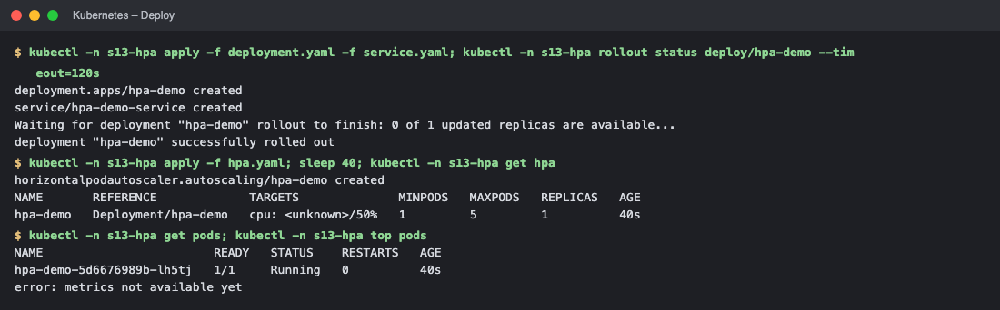
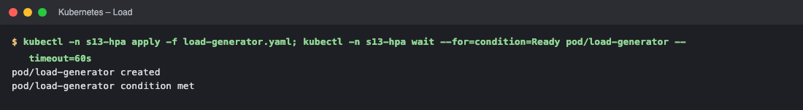
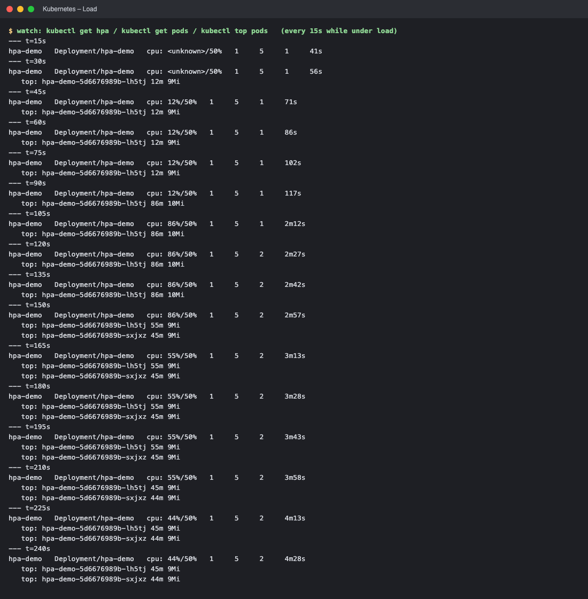
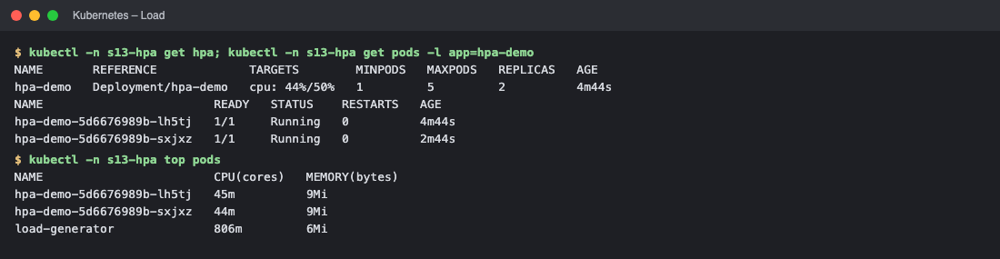
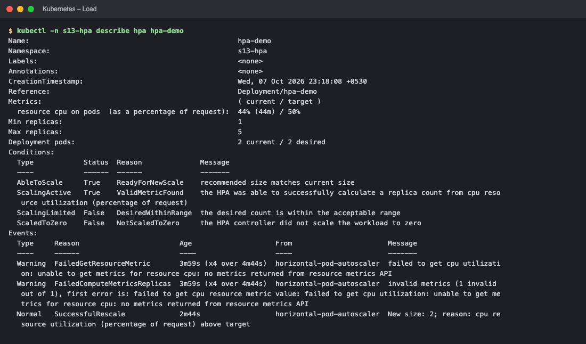
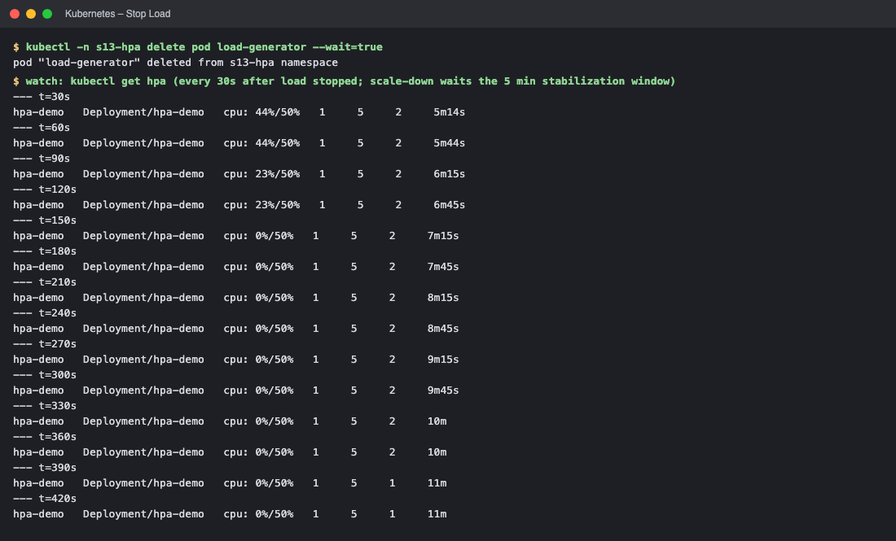
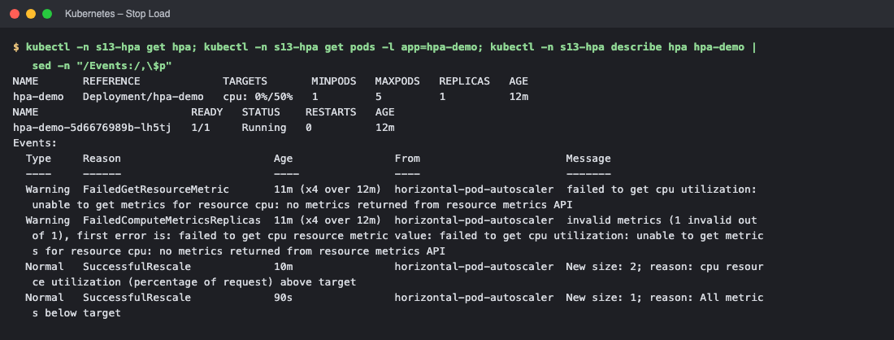

# HPA Hands-on (Session 13 – Task 2)

**Horizontal Pod Autoscaler (HPA)** automatically changes the number of Pod replicas of a Deployment based on observed metrics (here **CPU utilisation as a % of the Pod's CPU *request***). It requires **metrics-server** (`kubectl top`), and the Pods **must define `resources.requests.cpu`**, otherwise utilisation cannot be computed.

Algorithm: `desiredReplicas = ceil( currentReplicas × currentUtilisation / targetUtilisation )`, bounded by `minReplicas`/`maxReplicas`. Scale-up is quick; scale-down waits a **5-minute stabilisation window** to avoid flapping.

Files in this folder: [`deployment.yaml`](deployment.yaml), [`service.yaml`](service.yaml), [`hpa.yaml`](hpa.yaml), [`load-generator.yaml`](load-generator.yaml). Namespace used: `s13-hpa`.

```yaml
# deployment.yaml (requests.cpu: 100m is what the HPA percentage is based on)
apiVersion: apps/v1
kind: Deployment
metadata:
  name: hpa-demo
spec:
  replicas: 1
  selector:
    matchLabels:
      app: hpa-demo
  template:
    metadata:
      labels:
        app: hpa-demo
    spec:
      containers:
        - name: nginx
          image: nginx:1.27
          resources:
            requests:
              cpu: 100m
            limits:
              cpu: 200m
          ports:
            - containerPort: 80
---
# hpa.yaml – target 50 % CPU, 1..5 replicas
apiVersion: autoscaling/v2
kind: HorizontalPodAutoscaler
metadata:
  name: hpa-demo
spec:
  scaleTargetRef:
    apiVersion: apps/v1
    kind: Deployment
    name: hpa-demo
  minReplicas: 1
  maxReplicas: 5
  metrics:
    - type: Resource
      resource:
        name: cpu
        target:
          type: Utilization
          averageUtilization: 50
---
# load-generator.yaml – a Pod that calls the Service in a tight loop
# In-cluster load generator: hammers the Service in a loop to raise CPU usage
apiVersion: v1
kind: Pod
metadata:
  name: load-generator
spec:
  restartPolicy: Never
  containers:
    - name: busybox
      image: busybox:1.36
      command: ["/bin/sh", "-c", "while true; do wget -q -O- http://hpa-demo-service > /dev/null; done"]
```

## Step 1 – Deploy the application, create the HPA, verify
```bash
kubectl apply -f deployment.yaml -f service.yaml
kubectl apply -f hpa.yaml
kubectl get hpa
kubectl get pods
kubectl top pods
```
```text
$ kubectl -n s13-hpa apply -f deployment.yaml -f service.yaml; kubectl -n s13-hpa rollout status deploy/hpa-demo --timeout=120s
deployment.apps/hpa-demo created
service/hpa-demo-service created
Waiting for deployment "hpa-demo" rollout to finish: 0 of 1 updated replicas are available...
deployment "hpa-demo" successfully rolled out

$ kubectl -n s13-hpa apply -f hpa.yaml; sleep 40; kubectl -n s13-hpa get hpa
horizontalpodautoscaler.autoscaling/hpa-demo created
NAME       REFERENCE             TARGETS              MINPODS   MAXPODS   REPLICAS   AGE
hpa-demo   Deployment/hpa-demo   cpu: <unknown>/50%   1         5         1          40s

$ kubectl -n s13-hpa get pods; kubectl -n s13-hpa top pods
NAME                        READY   STATUS    RESTARTS   AGE
hpa-demo-5d6676989b-lh5tj   1/1     Running   0          40s
error: metrics not available yet
```
> Right after creation the HPA shows `cpu: <unknown>/50%` and `kubectl top` says *metrics not available yet*: metrics-server needs ~30–60 s to scrape a brand-new Pod. This is normal.

## Step 2 – Deploy the load generator and watch CPU + scaling
```bash
kubectl apply -f load-generator.yaml
kubectl get hpa -w          # in another terminal
kubectl get pods
kubectl top pods
kubectl describe hpa hpa-demo
```
Samples were taken every 15 s:
```text
$ kubectl -n s13-hpa apply -f load-generator.yaml; kubectl -n s13-hpa wait --for=condition=Ready pod/load-generator --timeout=60s
pod/load-generator created
pod/load-generator condition met

$ watch: kubectl get hpa / kubectl get pods / kubectl top pods   (every 15s while under load)
--- t=15s
hpa-demo   Deployment/hpa-demo   cpu: <unknown>/50%   1     5     1     41s
   hpa-demo-5d6676989b-lh5tj 1/1 Running
error: metrics not available yet
--- t=30s
hpa-demo   Deployment/hpa-demo   cpu: <unknown>/50%   1     5     1     56s
   hpa-demo-5d6676989b-lh5tj 1/1 Running
   top: hpa-demo-5d6676989b-lh5tj 12m 9Mi
--- t=45s
hpa-demo   Deployment/hpa-demo   cpu: 12%/50%   1     5     1     71s
   hpa-demo-5d6676989b-lh5tj 1/1 Running
   top: hpa-demo-5d6676989b-lh5tj 12m 9Mi
--- t=60s
hpa-demo   Deployment/hpa-demo   cpu: 12%/50%   1     5     1     86s
   hpa-demo-5d6676989b-lh5tj 1/1 Running
   top: hpa-demo-5d6676989b-lh5tj 12m 9Mi
--- t=75s
hpa-demo   Deployment/hpa-demo   cpu: 12%/50%   1     5     1     102s
   hpa-demo-5d6676989b-lh5tj 1/1 Running
   top: hpa-demo-5d6676989b-lh5tj 12m 9Mi
--- t=90s
hpa-demo   Deployment/hpa-demo   cpu: 12%/50%   1     5     1     117s
   hpa-demo-5d6676989b-lh5tj 1/1 Running
   top: hpa-demo-5d6676989b-lh5tj 86m 10Mi
--- t=105s
hpa-demo   Deployment/hpa-demo   cpu: 86%/50%   1     5     1     2m12s
   hpa-demo-5d6676989b-lh5tj 1/1 Running
   hpa-demo-5d6676989b-sxjxz 1/1 Running
   top: hpa-demo-5d6676989b-lh5tj 86m 10Mi
--- t=120s
hpa-demo   Deployment/hpa-demo   cpu: 86%/50%   1     5     2     2m27s
   hpa-demo-5d6676989b-lh5tj 1/1 Running
   hpa-demo-5d6676989b-sxjxz 1/1 Running
   top: hpa-demo-5d6676989b-lh5tj 86m 10Mi
--- t=135s
hpa-demo   Deployment/hpa-demo   cpu: 86%/50%   1     5     2     2m42s
   hpa-demo-5d6676989b-lh5tj 1/1 Running
   hpa-demo-5d6676989b-sxjxz 1/1 Running
   top: hpa-demo-5d6676989b-lh5tj 86m 10Mi
--- t=150s
hpa-demo   Deployment/hpa-demo   cpu: 86%/50%   1     5     2     2m57s
   hpa-demo-5d6676989b-lh5tj 1/1 Running
   hpa-demo-5d6676989b-sxjxz 1/1 Running
   top: hpa-demo-5d6676989b-lh5tj 55m 9Mi
   top: hpa-demo-5d6676989b-sxjxz 45m 9Mi
--- t=165s
hpa-demo   Deployment/hpa-demo   cpu: 55%/50%   1     5     2     3m13s
   hpa-demo-5d6676989b-lh5tj 1/1 Running
   hpa-demo-5d6676989b-sxjxz 1/1 Running
   top: hpa-demo-5d6676989b-lh5tj 55m 9Mi
   top: hpa-demo-5d6676989b-sxjxz 45m 9Mi
--- t=180s
hpa-demo   Deployment/hpa-demo   cpu: 55%/50%   1     5     2     3m28s
   hpa-demo-5d6676989b-lh5tj 1/1 Running
   hpa-demo-5d6676989b-sxjxz 1/1 Running
   top: hpa-demo-5d6676989b-lh5tj 55m 9Mi
   top: hpa-demo-5d6676989b-sxjxz 45m 9Mi
--- t=195s
hpa-demo   Deployment/hpa-demo   cpu: 55%/50%   1     5     2     3m43s
   hpa-demo-5d6676989b-lh5tj 1/1 Running
   hpa-demo-5d6676989b-sxjxz 1/1 Running
   top: hpa-demo-5d6676989b-lh5tj 55m 9Mi
   top: hpa-demo-5d6676989b-sxjxz 45m 9Mi
--- t=210s
hpa-demo   Deployment/hpa-demo   cpu: 55%/50%   1     5     2     3m58s
   hpa-demo-5d6676989b-lh5tj 1/1 Running
   hpa-demo-5d6676989b-sxjxz 1/1 Running
   top: hpa-demo-5d6676989b-lh5tj 45m 9Mi
   top: hpa-demo-5d6676989b-sxjxz 44m 9Mi
--- t=225s
hpa-demo   Deployment/hpa-demo   cpu: 44%/50%   1     5     2     4m13s
   hpa-demo-5d6676989b-lh5tj 1/1 Running
   hpa-demo-5d6676989b-sxjxz 1/1 Running
   top: hpa-demo-5d6676989b-lh5tj 45m 9Mi
   top: hpa-demo-5d6676989b-sxjxz 44m 9Mi
--- t=240s
hpa-demo   Deployment/hpa-demo   cpu: 44%/50%   1     5     2     4m28s
   hpa-demo-5d6676989b-lh5tj 1/1 Running
   hpa-demo-5d6676989b-sxjxz 1/1 Running
   top: hpa-demo-5d6676989b-lh5tj 45m 9Mi
   top: hpa-demo-5d6676989b-sxjxz 44m 9Mi

$ kubectl -n s13-hpa get hpa; kubectl -n s13-hpa get pods -l app=hpa-demo
NAME       REFERENCE             TARGETS        MINPODS   MAXPODS   REPLICAS   AGE
hpa-demo   Deployment/hpa-demo   cpu: 44%/50%   1         5         2          4m44s
NAME                        READY   STATUS    RESTARTS   AGE
hpa-demo-5d6676989b-lh5tj   1/1     Running   0          4m44s
hpa-demo-5d6676989b-sxjxz   1/1     Running   0          2m44s

$ kubectl -n s13-hpa top pods
NAME                        CPU(cores)   MEMORY(bytes)   
hpa-demo-5d6676989b-lh5tj   45m          9Mi             
hpa-demo-5d6676989b-sxjxz   44m          9Mi             
load-generator              806m         6Mi             

$ kubectl -n s13-hpa describe hpa hpa-demo
Name:                                                  hpa-demo
Namespace:                                             s13-hpa
Labels:                                                <none>
Annotations:                                           <none>
CreationTimestamp:                                     Wed, 07 Oct 2026 23:18:08 +0530
Reference:                                             Deployment/hpa-demo
Metrics:                                               ( current / target )
  resource cpu on pods  (as a percentage of request):  44% (44m) / 50%
Min replicas:                                          1
Max replicas:                                          5
Deployment pods:                                       2 current / 2 desired
Conditions:
  Type            Status  Reason              Message
  ----            ------  ------              -------
  AbleToScale     True    ReadyForNewScale    recommended size matches current size
  ScalingActive   True    ValidMetricFound    the HPA was able to successfully calculate a replica count from cpu resource utilization (percentage of request)
  ScalingLimited  False   DesiredWithinRange  the desired count is within the acceptable range
  ScaledToZero    False   NotScaledToZero     the HPA controller did not scale the workload to zero
Events:
  Type     Reason                        Age                    From                       Message
  ----     ------                        ----                   ----                       -------
  Warning  FailedGetResourceMetric       3m59s (x4 over 4m44s)  horizontal-pod-autoscaler  failed to get cpu utilization: unable to get metrics for resource cpu: no metrics returned from resource metrics API
  Warning  FailedComputeMetricsReplicas  3m59s (x4 over 4m44s)  horizontal-pod-autoscaler  invalid metrics (1 invalid out of 1), first error is: failed to get cpu resource metric value: failed to get cpu utilization: unable to get metrics for resource cpu: no metrics returned from resource metrics API
  Normal   SuccessfulRescale             2m44s                  horizontal-pod-autoscaler  New size: 2; reason: cpu resource utilization (percentage of request) above target
```
**What happened:** CPU of the single Pod jumped from **12 m (12 %)** to **86 m (86 % of the 100 m request)** → HPA computed `ceil(1 × 86/50) = 2` and **scaled 1 → 2 replicas** (see `SuccessfulRescale`). With two Pods the load was shared and utilisation settled at **44 %**, below the 50 % target, so no further scale-out was needed (a single `wget` loop saturates ~0.8 CPU; use several generators to reach the `maxReplicas` of 5).

## Step 3 – Stop the load and observe scale-down
```bash
kubectl delete pod load-generator
kubectl get hpa -w
```
```text
$ kubectl -n s13-hpa delete pod load-generator --wait=true
pod "load-generator" deleted from s13-hpa namespace

$ watch: kubectl get hpa (every 30s after load stopped; scale-down waits the 5 min stabilization window)
--- t=30s
hpa-demo   Deployment/hpa-demo   cpu: 44%/50%   1     5     2     5m14s
--- t=60s
hpa-demo   Deployment/hpa-demo   cpu: 44%/50%   1     5     2     5m44s
--- t=90s
hpa-demo   Deployment/hpa-demo   cpu: 23%/50%   1     5     2     6m15s
--- t=120s
hpa-demo   Deployment/hpa-demo   cpu: 23%/50%   1     5     2     6m45s
--- t=150s
hpa-demo   Deployment/hpa-demo   cpu: 0%/50%   1     5     2     7m15s
--- t=180s
hpa-demo   Deployment/hpa-demo   cpu: 0%/50%   1     5     2     7m45s
--- t=210s
hpa-demo   Deployment/hpa-demo   cpu: 0%/50%   1     5     2     8m15s
--- t=240s
hpa-demo   Deployment/hpa-demo   cpu: 0%/50%   1     5     2     8m45s
--- t=270s
hpa-demo   Deployment/hpa-demo   cpu: 0%/50%   1     5     2     9m15s
--- t=300s
hpa-demo   Deployment/hpa-demo   cpu: 0%/50%   1     5     2     9m45s
--- t=330s
hpa-demo   Deployment/hpa-demo   cpu: 0%/50%   1     5     2     10m
--- t=360s
hpa-demo   Deployment/hpa-demo   cpu: 0%/50%   1     5     2     10m
--- t=390s
hpa-demo   Deployment/hpa-demo   cpu: 0%/50%   1     5     1     11m
--- t=420s
hpa-demo   Deployment/hpa-demo   cpu: 0%/50%   1     5     1     11m
$ kubectl -n s13-hpa get hpa; kubectl -n s13-hpa get pods -l app=hpa-demo; kubectl -n s13-hpa describe hpa hpa-demo | sed -n "/Events:/,\$p"
NAME       REFERENCE             TARGETS       MINPODS   MAXPODS   REPLICAS   AGE
hpa-demo   Deployment/hpa-demo   cpu: 0%/50%   1         5         1          12m
NAME                        READY   STATUS    RESTARTS   AGE
hpa-demo-5d6676989b-lh5tj   1/1     Running   0          12m
Events:
  Type     Reason                        Age                From                       Message
  ----     ------                        ----               ----                       -------
  Warning  FailedGetResourceMetric       11m (x4 over 12m)  horizontal-pod-autoscaler  failed to get cpu utilization: unable to get metrics for resource cpu: no metrics returned from resource metrics API
  Warning  FailedComputeMetricsReplicas  11m (x4 over 12m)  horizontal-pod-autoscaler  invalid metrics (1 invalid out of 1), first error is: failed to get cpu resource metric value: failed to get cpu utilization: unable to get metrics for resource cpu: no metrics returned from resource metrics API
  Normal   SuccessfulRescale             10m                horizontal-pod-autoscaler  New size: 2; reason: cpu resource utilization (percentage of request) above target
  Normal   SuccessfulRescale             90s                horizontal-pod-autoscaler  New size: 1; reason: All metrics below target
```
**What happened:** CPU dropped to `0%` immediately, but replicas stayed at 2 for ≈5 minutes (the **scale-down stabilisation window**), then the HPA scaled **2 → 1** (`New size: 1; reason: All metrics below target`).

## Summary
| Phase | CPU / target | Replicas |
|---|---|---|
| idle | 12 % / 50 % | 1 |
| under load | 86 % / 50 % | 1 → **2** |
| balanced | 44 % / 50 % | 2 |
| load stopped | 0 % / 50 % | 2 → (after 5 min) **1** |

Useful commands: `kubectl get hpa`, `kubectl get pods`, `kubectl top pods`, `kubectl describe hpa <name>`, `kubectl autoscale deployment <name> --cpu-percent=50 --min=1 --max=5`.

<!-- screenshots:start -->

## Screenshots (terminal output of the live run)

> Each image shows the real output of the commands run for this task (rendered from the captured terminal output of the actual run).

### Deploy



*Commands: `kubectl -n s13-hpa apply -f deployment.yaml -f service.yaml` · `kubectl -n s13-hpa apply -f hpa.yaml` · `kubectl -n s13-hpa get pods`*

### Load



*Commands: `kubectl -n s13-hpa apply -f load-generator.yaml`*



*Commands: `watch: kubectl get hpa / kubectl get pods / kubectl top pods   (every `*



*Commands: `kubectl -n s13-hpa get hpa` · `kubectl -n s13-hpa top pods`*



*Commands: `kubectl -n s13-hpa describe hpa hpa-demo`*

### Stop Load



*Commands: `kubectl -n s13-hpa delete pod load-generator --wait=true` · `watch: kubectl get hpa (every 30s after load stopped`*



*Commands: `kubectl -n s13-hpa get hpa`*

<!-- screenshots:end -->
