# Helm Commands (Session 15 – Task 1)

**Helm** is the package manager for Kubernetes. A **chart** is a package of templated manifests (`Chart.yaml`, `values.yaml`, `templates/`); installing a chart creates a **release** with a revision history that can be upgraded and rolled back.

Chart used: [`demo-chart/`](demo-chart/) generated with `helm create demo-chart` (nginx). Namespace `s15`. Helm v4.3.0.

| Command | What it does |
|---|---|
| `helm create <name>` | scaffold a new chart |
| `helm lint <chart>` | check a chart for problems |
| `helm template <rel> <chart>` | render the manifests locally (no cluster) |
| `helm install <rel> <chart>` | create a release (revision 1) |
| `helm list` | list releases |
| `helm status <rel>` | status + resources + NOTES of a release |
| `helm get values / manifest / notes / hooks / metadata <rel>` | what was supplied / rendered / printed |
| `helm upgrade <rel> <chart> --set k=v` | new revision with changed chart/values |
| `helm history <rel>` | all revisions |
| `helm rollback <rel> <rev>` | new revision that restores an old one |
| `helm test <rel>` | run the chart's test hooks |
| `helm uninstall <rel>` | delete the release |
| `helm repo add/list/update/remove` | manage chart repositories |
| `helm search repo / hub` | search added repos / Artifact Hub |
| `helm pull`, `helm show chart/values` | download / inspect a chart |

## Executed commands and output
```text
$ helm version --short
v4.3.0+gbec5b06

$ helm create demo-chart-new && ls demo-chart-new demo-chart-new/templates && rm -rf demo-chart-new
Creating demo-chart-new
demo-chart-new:
Chart.yaml
charts
templates
values.yaml

demo-chart-new/templates:
NOTES.txt
_helpers.tpl
deployment.yaml
hpa.yaml
httproute.yaml
ingress.yaml
service.yaml
serviceaccount.yaml
tests

$ helm lint demo-chart
==> Linting demo-chart
[INFO] Chart.yaml: icon is recommended

1 chart(s) linted, 0 chart(s) failed

$ helm template web demo-chart --set image.tag=1.27-alpine | head -n 45
---
# Source: demo-chart/templates/serviceaccount.yaml
apiVersion: v1
kind: ServiceAccount
metadata:
  name: web-demo-chart
  labels:
    helm.sh/chart: demo-chart-0.1.0
    app.kubernetes.io/name: demo-chart
    app.kubernetes.io/instance: web
    app.kubernetes.io/version: "1.16.0"
    app.kubernetes.io/managed-by: Helm
automountServiceAccountToken: true

---
# Source: demo-chart/templates/service.yaml
apiVersion: v1
kind: Service
metadata:
  name: web-demo-chart
  labels:
    helm.sh/chart: demo-chart-0.1.0
    app.kubernetes.io/name: demo-chart
    app.kubernetes.io/instance: web
    app.kubernetes.io/version: "1.16.0"
    app.kubernetes.io/managed-by: Helm
spec:
  type: ClusterIP
  ports:
    - port: 80
      targetPort: http
      protocol: TCP
      name: http
  selector:
    app.kubernetes.io/name: demo-chart
    app.kubernetes.io/instance: web

---
# Source: demo-chart/templates/deployment.yaml
apiVersion: apps/v1
kind: Deployment
metadata:
  name: web-demo-chart
  labels:
    helm.sh/chart: demo-chart-0.1.0

$ helm install web demo-chart -n s15 --set image.tag=1.27-alpine
NAME: web
LAST DEPLOYED: Wed Oct  7 23:36:43 2026
NAMESPACE: s15
STATUS: deployed
REVISION: 1
DESCRIPTION: Install complete
NOTES:
1. Get the application URL by running these commands:
  export POD_NAME=$(kubectl get pods --namespace s15 -l "app.kubernetes.io/name=demo-chart,app.kubernetes.io/instance=web" -o jsonpath="{.items[0].metadata.name}")
  export CONTAINER_PORT=$(kubectl get pod --namespace s15 $POD_NAME -o jsonpath="{.spec.containers[0].ports[0].containerPort}")
  echo "Visit http://127.0.0.1:8080 to use your application"
  kubectl --namespace s15 port-forward $POD_NAME 8080:$CONTAINER_PORT

$ kubectl -n s15 rollout status deploy/web-demo-chart --timeout=120s; kubectl -n s15 get all
deployment "web-demo-chart" successfully rolled out
NAME                                 READY   STATUS    RESTARTS   AGE
pod/web-demo-chart-c99857f87-zbp42   1/1     Running   0          29s

NAME                     TYPE        CLUSTER-IP     EXTERNAL-IP   PORT(S)   AGE
service/web-demo-chart   ClusterIP   10.109.33.24   <none>        80/TCP    29s

NAME                             READY   UP-TO-DATE   AVAILABLE   AGE
deployment.apps/web-demo-chart   1/1     1            1           29s

NAME                                       DESIRED   CURRENT   READY   AGE
replicaset.apps/web-demo-chart-c99857f87   1         1         1       29s

$ helm list -n s15
NAME	NAMESPACE	REVISION	UPDATED                             	STATUS  	CHART           	APP VERSION
web 	s15      	1       	2026-10-07 23:36:43.311583 +0530 IST	deployed	demo-chart-0.1.0	1.16.0     

$ helm status web -n s15
NAME: web
LAST DEPLOYED: Wed Oct  7 23:36:43 2026
NAMESPACE: s15
STATUS: deployed
REVISION: 1
DESCRIPTION: Install complete
RESOURCES:
==> v1/Pod(related)
NAME                             READY   STATUS    RESTARTS   AGE
web-demo-chart-c99857f87-zbp42   1/1     Running   0          30s

==> v1/ServiceAccount
NAME             AGE
web-demo-chart   30s

==> v1/Service
NAME             TYPE        CLUSTER-IP     EXTERNAL-IP   PORT(S)   AGE
web-demo-chart   ClusterIP   10.109.33.24   <none>        80/TCP    30s

==> v1/Deployment
NAME             READY   UP-TO-DATE   AVAILABLE   AGE
web-demo-chart   1/1     1            1           30s

NOTES:
1. Get the application URL by running these commands:
  export POD_NAME=$(kubectl get pods --namespace s15 -l "app.kubernetes.io/name=demo-chart,app.kubernetes.io/instance=web" -o jsonpath="{.items[0].metadata.name}")
  export CONTAINER_PORT=$(kubectl get pod --namespace s15 $POD_NAME -o jsonpath="{.spec.containers[0].ports[0].containerPort}")
  echo "Visit http://127.0.0.1:8080 to use your application"
  kubectl --namespace s15 port-forward $POD_NAME 8080:$CONTAINER_PORT

$ helm get values web -n s15; helm get values web -n s15 --all | head -n 12
USER-SUPPLIED VALUES:
image:
  tag: 1.27-alpine
COMPUTED VALUES:
affinity: {}
autoscaling:
  enabled: false
  maxReplicas: 100
  minReplicas: 1
  targetCPUUtilizationPercentage: 80
fullnameOverride: ""
httpRoute:
  annotations: {}
  enabled: false
  hostnames:

$ helm get manifest web -n s15 | head -n 30
---
# Source: demo-chart/templates/serviceaccount.yaml
apiVersion: v1
kind: ServiceAccount
metadata:
  name: web-demo-chart
  labels:
    helm.sh/chart: demo-chart-0.1.0
    app.kubernetes.io/name: demo-chart
    app.kubernetes.io/instance: web
    app.kubernetes.io/version: "1.16.0"
    app.kubernetes.io/managed-by: Helm
automountServiceAccountToken: true

---
# Source: demo-chart/templates/service.yaml
apiVersion: v1
kind: Service
metadata:
  name: web-demo-chart
  labels:
    helm.sh/chart: demo-chart-0.1.0
    app.kubernetes.io/name: demo-chart
    app.kubernetes.io/instance: web
    app.kubernetes.io/version: "1.16.0"
    app.kubernetes.io/managed-by: Helm
spec:
  type: ClusterIP
  ports:
    - port: 80

$ helm get notes web -n s15
NOTES:
1. Get the application URL by running these commands:
  export POD_NAME=$(kubectl get pods --namespace s15 -l "app.kubernetes.io/name=demo-chart,app.kubernetes.io/instance=web" -o jsonpath="{.items[0].metadata.name}")
  export CONTAINER_PORT=$(kubectl get pod --namespace s15 $POD_NAME -o jsonpath="{.spec.containers[0].ports[0].containerPort}")
  echo "Visit http://127.0.0.1:8080 to use your application"
  kubectl --namespace s15 port-forward $POD_NAME 8080:$CONTAINER_PORT

$ helm get hooks web -n s15; helm get metadata web -n s15
---
# Source: demo-chart/templates/tests/test-connection.yaml
apiVersion: v1
kind: Pod
metadata:
  name: "web-demo-chart-test-connection"
  labels:
    helm.sh/chart: demo-chart-0.1.0
    app.kubernetes.io/name: demo-chart
    app.kubernetes.io/instance: web
    app.kubernetes.io/version: "1.16.0"
    app.kubernetes.io/managed-by: Helm
  annotations:
    "helm.sh/hook": test
spec:
  containers:
    - name: wget
      image: busybox
      command: ['wget']
      args: ['web-demo-chart:80']
  restartPolicy: Never

NAME: web
CHART: demo-chart
VERSION: 0.1.0
APP_VERSION: 1.16.0
ANNOTATIONS: 
LABELS: modifiedAt=1791396403,name=web,owner=helm,status=deployed,version=1
DEPENDENCIES: 
NAMESPACE: s15
REVISION: 1
STATUS: deployed
DEPLOYED_AT: 2026-10-07T23:36:43+05:30
APPLY_METHOD: server-side apply

$ helm upgrade web demo-chart -n s15 --set image.tag=1.27-alpine --set replicaCount=2
Release "web" has been upgraded. Happy Helming!
NAME: web
LAST DEPLOYED: Wed Oct  7 23:37:13 2026
NAMESPACE: s15
STATUS: deployed
REVISION: 2
DESCRIPTION: Upgrade complete
NOTES:
1. Get the application URL by running these commands:
  export POD_NAME=$(kubectl get pods --namespace s15 -l "app.kubernetes.io/name=demo-chart,app.kubernetes.io/instance=web" -o jsonpath="{.items[0].metadata.name}")
  export CONTAINER_PORT=$(kubectl get pod --namespace s15 $POD_NAME -o jsonpath="{.spec.containers[0].ports[0].containerPort}")
  echo "Visit http://127.0.0.1:8080 to use your application"
  kubectl --namespace s15 port-forward $POD_NAME 8080:$CONTAINER_PORT

$ kubectl -n s15 rollout status deploy/web-demo-chart --timeout=120s; helm list -n s15; kubectl -n s15 get pods
deployment "web-demo-chart" successfully rolled out
NAME	NAMESPACE	REVISION	UPDATED                             	STATUS  	CHART           	APP VERSION
web 	s15      	2       	2026-10-07 23:37:13.318596 +0530 IST	deployed	demo-chart-0.1.0	1.16.0     
NAME                             READY   STATUS    RESTARTS   AGE
web-demo-chart-c99857f87-4mqb2   1/1     Running   0          1s
web-demo-chart-c99857f87-zbp42   1/1     Running   0          31s

$ helm history web -n s15
REVISION	UPDATED                 	STATUS    	CHART           	APP VERSION	DESCRIPTION     
1       	Wed Oct  7 23:36:43 2026	superseded	demo-chart-0.1.0	1.16.0     	Install complete
2       	Wed Oct  7 23:37:13 2026	deployed  	demo-chart-0.1.0	1.16.0     	Upgrade complete

$ helm rollback web 1 -n s15; kubectl -n s15 rollout status deploy/web-demo-chart --timeout=120s; helm history web -n s15; kubectl -n s15 get pods
Rollback was a success! Happy Helming!
deployment "web-demo-chart" successfully rolled out
REVISION	UPDATED                 	STATUS    	CHART           	APP VERSION	DESCRIPTION     
1       	Wed Oct  7 23:36:43 2026	superseded	demo-chart-0.1.0	1.16.0     	Install complete
2       	Wed Oct  7 23:37:13 2026	superseded	demo-chart-0.1.0	1.16.0     	Upgrade complete
3       	Wed Oct  7 23:37:14 2026	deployed  	demo-chart-0.1.0	1.16.0     	Rollback to 1   
NAME                             READY   STATUS        RESTARTS   AGE
web-demo-chart-c99857f87-4mqb2   1/1     Terminating   0          2s
web-demo-chart-c99857f87-zbp42   1/1     Running       0          32s

$ helm test web -n s15
NAME: web
LAST DEPLOYED: Wed Oct  7 23:37:14 2026
NAMESPACE: s15
STATUS: deployed
REVISION: 3
DESCRIPTION: Rollback to 1
TEST SUITE:     web-demo-chart-test-connection
Last Started:   Wed Oct  7 23:37:15 2026
Last Completed: Wed Oct  7 23:37:21 2026
Phase:          Succeeded

$ helm uninstall web -n s15; helm list -n s15; kubectl -n s15 get all
release "web" uninstalled
NAME	NAMESPACE	REVISION	UPDATED	STATUS	CHART	APP VERSION
NAME                                 READY   STATUS        RESTARTS   AGE
pod/web-demo-chart-c99857f87-zbp42   1/1     Terminating   0          39s
pod/web-demo-chart-test-connection   0/1     Completed     0          7s

$ helm repo add bitnami https://charts.bitnami.com/bitnami
"bitnami" has been added to your repositories

$ helm repo list
NAME   	URL                               
bitnami	https://charts.bitnami.com/bitnami

$ helm repo update
Hang tight while we grab the latest from your chart repositories...
...Successfully got an update from the "bitnami" chart repository
Update Complete. ⎈Happy Helming!⎈

$ helm search repo nginx | head -n 8
NAME                            	CHART VERSION	APP VERSION	DESCRIPTION                                       
bitnami/nginx                   	25.2.1       	1.31.6     	NGINX Open Source is a web server that can be a...
bitnami/nginx-ingress-controller	12.0.7       	1.13.1     	NGINX Ingress Controller is an Ingress controll...
bitnami/nginx-intel             	2.1.15       	0.4.9      	DEPRECATED NGINX Open Source for Intel is a lig...

$ helm search repo bitnami/nginx --versions | head -n 5
NAME                            	CHART VERSION	APP VERSION	DESCRIPTION                                       
bitnami/nginx                   	25.2.1       	1.31.6     	NGINX Open Source is a web server that can be a...
bitnami/nginx                   	25.2.0       	1.31.6     	NGINX Open Source is a web server that can be a...
bitnami/nginx                   	25.1.15      	1.31.6     	NGINX Open Source is a web server that can be a...
bitnami/nginx                   	25.1.14      	1.31.6     	NGINX Open Source is a web server that can be a...

$ helm show chart bitnami/nginx | head -n 15
Error: failed to perform "Fetch" on source: Get "https://production.cloudfront.docker.com/registry-v2/docker/registry/v2/blobs/sha256/e0/e031a19f910a6d8625c06cf31a8d

$ helm search hub wordpress --max-col-width 60 | head -n 4
URL                                                         	CHART VERSION	APP VERSION        	DESCRIPTION                                                 
https://artifacthub.io/packages/helm/slybase-wordpress/wo...	5.5.41       	7.0.1              	Using the official WordPress image. This chart provides a...
https://artifacthub.io/packages/helm/wordpress-ng/wordpress 	1.0.11       	7.1.3              	WordPress is the world's most popular blogging and conten...
https://artifacthub.io/packages/helm/quench-wordpress/wor...	0.0.25       	7.1.3              	Hardened WordPress CMS (PHP-FPM + nginx) on a 0-CVE nonro...

$ helm pull bitnami/nginx --untar --destination /tmp/pulled && ls /tmp/pulled/nginx | head
Chart.yaml
README.md
charts
templates
values.yaml
$ helm show chart /tmp/pulled/nginx | head -n 14      # chart pulled with `helm pull`
annotations:
  fips: "true"
  images: |
    - name: git
      version: 2.56.0
      image: registry-1.docker.io/bitnami/git:latest
    - name: nginx
      version: 1.31.6
      image: registry-1.docker.io/bitnami/nginx:latest
    - name: nginx-exporter
      version: 1.5.3
      image: registry-1.docker.io/bitnami/nginx-exporter:latest
  licenses: Apache-2.0
  tanzuCategory: clusterUtility

$ helm show values /tmp/pulled/nginx | head -n 8
# Copyright Broadcom, Inc. All Rights Reserved.
# SPDX-License-Identifier: APACHE-2.0

## @section Global parameters
## Global Docker image parameters
## Please, note that this will override the image parameters, including dependencies, configured to use the global value
## Current available global Docker image parameters: imageRegistry, imagePullSecrets and storageClass

$ helm repo remove bitnami; helm repo list 2>&1
"bitnami" has been removed from your repositories
no repositories to show
```

## What I observed
* `helm install` created revision 1 and the Deployment/Service/ServiceAccount; `helm status` and `helm get` show what is deployed and which values were user-supplied.
* `helm upgrade --set replicaCount=2` created **revision 2** (two Pods); `helm history` lists both.
* `helm rollback web 1` created **revision 3** ("Rollback to 1") – rollback never rewrites history, it adds a new revision with the old content.
* `helm test` ran the `test-connection` Pod (`Phase: Succeeded`).
* `helm repo add bitnami …` + `helm search repo nginx` found charts in the repo; `helm search hub` queries Artifact Hub; `helm pull` downloaded and extracted a chart. (`helm show chart bitnami/nginx` directly from the remote repo failed with a transient CDN error, so the same information is shown from the pulled copy.)

<!-- screenshots:start -->

## Screenshots (terminal output of the live run)

> Each image shows the real output of the commands run for this task (rendered from the captured terminal output of the actual run).

### Helm commands

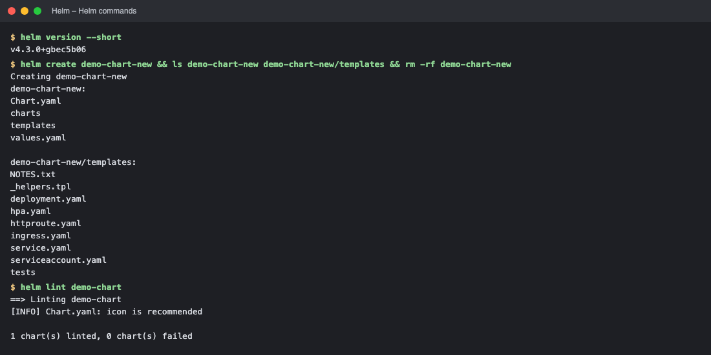

*Commands: `helm version --short` · `helm create demo-chart-new && ls demo-chart-new demo-chart-new/templat` · `helm lint demo-chart`*

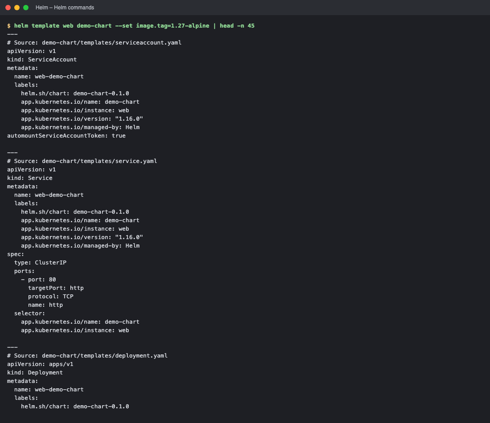

*Commands: `helm template web demo-chart --set image.tag=1.27-alpine | head -n 45`*

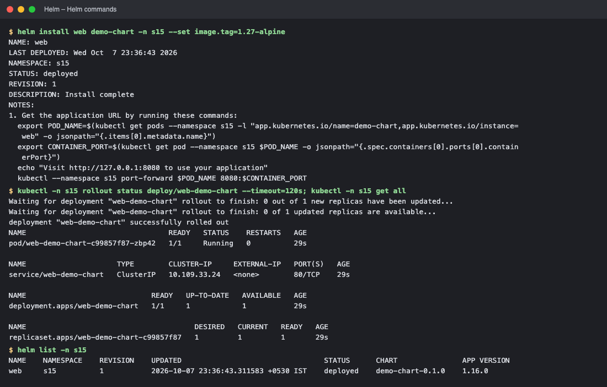

*Commands: `helm install web demo-chart -n s15 --set image.tag=1.27-alpine` · `kubectl -n s15 rollout status deploy/web-demo-chart --timeout=120s` · `helm list -n s15`*

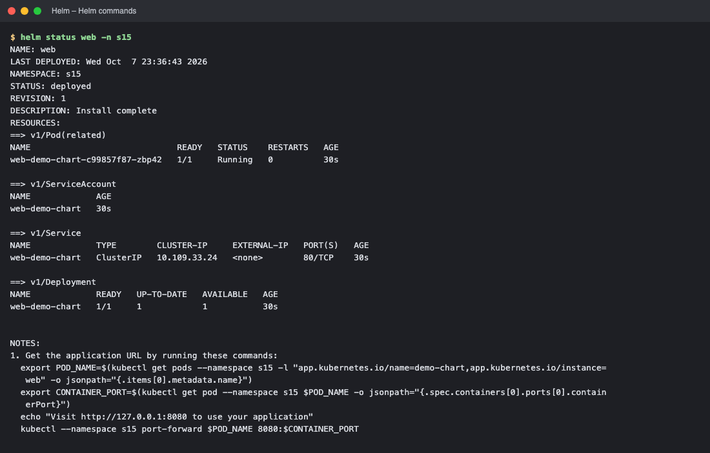

*Commands: `helm status web -n s15`*

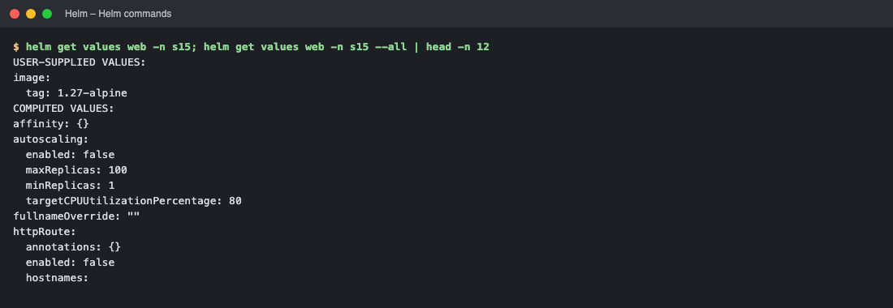

*Commands: `helm get values web -n s15`*

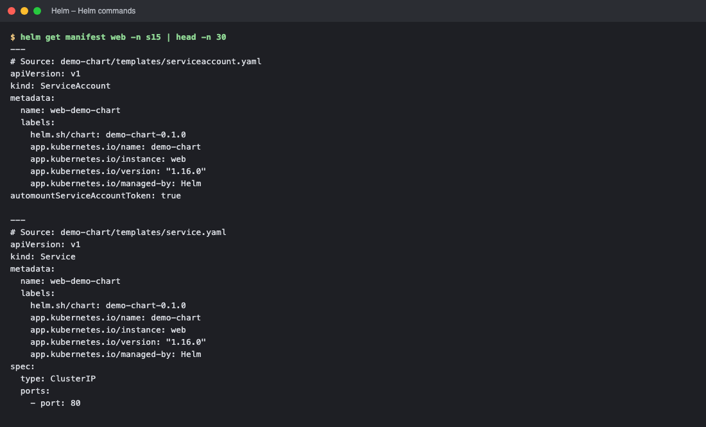

*Commands: `helm get manifest web -n s15 | head -n 30`*

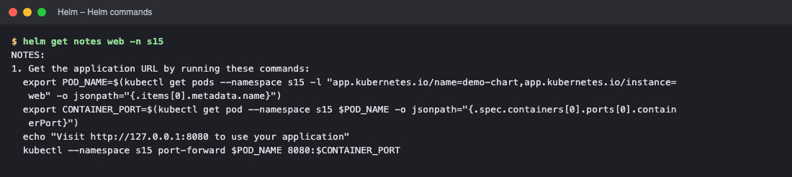

*Commands: `helm get notes web -n s15`*

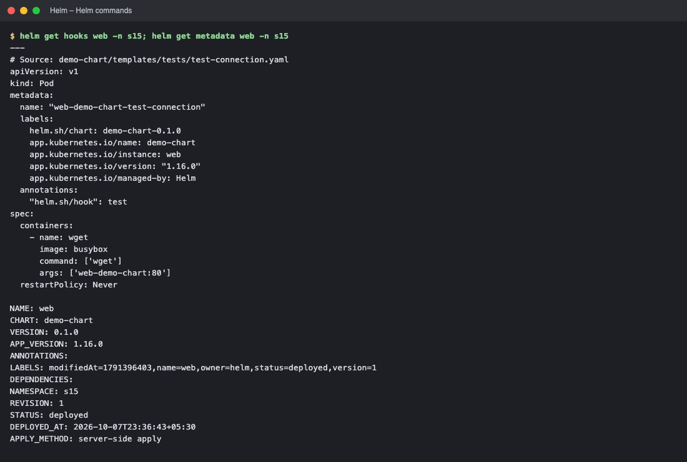

*Commands: `helm get hooks web -n s15`*

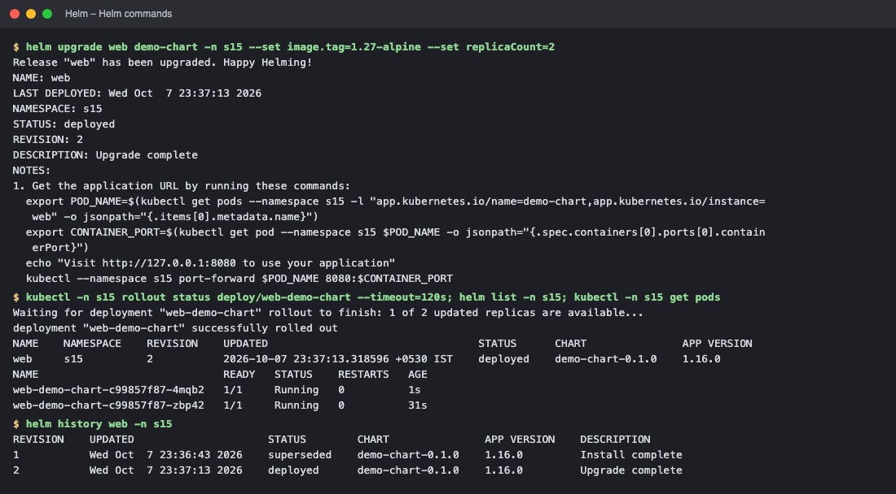

*Commands: `helm upgrade web demo-chart -n s15 --set image.tag=1.27-alpine --set r` · `kubectl -n s15 rollout status deploy/web-demo-chart --timeout=120s` · `helm history web -n s15`*

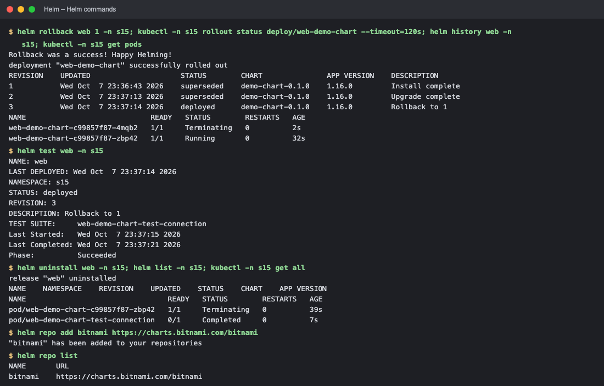

*Commands: `helm rollback web 1 -n s15` · `helm test web -n s15` · `helm uninstall web -n s15` · `helm repo add bitnami https://charts.bitnami.com/bitnami`*

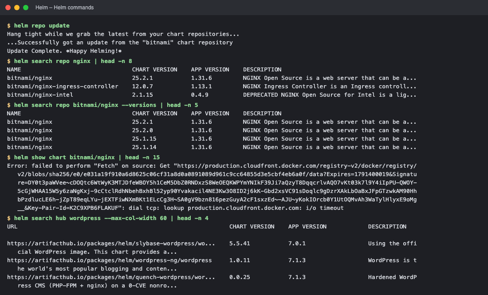

*Commands: `helm repo update` · `helm search repo nginx | head -n 8` · `helm search repo bitnami/nginx --versions | head -n 5` · `helm show chart bitnami/nginx | head -n 15`*

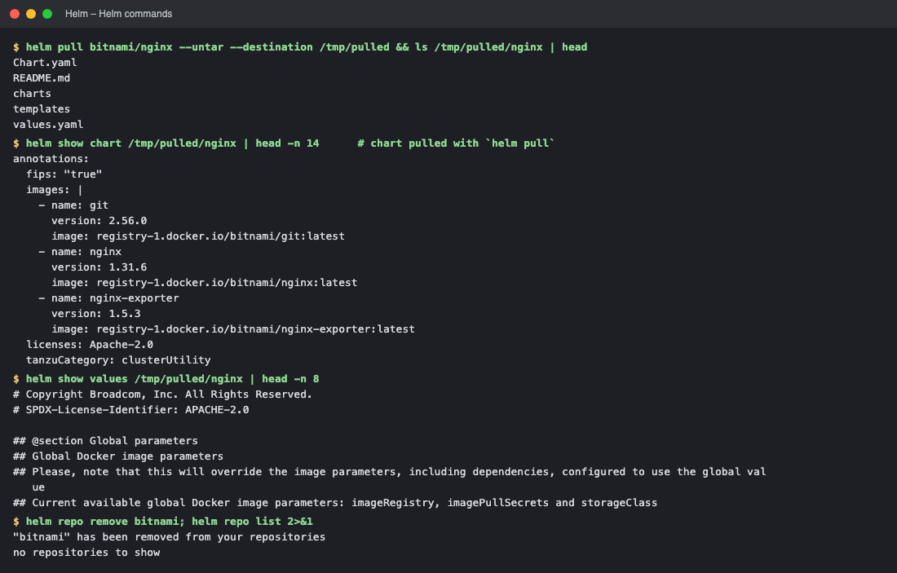

*Commands: `helm pull bitnami/nginx --untar --destination /tmp/pulled && ls /tmp/p` · `helm show chart /tmp/pulled/nginx | head -n 14      # chart pulled wit` · `helm show values /tmp/pulled/nginx | head -n 8` · `helm repo remove bitnami`*

<!-- screenshots:end -->
