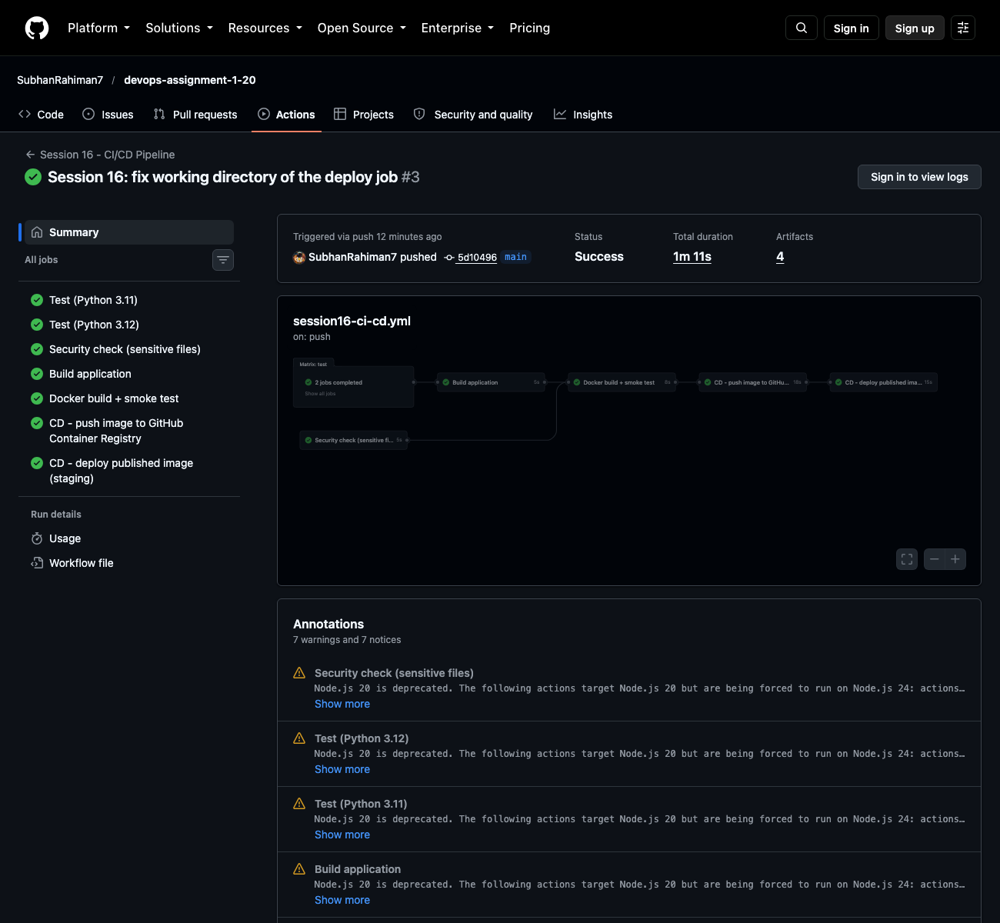
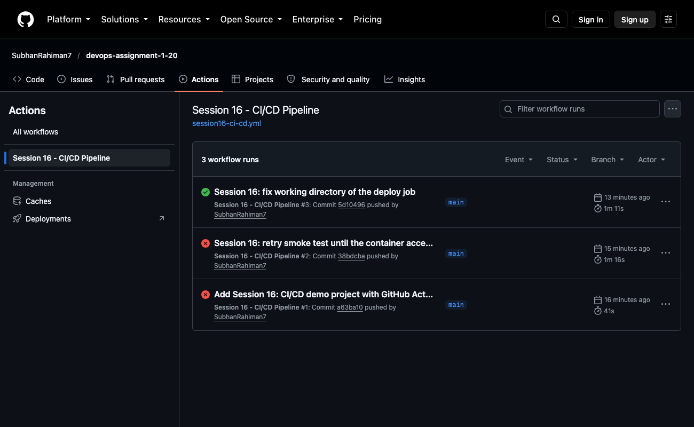
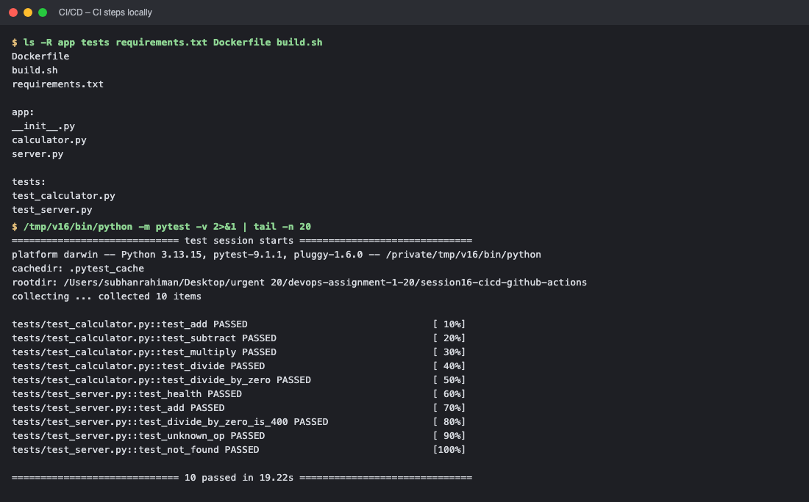
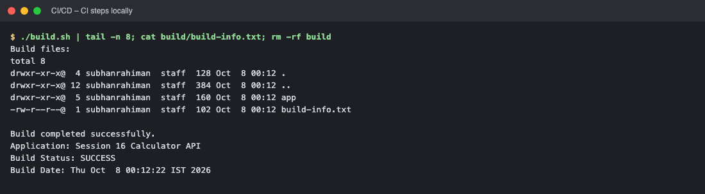
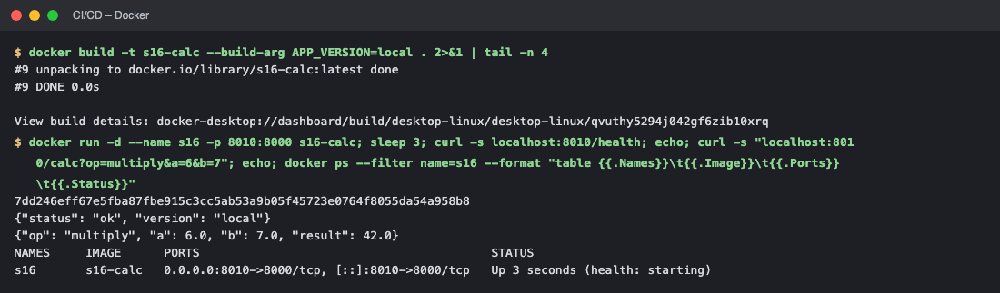
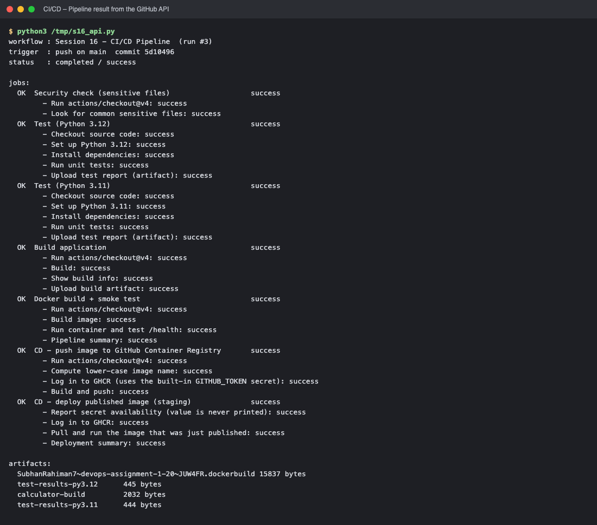

# Session 16 – CI/CD & GitHub Actions (Demo Project)

A small **Calculator API** (Python, standard library) with unit tests, a Dockerfile and a complete **GitHub Actions** pipeline: CI (test → build → security check → Docker build + smoke test) and CD (publish the image to GitHub Container Registry and deploy/verify it).

* Workflow file: [`.github/workflows/session16-ci-cd.yml`](../.github/workflows/session16-ci-cd.yml)
* **Successful pipeline run:** https://github.com/SubhanRahiman7/devops-assignment-1-20/actions/runs/37667133806
* Application: [`app/`](app/) · Tests: [`tests/`](tests/) · [`Dockerfile`](Dockerfile) · [`build.sh`](build.sh)

## Application
| Endpoint | Result |
|---|---|
| `GET /health` | `{"status": "ok", "version": "<git sha>"}` |
| `GET /calc?op=add&a=10&b=5` | `{"op": "add", "a": 10.0, "b": 5.0, "result": 15.0}` (ops: add, subtract, multiply, divide; divide by zero → HTTP 400) |

`pytest` runs 10 tests (calculator functions + the HTTP API on a random local port).

## CI vs CD
| | **Continuous Integration (CI)** | **Continuous Delivery / Deployment (CD)** |
|---|---|---|
| Goal | Merge small changes often and **verify automatically** (build + test + checks) | **Release** a verified build automatically (publish artifact/image, deploy) |
| Trigger | every push / pull request | after CI succeeded on `main` |
| In this project | jobs `test`, `security-check`, `build`, `docker` | jobs `publish` (push image to GHCR) and `deploy` (pull + run + verify the published image) |
| Benefit | bugs found minutes after the commit | fast, repeatable, low-risk releases |

## The pipeline
```
 push to main ──► test (3.11) ─┐
                  test (3.12) ─┴─► build ──┐
                  security-check ──────────┴─► docker (build + smoke test) ──► publish (GHCR) ──► deploy (staging)
                                                         └──────────── CI ─────────────┘└────────── CD ──────────┘
```
A pipeline is a series of automated stages; if one fails, the following stages (`needs:`) do not run.

## GitHub Actions concepts – where they appear in the workflow
| Concept | Meaning | In `session16-ci-cd.yml` |
|---|---|---|
| **Workflow** | YAML automation in `.github/workflows/` | the whole file; `on:` = `push` (main, path filter), `pull_request`, `workflow_dispatch` (manual) |
| **Job** | a set of steps running on one runner; jobs run in parallel unless `needs:` | `test`, `security-check`, `build`, `docker`, `publish`, `deploy` |
| **Step** | one command (`run:`) or reusable action (`uses:`) | e.g. `actions/checkout@v4`, `pytest -v`, `docker build …` |
| **Runner** | machine that executes a job | `runs-on: ubuntu-latest` – a fresh **GitHub-hosted** Ubuntu VM per job (self-hosted runners are your own machines) |
| **Matrix** | run a job for several values | `test` on Python 3.11 **and** 3.12 |
| **Secrets** | encrypted values, masked in logs | built-in `secrets.GITHUB_TOKEN` logs in to GHCR; `secrets.DEMO_SECRET` shows how a repository secret is injected as an env var (the job only reports whether it is set, never prints it) |
| **Artifacts** | files produced by a run, kept for download / later jobs | `upload-artifact`: test reports (`test-results-py3.11/3.12`) and `calculator-build` |
| **Build** | package the application | `build.sh` → `build/` + `build-info.txt`, and `docker build` |
| **Test** | automated verification | `pytest` (unit + API tests) and a container smoke test (`/health`, `/calc`) |
| **Permissions** | least-privilege token | `publish` has `packages: write`, others only `contents: read` |
| **Environment** | named deployment target | `deploy` uses `environment: staging` |

```yaml
name: Session 16 - CI/CD Pipeline

# WORKFLOW: triggered by pushes/PRs that touch this project, or manually
on:
  push:
    branches: [main]
    paths:
      - "session16-cicd-github-actions/**"
      - ".github/workflows/session16-ci-cd.yml"
  pull_request:
    branches: [main]
    paths:
      - "session16-cicd-github-actions/**"
  workflow_dispatch:

env:
  APP_DIR: session16-cicd-github-actions
  IMAGE_NAME: session16-calculator-api

defaults:
  run:
    working-directory: session16-cicd-github-actions

jobs:
  # ---------------------------------------------------------------- CI
  test:
    name: Test (Python ${{ matrix.python-version }})
    runs-on: ubuntu-latest            # RUNNER: GitHub-hosted Ubuntu VM
    strategy:
      matrix:
        python-version: ["3.11", "3.12"]
    steps:
      - name: Checkout source code
        uses: actions/checkout@v4
      - name: Set up Python ${{ matrix.python-version }}
        uses: actions/setup-python@v5
        with:
          python-version: ${{ matrix.python-version }}
          cache: pip
          cache-dependency-path: session16-cicd-github-actions/requirements.txt
      - name: Install dependencies
        run: |
          python -m pip install --upgrade pip
          pip install -r requirements.txt
      - name: Run unit tests
        run: pytest -v --junitxml=test-results-${{ matrix.python-version }}.xml
      - name: Upload test report (artifact)
        if: always()
        uses: actions/upload-artifact@v4
        with:
          name: test-results-py${{ matrix.python-version }}
          path: session16-cicd-github-actions/test-results-${{ matrix.python-version }}.xml

  security-check:
    name: Security check (sensitive files)
    runs-on: ubuntu-latest
    steps:
      - uses: actions/checkout@v4
      - name: Look for common sensitive files
        working-directory: .
        run: |
          echo "Checking repository for common sensitive files..."
          if find . -path ./.git -prune -o -type f \( -name ".env" -o -name "*.pem" -o -name "*.key" \) -print | grep -q .; then
            echo "Potential sensitive file found."; exit 1
          else
            echo "No common sensitive files found."
          fi

  build:
    name: Build application
    needs: test                        # runs only if every test job passed
    runs-on: ubuntu-latest
    steps:
      - uses: actions/checkout@v4
      - name: Build
        run: ./build.sh
      - name: Show build info
        run: cat build/build-info.txt
      - name: Upload build artifact
        uses: actions/upload-artifact@v4
        with:
          name: calculator-build
          path: session16-cicd-github-actions/build/

  docker:
    name: Docker build + smoke test
    needs: [build, security-check]
    runs-on: ubuntu-latest
    steps:
      - uses: actions/checkout@v4
      - name: Build image
        run: docker build --build-arg APP_VERSION=${{ github.sha }} -t "$IMAGE_NAME:ci" .
      - name: Run container and test /health
        run: |
          docker run -d --name api -p 8000:8000 "$IMAGE_NAME:ci"
          curl -fs --retry 20 --retry-all-errors --retry-delay 1 http://localhost:8000/health
          echo
          curl -fs "http://localhost:8000/calc?op=add&a=10&b=5"
          echo
          docker logs api
      - name: Pipeline summary
        run: |
          {
            echo "### CI result"
            echo "- unit tests: passed (Python 3.11 + 3.12)"
            echo "- build artifact: uploaded"
            echo "- docker image built and smoke tested"
          } >> "$GITHUB_STEP_SUMMARY"

  # ---------------------------------------------------------------- CD
  publish:
    name: CD - push image to GitHub Container Registry
    needs: docker
    if: github.event_name != 'pull_request' && github.ref == 'refs/heads/main'
    runs-on: ubuntu-latest
    permissions:
      contents: read
      packages: write
    outputs:
      image: ${{ steps.meta.outputs.image }}
    steps:
      - uses: actions/checkout@v4
      - name: Compute lower-case image name
        id: meta
        working-directory: .
        run: echo "image=ghcr.io/${GITHUB_REPOSITORY_OWNER,,}/${IMAGE_NAME}" >> "$GITHUB_OUTPUT"
      - name: Log in to GHCR (uses the built-in GITHUB_TOKEN secret)
        uses: docker/login-action@v3
        with:
          registry: ghcr.io
          username: ${{ github.actor }}
          password: ${{ secrets.GITHUB_TOKEN }}
      - name: Build and push
        uses: docker/build-push-action@v6
        with:
          context: session16-cicd-github-actions
          push: true
          build-args: APP_VERSION=${{ github.sha }}
          tags: |
            ${{ steps.meta.outputs.image }}:latest
            ${{ steps.meta.outputs.image }}:${{ github.sha }}

  deploy:
    name: CD - deploy published image (staging)
    needs: publish
    runs-on: ubuntu-latest
    environment: staging
    permissions:
      contents: read
      packages: read
    defaults:
      run:
        working-directory: .      # this job has no checkout, so use the default directory
    env:
      # Secrets demo: a repository secret would be injected like this.
      # It is masked in logs; here we only report whether it exists.
      DEMO_SECRET: ${{ secrets.DEMO_SECRET }}
    steps:
      - name: Report secret availability (value is never printed)
        run: |
          if [ -n "$DEMO_SECRET" ]; then
            echo "DEMO_SECRET is configured (value hidden)"
          else
            echo "DEMO_SECRET is not set for this repository"
          fi
      - name: Log in to GHCR
        uses: docker/login-action@v3
        with:
          registry: ghcr.io
          username: ${{ github.actor }}
          password: ${{ secrets.GITHUB_TOKEN }}
      - name: Pull and run the image that was just published
        run: |
          IMAGE="${{ needs.publish.outputs.image }}:${{ github.sha }}"
          docker pull "$IMAGE"
          docker run -d --name staging -p 8000:8000 "$IMAGE"
          curl -fs --retry 20 --retry-all-errors --retry-delay 1 http://localhost:8000/health
          echo
          curl -fs "http://localhost:8000/calc?op=multiply&a=6&b=7"
          echo
      - name: Deployment summary
        run: |
          {
            echo "### Deployed"
            echo "Image: \`${{ needs.publish.outputs.image }}:${{ github.sha }}\`"
          } >> "$GITHUB_STEP_SUMMARY"

```

## Pipeline execution results
Run #3 (commit `5d10496`): **status success, 7 jobs, 4 artifacts, 1 min 11 s**.

| Job | Result |
|---|---|
| Test (Python 3.11) / Test (Python 3.12) | ✅ |
| Security check (sensitive files) | ✅ |
| Build application | ✅ (artifact `calculator-build`) |
| Docker build + smoke test | ✅ |
| CD – push image to GitHub Container Registry | ✅ (`ghcr.io/subhanrahiman7/session16-calculator-api:latest` and `:<sha>`) |
| CD – deploy published image (staging) | ✅ (pulled the image from GHCR and called `/health` and `/calc`) |

**Debugging history (also visible in the Actions tab):** run #1 failed in the *Docker smoke test* because Docker's port proxy reset the first connections before the app was listening – fixed by `curl --retry-all-errors`; run #2 passed up to *deploy*, where the job failed because it had no checkout and the default `working-directory` did not exist – fixed with a job-level `defaults.run.working-directory: .`; run #3 passed completely. GitHub also shows annotations about the Node.js-20 deprecation of some action versions; they do not affect the result.

> ⚠️ **Screenshots / logs:** the job-log pages on github.com require sign-in; the screenshots below are the public run summary pages, plus terminal output of the same facts read from the GitHub API.





<!-- screenshots:start -->


## Screenshots (terminal output of the live run)

> Each image shows the real output of the commands run for this task (rendered from the captured terminal output of the actual run).

### CI steps locally



*Commands: `ls -R app tests requirements.txt Dockerfile build.sh` · `/tmp/v16/bin/python -m pytest -v 2>&1 | tail -n 20`*



*Commands: `./build.sh | tail -n 8`*

### Docker



*Commands: `docker build -t s16-calc --build-arg APP_VERSION=local . 2>&1 | tail -` · `docker run -d --name s16 -p 8010:8000 s16-calc`*

### Pipeline result from the GitHub API



*Commands: `python3 pipeline_status.py`*

<!-- screenshots:end -->


