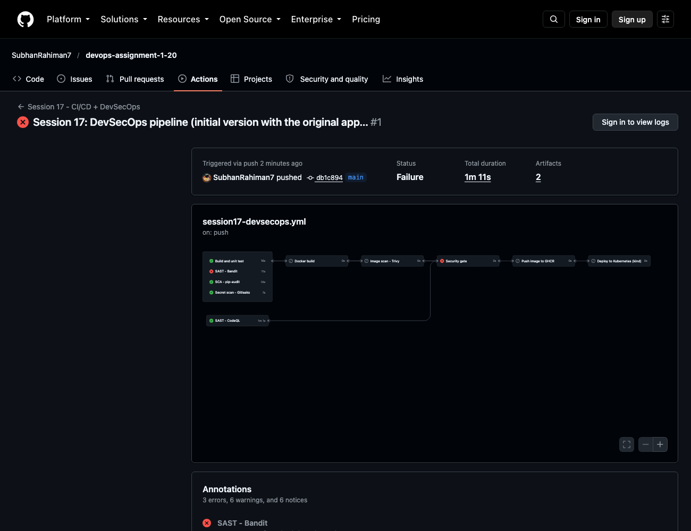
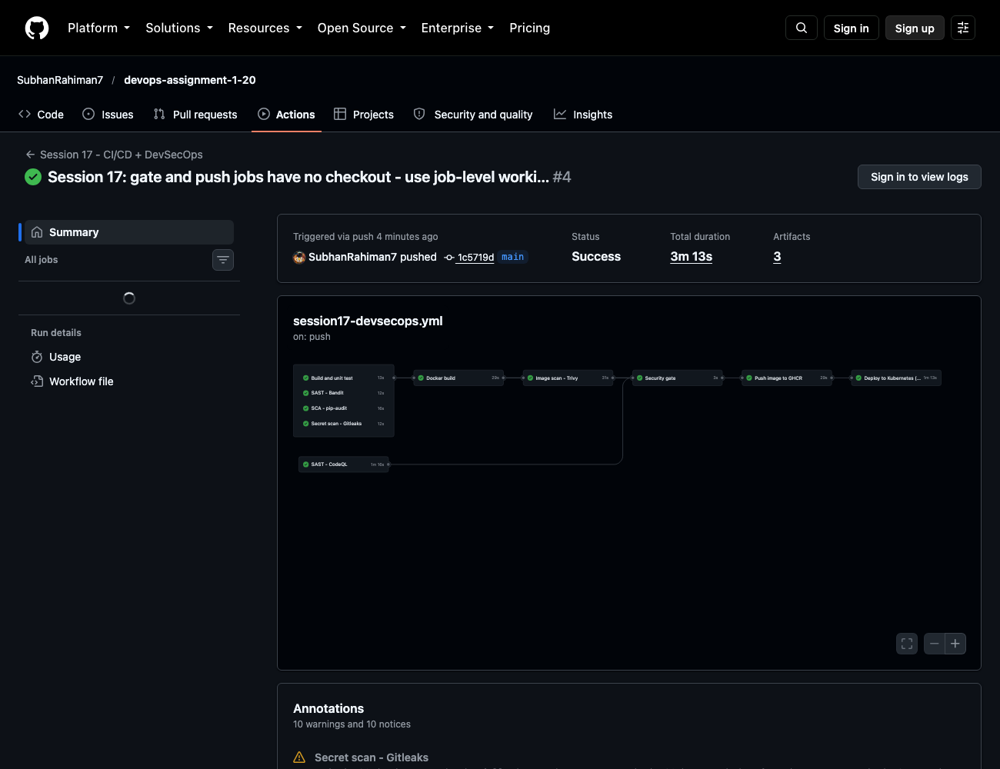
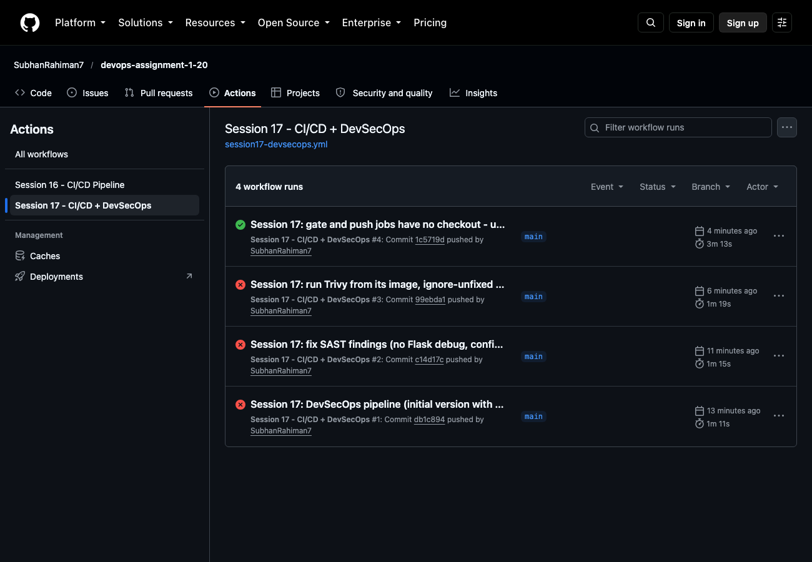
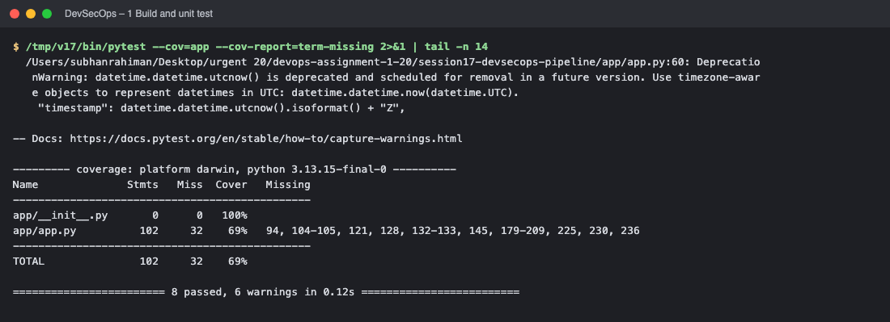
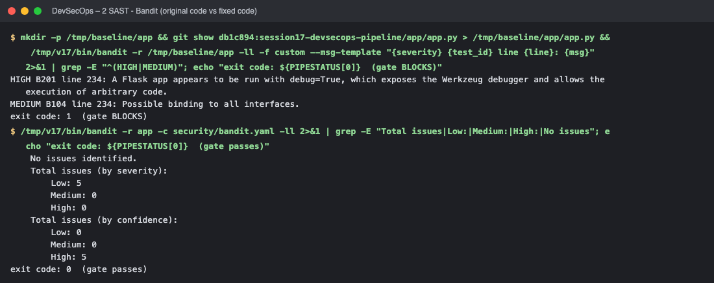
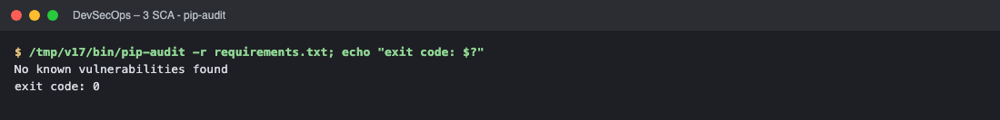
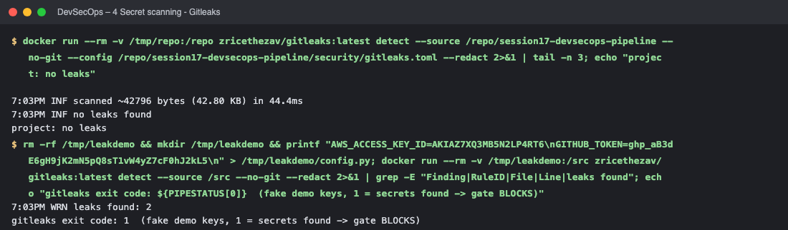
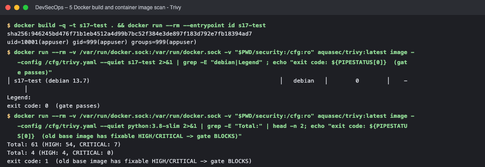
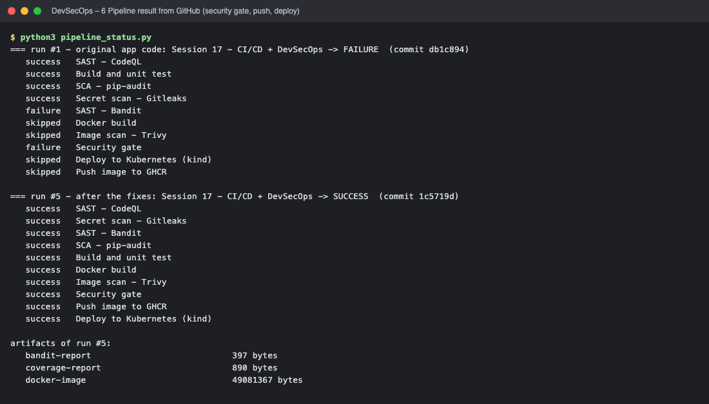

# Session 17 – Complete CI/CD & DevSecOps

A Flask application taken through a full **CI/CD + DevSecOps pipeline** on GitHub Actions: build → unit test → **SAST** → **SCA** → **secret scan** → Docker build → **container image scan** → **security gate** → push image to a registry → deploy to **Kubernetes**.

* Workflow: [`.github/workflows/session17-devsecops.yml`](../.github/workflows/session17-devsecops.yml)
* ✅ **Successful pipeline run (all 10 jobs):** https://github.com/SubhanRahiman7/devops-assignment-1-20/actions/runs/37670866428
* ❌ **Blocked run (security gate stopped an insecure build):** https://github.com/SubhanRahiman7/devops-assignment-1-20/actions/runs/37669665641
* Application: [`app/`](app/) · Tests: [`tests/`](tests/) · [`Dockerfile`](Dockerfile) · Kubernetes manifests: [`k8s/`](k8s/) · Security tool configs: [`security/`](security/) · [`SECURITY.md`](SECURITY.md)

## Expected flow
```text
Code ─► Build ─► Unit Test ─► SAST ─► SCA ─► Secret Scan ─► Docker Build ─► Image Scan ─► SECURITY GATE ─► Push Image ─► Deploy to Kubernetes
              (pytest)      (Bandit   (pip-   (Gitleaks)     (docker)      (Trivy)        (all green?)     (GHCR)        (kind cluster)
                             +CodeQL)  audit)
```

## What each stage does
| Stage | Tool | Detects | Gate rule (pipeline fails when…) | Config |
|---|---|---|---|---|
| Build + unit test | pytest + coverage | functional bugs | any test fails | `pytest.ini`, `requirements-dev.txt` |
| **SAST** (static analysis of *our* code) | **Bandit** and **CodeQL** | insecure code patterns (debug mode, injection, weak crypto…) | Bandit finds MEDIUM+ issue | [`security/bandit.yaml`](security/bandit.yaml) |
| **SCA** (software composition analysis) | **pip-audit** | known CVEs in *third-party dependencies* | any vulnerable dependency | `requirements.txt` |
| **Secret scanning** | **Gitleaks** | hard-coded keys/tokens/passwords in files | any secret found | [`security/gitleaks.toml`](security/gitleaks.toml) |
| Docker build | docker | – | build fails (only runs after the code scans passed) | [`Dockerfile`](Dockerfile) |
| **Container image scanning** | **Trivy** | OS-package + library CVEs, secrets inside the image | fixable HIGH/CRITICAL vulnerability | [`security/trivy.yaml`](security/trivy.yaml) |
| **Security gate** | workflow job `security-gate` | – | **any** previous stage is not `success` | workflow |
| Container registry | **GitHub Container Registry** (`ghcr.io/subhanrahiman7/session17-devsecops`) | – | login/push fails | `secrets.GITHUB_TOKEN` |
| Kubernetes deployment | **kind** cluster created in the runner + `kubectl` | – | rollout or smoke test fails | [`k8s/`](k8s/) |

Design notes:
* The image is built **once**, saved as an artifact and that exact image is scanned and later pushed – what was scanned is what is released.
* `push` depends on `security-gate`, and `deploy` on `push`, so a failed scan means **nothing is published or deployed**.
* The registry package is private, so the deploy job creates an `imagePullSecret` (`ghcr-creds`) in the cluster – no credentials are stored in Git.

## The security gate in action
**Run 1 – original code from the course demo.** Bandit reported:

| Severity | Test | Finding |
|---|---|---|
| HIGH | B201 | `app.run(..., debug=True)` – Flask debug mode exposes the Werkzeug debugger which allows **arbitrary code execution** |
| MEDIUM | B104 | binding to all interfaces (`0.0.0.0`) hard-coded |

Result: `SAST - Bandit` ❌ → `Security gate` ❌ → **Docker build, image scan, push and deploy were skipped.**



**Fix:** debug mode is off by default (`FLASK_DEBUG=0`), the bind address comes from the `HOST` environment variable (the container sets `HOST=0.0.0.0` explicitly), and the container now runs as a **non-root user**:
```python
app.run(host=os.environ.get("HOST", "127.0.0.1"),
        port=int(os.environ.get("PORT", "5001")),
        debug=os.environ.get("FLASK_DEBUG", "0") == "1")
```
**Other gate/pipeline problems fixed on the way (visible in the Actions history):**
1. The first Trivy attempt used a GitHub Action whose version tag could not be resolved ("Set up job" failed) → Trivy is now run from its own Docker image.
2. Trivy's `ignore-unfixed` has to be nested under `vulnerability:` in `trivy.yaml` – otherwise unfixable Debian CVEs (`Fixed Version: none`) would block every build.
3. The `security-gate` and `push` jobs have no checkout, so the workflow-wide `working-directory` did not exist there → job-level `working-directory: .`.

**Final run – everything green:** https://github.com/SubhanRahiman7/devops-assignment-1-20/actions/runs/37670866428





## Full workflow
```yaml
name: Session 17 - CI/CD + DevSecOps

on:
  push:
    branches: [main]
    paths:
      - "session17-devsecops-pipeline/**"
      - ".github/workflows/session17-devsecops.yml"
  pull_request:
    branches: [main]
    paths:
      - "session17-devsecops-pipeline/**"
  workflow_dispatch:

env:
  IMAGE_NAME: session17-devsecops

defaults:
  run:
    working-directory: session17-devsecops-pipeline

jobs:
  # 1 ───────────────────────────── Build + Unit test
  test:
    name: Build and unit test
    runs-on: ubuntu-latest
    steps:
      - uses: actions/checkout@v4
      - uses: actions/setup-python@v5
        with:
          python-version: "3.12"
          cache: pip
          cache-dependency-path: session17-devsecops-pipeline/requirements-dev.txt
      - name: Install dependencies
        run: pip install -r requirements-dev.txt
      - name: Run unit tests with coverage
        run: pytest --cov=app --cov-report=term-missing --cov-report=xml
      - uses: actions/upload-artifact@v4
        with:
          name: coverage-report
          path: session17-devsecops-pipeline/coverage.xml

  # 2 ───────────────────────────── SAST
  sast-bandit:
    name: SAST - Bandit
    runs-on: ubuntu-latest
    steps:
      - uses: actions/checkout@v4
      - uses: actions/setup-python@v5
        with:
          python-version: "3.12"
      - name: Install Bandit
        run: pip install bandit
      - name: Run Bandit (fails on MEDIUM and above)
        run: |
          bandit -r app -c security/bandit.yaml -ll -f json -o bandit-report.json || echo "BANDIT_FAILED=1" >> "$GITHUB_ENV"
          bandit -r app -c security/bandit.yaml -ll || true
      - uses: actions/upload-artifact@v4
        if: always()
        with:
          name: bandit-report
          path: session17-devsecops-pipeline/bandit-report.json
      - name: Enforce result
        run: |
          if [ "${BANDIT_FAILED:-0}" = "1" ]; then
            echo "::error::Bandit found MEDIUM/HIGH severity issues"; exit 1
          fi

  sast-codeql:
    name: SAST - CodeQL
    runs-on: ubuntu-latest
    permissions:
      contents: read
      security-events: write
    steps:
      - uses: actions/checkout@v4
      - uses: github/codeql-action/init@v3
        with:
          languages: python
      - uses: github/codeql-action/analyze@v3

  # 3 ───────────────────────────── SCA
  sca:
    name: SCA - pip-audit
    runs-on: ubuntu-latest
    steps:
      - uses: actions/checkout@v4
      - uses: actions/setup-python@v5
        with:
          python-version: "3.12"
      - name: Install pip-audit
        run: pip install pip-audit
      - name: Audit dependencies (fails on known vulnerabilities)
        run: pip-audit -r requirements.txt

  # 4 ───────────────────────────── Secret scan
  secret-scan:
    name: Secret scan - Gitleaks
    runs-on: ubuntu-latest
    steps:
      - uses: actions/checkout@v4
      - name: Run Gitleaks on the project files
        working-directory: .
        run: |
          docker run --rm -v "$PWD:/repo" zricethezav/gitleaks:latest detect \
            --source /repo/session17-devsecops-pipeline --no-git \
            --config /repo/session17-devsecops-pipeline/security/gitleaks.toml --verbose --redact

  # 5 ───────────────────────────── Docker build (only after the code scans pass)
  docker-build:
    name: Docker build
    needs: [test, sast-bandit, sca, secret-scan]
    runs-on: ubuntu-latest
    steps:
      - uses: actions/checkout@v4
      - name: Build image
        run: docker build -t "$IMAGE_NAME:${{ github.sha }}" .
      - name: Save image so the same bytes are scanned and pushed
        run: docker save "$IMAGE_NAME:${{ github.sha }}" -o /tmp/image.tar
      - uses: actions/upload-artifact@v4
        with:
          name: docker-image
          path: /tmp/image.tar
          retention-days: 1

  # 6 ───────────────────────────── Container image scan
  image-scan:
    name: Image scan - Trivy
    needs: docker-build
    runs-on: ubuntu-latest
    steps:
      - uses: actions/checkout@v4
      - uses: actions/download-artifact@v4
        with:
          name: docker-image
          path: /tmp
      - name: Load image
        run: docker load -i /tmp/image.tar
      - name: Scan image with Trivy (fails on fixable HIGH/CRITICAL)
        run: |
          docker run --rm \
            -v /var/run/docker.sock:/var/run/docker.sock \
            -v "$PWD/security:/cfg:ro" \
            -e TRIVY_DISABLE_VEX_NOTICE=true \
            aquasec/trivy:latest image --config /cfg/trivy.yaml "$IMAGE_NAME:${{ github.sha }}"

  # 7 ───────────────────────────── Security gate
  security-gate:
    name: Security gate
    if: always()
    needs: [test, sast-bandit, sast-codeql, sca, secret-scan, docker-build, image-scan]
    runs-on: ubuntu-latest
    defaults:
      run:
        working-directory: .      # no checkout in this job
    steps:
      - name: Evaluate all security results
        env:
          RESULTS: ${{ toJSON(needs) }}
        run: |
          echo "$RESULTS" | python3 -c '
          import json,sys,os
          needs=json.load(sys.stdin)
          rows=[]; bad=[]
          for job,v in needs.items():
              r=v["result"]; rows.append((job,r))
              if r!="success": bad.append(job)
          out=["### Security gate","| Stage | Result |","|---|---|"]+[f"| {j} | {r} |" for j,r in rows]
          out.append(""); out.append("**GATE: " + ("BLOCKED - " + ", ".join(bad) if bad else "PASSED - image may be published") + "**")
          open(os.environ["GITHUB_STEP_SUMMARY"],"a").write("\n".join(out)+"\n")
          print("\n".join(out))
          sys.exit(1 if bad else 0)
          '

  # 8 ───────────────────────────── Push image
  push:
    name: Push image to GHCR
    needs: security-gate
    if: github.event_name != 'pull_request' && github.ref == 'refs/heads/main'
    runs-on: ubuntu-latest
    permissions:
      contents: read
      packages: write
    defaults:
      run:
        working-directory: .      # no checkout in this job
    outputs:
      image: ${{ steps.meta.outputs.image }}
    steps:
      - uses: actions/download-artifact@v4
        with:
          name: docker-image
          path: /tmp
      - name: Compute image name
        id: meta
        working-directory: .
        run: echo "image=ghcr.io/${GITHUB_REPOSITORY_OWNER,,}/${IMAGE_NAME}" >> "$GITHUB_OUTPUT"
      - uses: docker/login-action@v3
        with:
          registry: ghcr.io
          username: ${{ github.actor }}
          password: ${{ secrets.GITHUB_TOKEN }}
      - name: Load, tag and push the scanned image
        run: |
          docker load -i /tmp/image.tar
          IMAGE="${{ steps.meta.outputs.image }}"
          docker tag "$IMAGE_NAME:${{ github.sha }}" "$IMAGE:${{ github.sha }}"
          docker tag "$IMAGE_NAME:${{ github.sha }}" "$IMAGE:latest"
          docker push "$IMAGE:${{ github.sha }}"
          docker push "$IMAGE:latest"

  # 9 ───────────────────────────── Deploy to Kubernetes
  deploy:
    name: Deploy to Kubernetes (kind)
    needs: push
    runs-on: ubuntu-latest
    permissions:
      contents: read
      packages: read
    steps:
      - uses: actions/checkout@v4
      - name: Create a Kubernetes cluster (kind)
        uses: helm/kind-action@v1
      - name: Create image pull secret for the private GHCR package
        run: |
          kubectl create secret docker-registry ghcr-creds \
            --docker-server=ghcr.io \
            --docker-username="${{ github.actor }}" \
            --docker-password="${{ secrets.GITHUB_TOKEN }}"
      - name: Deploy manifests with the new image tag
        run: |
          sed -i "s|__IMAGE__|${{ needs.push.outputs.image }}:${{ github.sha }}|" k8s/deployment.yaml
          kubectl apply -f k8s/deployment.yaml -f k8s/service.yaml
      - name: Wait for rollout
        run: kubectl rollout status deployment/session17-devsecops --timeout=180s
      - name: Show cluster state
        run: |
          kubectl get deploy,pods,svc -o wide
          kubectl get pods -o jsonpath='{range .items[*]}{.metadata.name}{"  image="}{.spec.containers[0].image}{"\n"}{end}'
      - name: Smoke test through the Service
        run: |
          kubectl port-forward service/session17-devsecops 5001:80 &
          sleep 3
          curl -fs http://localhost:5001/health
          echo
          curl -fs http://localhost:5001/api/status
          echo

```

## Kubernetes manifests
`k8s/deployment.yaml` (2 replicas, readiness/liveness probes on `/health`, resource requests/limits, `imagePullSecrets`, image placeholder `__IMAGE__` replaced by the pipeline with `ghcr.io/<owner>/session17-devsecops:<git sha>`) and `k8s/service.yaml` (ClusterIP 80 → 5001).

## Pipeline output
The *deploy* job creates a kind cluster, creates the `ghcr-creds` secret, applies the manifests with the pushed image tag, waits for `kubectl rollout status deployment/session17-devsecops` and calls `/health` and `/api/status` through the Service. The job-log pages on github.com require sign-in, so the evidence below is the public run summary (screenshots above) plus the same job list read from the GitHub API and each security tool executed locally with the same configuration.

> **Terminal screenshots:** each image shows the real output of the commands (rendered from the captured terminal output of the live run).

## Short answers
* **SAST vs SCA** – SAST analyses *your* source code for insecure patterns; SCA checks the *libraries you depend on* for known vulnerabilities.
* **Why scan images?** The image also contains the OS packages and everything installed in it, which code scanners never see.
* **Security gate** – an automatic checkpoint that stops the pipeline (nothing gets pushed/deployed) unless all security checks pass; "shift-left" security.
* **Secret scanning** – finds credentials committed by mistake; if a real one is found it must be **rotated**, not just deleted from Git.

<!-- screenshots:start -->


## Screenshots (terminal output of the live run)

> Each image shows the real output of the commands run for this task (rendered from the captured terminal output of the actual run).

### 1 Build and unit test



*Commands: `/tmp/v17/bin/pytest --cov=app --cov-report=term-missing 2>&1 | tail -n`*

### 2 SAST - Bandit (original code vs fixed code)



*Commands: `mkdir -p /tmp/baseline/app && git show db1c894:session17-devsecops-pip` · `/tmp/v17/bin/bandit -r app -c security/bandit.yaml -ll 2>&1 | grep -E `*

### 3 SCA - pip-audit



*Commands: `/tmp/v17/bin/pip-audit -r requirements.txt`*

### 4 Secret scanning - Gitleaks



*Commands: `docker run --rm -v /tmp/repo:/repo zricethezav/gitleaks:latest detect ` · `rm -rf /tmp/leakdemo && mkdir /tmp/leakdemo && printf "AWS_ACCESS_KEY_`*

### 5 Docker build and container image scan - Trivy



*Commands: `docker build -q -t s17-test . && docker run --rm --entrypoint id s17-t` · `docker run --rm -v /var/run/docker.sock:/var/run/docker.sock -v "$PWD/` · `docker run --rm -v /var/run/docker.sock:/var/run/docker.sock -v "$PWD/`*

### 6 Pipeline result from GitHub (security gate, push, deploy)



*Commands: `python3 pipeline_status.py`*

<!-- screenshots:end -->

