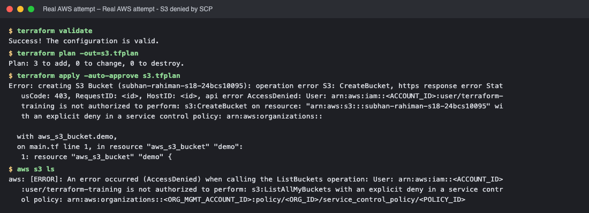
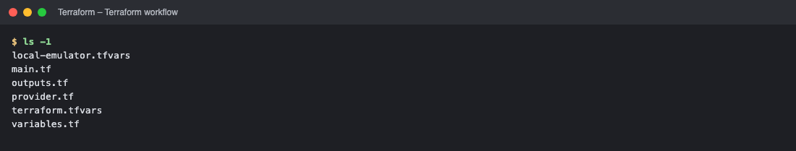
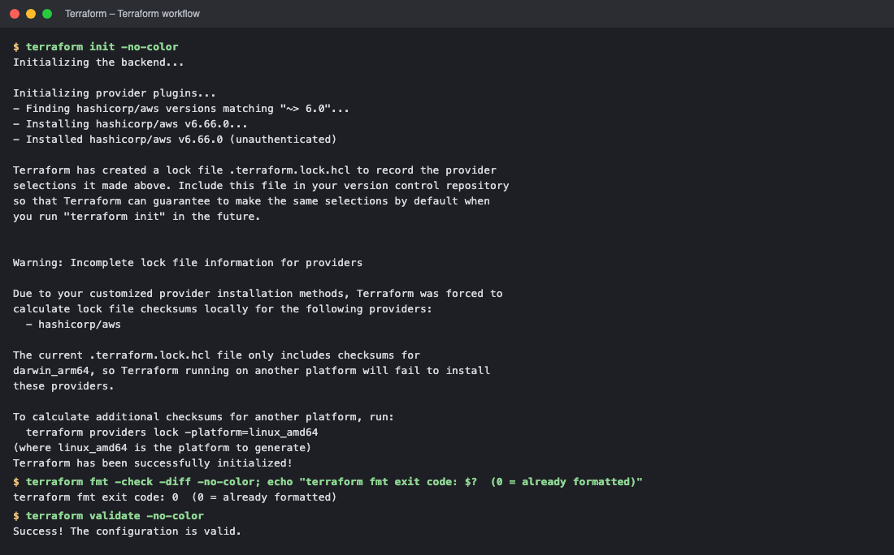
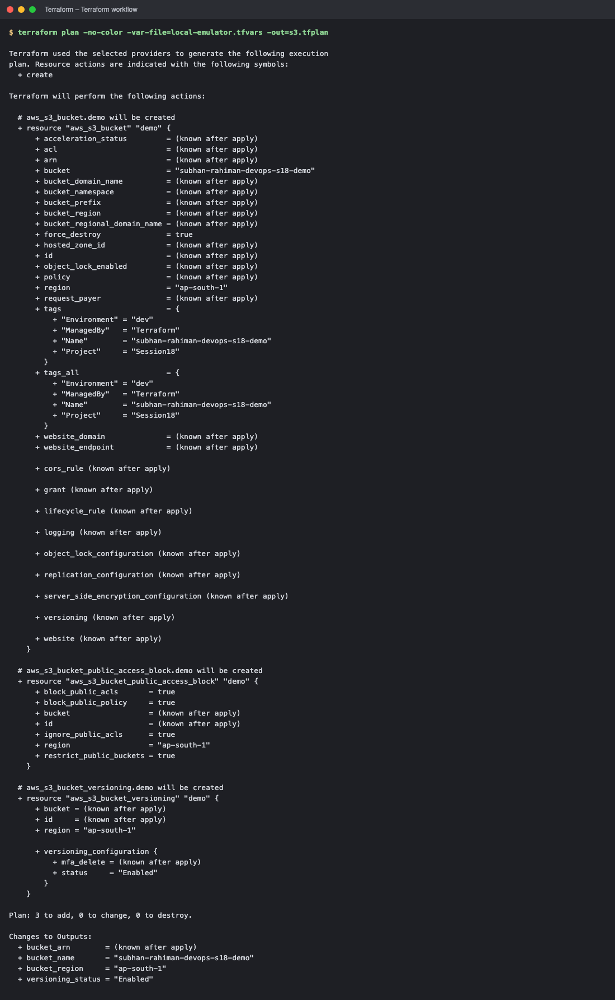
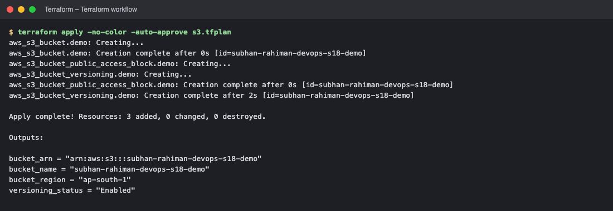
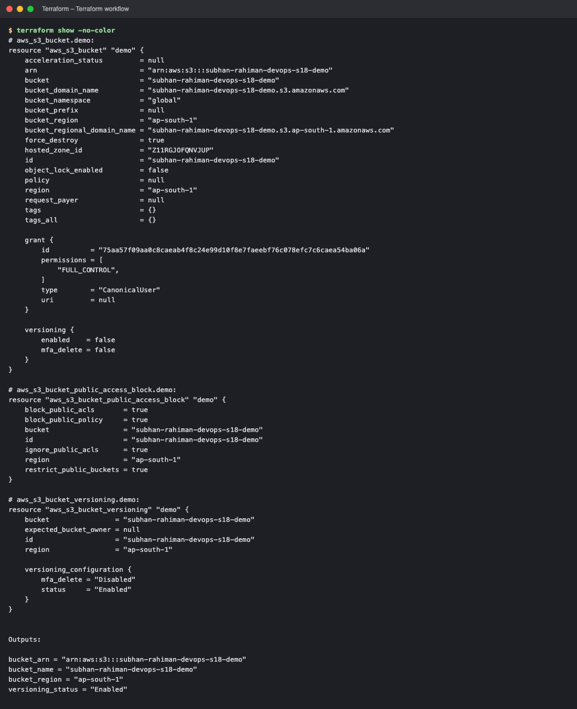
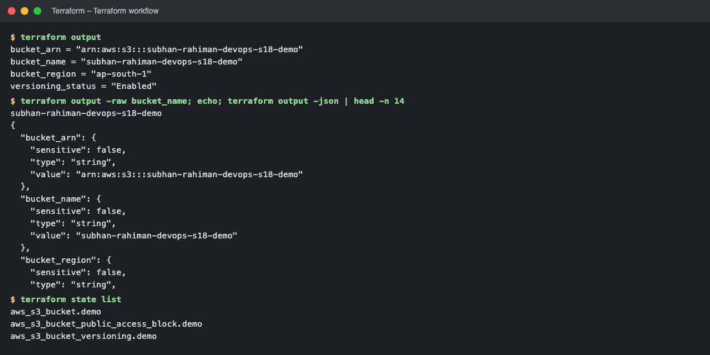
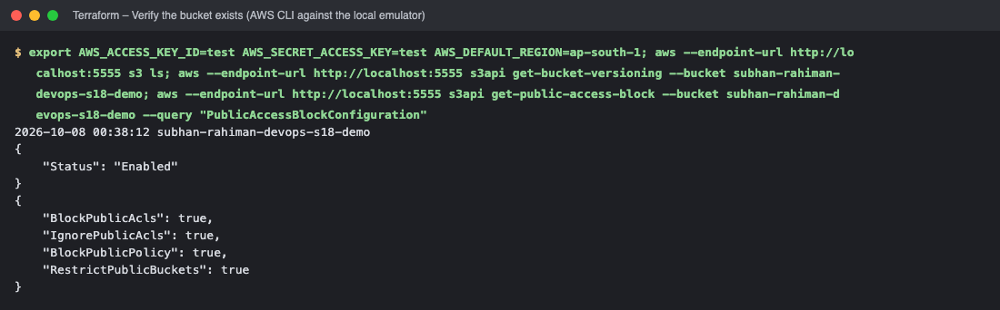
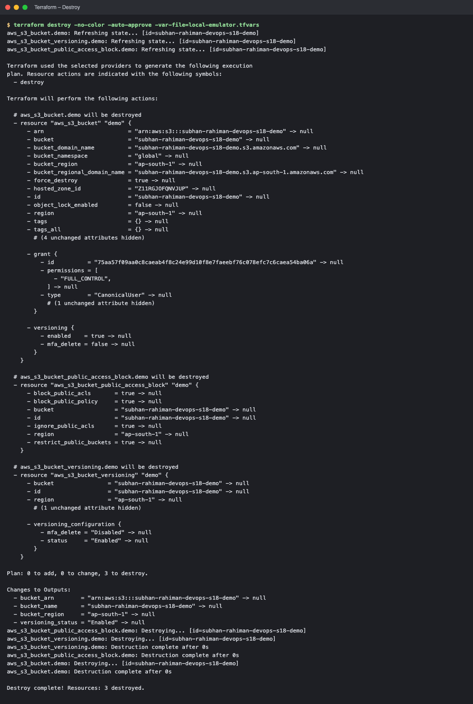
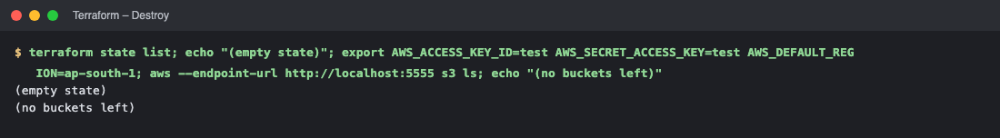

# Terraform S3 Demo (Session 18 – Task 1)

Creates an **AWS S3 bucket** (with versioning and a public-access block) using Terraform and walks through the complete workflow: `init → fmt → validate → plan → apply → show → output → destroy`.

```text
terraform-s3-demo/
├── provider.tf          # terraform {} block (version constraints) + provider "aws"
├── variables.tf         # input variables
├── main.tf              # resources (bucket, versioning, public access block)
├── outputs.tf           # output values
├── terraform.tfvars     # variable values for REAL AWS
├── local-emulator.tfvars# variable values to use a local AWS emulator (Moto) – used for the outputs below
└── README.md
```

> ## ⚠️ How the outputs in this README were produced
> The AWS access keys available while preparing this assignment were rejected by AWS (`InvalidClientTokenId`), so the workflow was executed against **Moto, a local AWS API emulator running in Docker** (`docker run -p 5555:5000 motoserver/moto`), by setting `use_local_emulator = true` (`-var-file=local-emulator.tfvars`). The Terraform code, plan, apply, state and outputs are real Terraform behaviour; **no real AWS account was touched**. With valid credentials the identical code runs against real AWS: `terraform apply` (uses `terraform.tfvars`, `use_local_emulator = false` by default).
> Emulator limitations seen: the bucket tags are not returned on read-back (`tags = {}` in `terraform show`) – on AWS they are stored.

## Concepts used
| Concept | Where |
|---|---|
| **IaC (Infrastructure as Code)** | the infrastructure is described in `.tf` files, version-controlled, repeatable |
| **Provider** | `provider "aws"` + `required_providers { aws = "~> 6.0" }` – plugin that talks to the AWS API (downloaded by `terraform init`) |
| **Resource** | `aws_s3_bucket`, `aws_s3_bucket_versioning`, `aws_s3_bucket_public_access_block` |
| **Variables** | `variables.tf` (type, description, default) + values in `terraform.tfvars` |
| **Outputs** | `bucket_name`, `bucket_arn`, `bucket_region`, `versioning_status` |
| **Dependencies** | `aws_s3_bucket.demo.id` used by the other resources → Terraform creates the bucket first (implicit dependency graph) |
| **State** | `terraform.tfstate` maps code ↔ real resources (not committed to Git – contains sensitive data; use a remote backend such as S3 + DynamoDB lock in teams) |

## Code
```hcl
# provider.tf
terraform {
  required_version = ">= 1.6.0"
  required_providers {
    aws = {
      source  = "hashicorp/aws"
      version = "~> 6.0"
    }
  }
}

provider "aws" {
  region = var.aws_region

  # ---- Optional: run the same code against a local AWS emulator (Moto) --------------
  # Default (use_local_emulator = false) talks to real AWS with your normal credentials.
  access_key                  = var.use_local_emulator ? "test" : null
  secret_key                  = var.use_local_emulator ? "test" : null
  skip_credentials_validation = var.use_local_emulator
  skip_requesting_account_id  = var.use_local_emulator
  skip_metadata_api_check     = var.use_local_emulator
  s3_use_path_style           = var.use_local_emulator

  endpoints {
    s3  = var.use_local_emulator ? var.emulator_endpoint : null
    sts = var.use_local_emulator ? var.emulator_endpoint : null
  }
}
```
```hcl
# variables.tf
variable "aws_region" {
  type        = string
  description = "AWS region where the S3 bucket will be created."
  default     = "ap-south-1"
}

variable "bucket_name" {
  type        = string
  description = "Globally unique name of the S3 bucket."
}

variable "environment" {
  type        = string
  description = "Environment tag."
  default     = "dev"
}

variable "use_local_emulator" {
  type        = bool
  description = "true = send API calls to a local AWS emulator (Moto) instead of real AWS."
  default     = false
}

variable "emulator_endpoint" {
  type        = string
  description = "URL of the local AWS emulator (only used when use_local_emulator = true)."
  default     = "http://localhost:5555"
}
```
```hcl
# main.tf
resource "aws_s3_bucket" "demo" {
  bucket        = var.bucket_name
  force_destroy = true # allow `terraform destroy` even if objects exist (demo only)

  tags = {
    Name        = var.bucket_name
    Environment = var.environment
    ManagedBy   = "Terraform"
    Project     = "Session18"
  }
}

resource "aws_s3_bucket_versioning" "demo" {
  bucket = aws_s3_bucket.demo.id

  versioning_configuration {
    status = "Enabled"
  }
}

resource "aws_s3_bucket_public_access_block" "demo" {
  bucket                  = aws_s3_bucket.demo.id
  block_public_acls       = true
  block_public_policy     = true
  ignore_public_acls      = true
  restrict_public_buckets = true
}
```
```hcl
# outputs.tf
output "bucket_name" {
  description = "Name of the S3 bucket."
  value       = aws_s3_bucket.demo.bucket
}

output "bucket_arn" {
  description = "ARN of the S3 bucket."
  value       = aws_s3_bucket.demo.arn
}

output "bucket_region" {
  description = "AWS region of the S3 bucket."
  value       = aws_s3_bucket.demo.region
}

output "versioning_status" {
  description = "Bucket versioning status."
  value       = aws_s3_bucket_versioning.demo.versioning_configuration[0].status
}
```
```hcl
# terraform.tfvars
# Values for REAL AWS (the bucket name must be globally unique)
aws_region  = "ap-south-1"
bucket_name = "subhan-rahiman-devops-s18-demo"
environment = "dev"
```

## The workflow
| Command | What it does |
|---|---|
| `terraform init` | initialises the directory: downloads providers (`.terraform/`), creates `.terraform.lock.hcl` |
| `terraform fmt` | rewrites files to the canonical style (`-check` only reports) |
| `terraform validate` | checks syntax and internal consistency (no API calls) |
| `terraform plan` | compares code ↔ state ↔ reality and shows what **will** change (`+` create, `~` update, `-` destroy) |
| `terraform apply` | executes the plan, updates the state |
| `terraform show` | prints the current state in readable form |
| `terraform output` | prints output values (`-raw`, `-json`) |
| `terraform state list` | lists the managed resources |
| `terraform destroy` | removes everything in the state |

## Complete output
```text
$ ls -1
local-emulator.tfvars
main.tf
outputs.tf
provider.tf
terraform.tfvars
variables.tf

$ terraform init -no-color
Initializing the backend...

Initializing provider plugins...
- Finding hashicorp/aws versions matching "~> 6.0"...
- Installing hashicorp/aws v6.66.0...
- Installed hashicorp/aws v6.66.0 (unauthenticated)

Terraform has created a lock file .terraform.lock.hcl to record the provider
selections it made above. Include this file in your version control repository
so that Terraform can guarantee to make the same selections by default when
you run "terraform init" in the future.


Warning: Incomplete lock file information for providers

Due to your customized provider installation methods, Terraform was forced to
calculate lock file checksums locally for the following providers:
  - hashicorp/aws

The current .terraform.lock.hcl file only includes checksums for
darwin_arm64, so Terraform running on another platform will fail to install
these providers.

To calculate additional checksums for another platform, run:
  terraform providers lock -platform=linux_amd64
(where linux_amd64 is the platform to generate)
Terraform has been successfully initialized!

$ terraform fmt -check -diff -no-color; echo "terraform fmt exit code: $?  (0 = already formatted)"
terraform fmt exit code: 0  (0 = already formatted)

$ terraform validate -no-color
Success! The configuration is valid.


$ terraform plan -no-color -var-file=local-emulator.tfvars -out=s3.tfplan

Terraform used the selected providers to generate the following execution
plan. Resource actions are indicated with the following symbols:
  + create

Terraform will perform the following actions:

  # aws_s3_bucket.demo will be created
  + resource "aws_s3_bucket" "demo" {
      + acceleration_status         = (known after apply)
      + acl                         = (known after apply)
      + arn                         = (known after apply)
      + bucket                      = "subhan-rahiman-devops-s18-demo"
      + bucket_domain_name          = (known after apply)
      + bucket_namespace            = (known after apply)
      + bucket_prefix               = (known after apply)
      + bucket_region               = (known after apply)
      + bucket_regional_domain_name = (known after apply)
      + force_destroy               = true
      + hosted_zone_id              = (known after apply)
      + id                          = (known after apply)
      + object_lock_enabled         = (known after apply)
      + policy                      = (known after apply)
      + region                      = "ap-south-1"
      + request_payer               = (known after apply)
      + tags                        = {
          + "Environment" = "dev"
          + "ManagedBy"   = "Terraform"
          + "Name"        = "subhan-rahiman-devops-s18-demo"
          + "Project"     = "Session18"
        }
      + tags_all                    = {
          + "Environment" = "dev"
          + "ManagedBy"   = "Terraform"
          + "Name"        = "subhan-rahiman-devops-s18-demo"
          + "Project"     = "Session18"
        }
      + website_domain              = (known after apply)
      + website_endpoint            = (known after apply)

      + cors_rule (known after apply)

      + grant (known after apply)

      + lifecycle_rule (known after apply)

      + logging (known after apply)

      + object_lock_configuration (known after apply)

      + replication_configuration (known after apply)

      + server_side_encryption_configuration (known after apply)

      + versioning (known after apply)

      + website (known after apply)
    }

  # aws_s3_bucket_public_access_block.demo will be created
  + resource "aws_s3_bucket_public_access_block" "demo" {
      + block_public_acls       = true
      + block_public_policy     = true
      + bucket                  = (known after apply)
      + id                      = (known after apply)
      + ignore_public_acls      = true
      + region                  = "ap-south-1"
      + restrict_public_buckets = true
    }

  # aws_s3_bucket_versioning.demo will be created
  + resource "aws_s3_bucket_versioning" "demo" {
      + bucket = (known after apply)
      + id     = (known after apply)
      + region = "ap-south-1"

      + versioning_configuration {
          + mfa_delete = (known after apply)
          + status     = "Enabled"
        }
    }

Plan: 3 to add, 0 to change, 0 to destroy.

Changes to Outputs:
  + bucket_arn        = (known after apply)
  + bucket_name       = "subhan-rahiman-devops-s18-demo"
  + bucket_region     = "ap-south-1"
  + versioning_status = "Enabled"

$ terraform apply -no-color -auto-approve s3.tfplan
aws_s3_bucket.demo: Creating...
aws_s3_bucket.demo: Creation complete after 0s [id=subhan-rahiman-devops-s18-demo]
aws_s3_bucket_public_access_block.demo: Creating...
aws_s3_bucket_versioning.demo: Creating...
aws_s3_bucket_public_access_block.demo: Creation complete after 0s [id=subhan-rahiman-devops-s18-demo]
aws_s3_bucket_versioning.demo: Creation complete after 2s [id=subhan-rahiman-devops-s18-demo]

Apply complete! Resources: 3 added, 0 changed, 0 destroyed.

Outputs:

bucket_arn = "arn:aws:s3:::subhan-rahiman-devops-s18-demo"
bucket_name = "subhan-rahiman-devops-s18-demo"
bucket_region = "ap-south-1"
versioning_status = "Enabled"

$ terraform show -no-color
# aws_s3_bucket.demo:
resource "aws_s3_bucket" "demo" {
    acceleration_status         = null
    arn                         = "arn:aws:s3:::subhan-rahiman-devops-s18-demo"
    bucket                      = "subhan-rahiman-devops-s18-demo"
    bucket_domain_name          = "subhan-rahiman-devops-s18-demo.s3.amazonaws.com"
    bucket_namespace            = "global"
    bucket_prefix               = null
    bucket_region               = "ap-south-1"
    bucket_regional_domain_name = "subhan-rahiman-devops-s18-demo.s3.ap-south-1.amazonaws.com"
    force_destroy               = true
    hosted_zone_id              = "Z11RGJOFQNVJUP"
    id                          = "subhan-rahiman-devops-s18-demo"
    object_lock_enabled         = false
    policy                      = null
    region                      = "ap-south-1"
    request_payer               = null
    tags                        = {}
    tags_all                    = {}

    grant {
        id          = "75aa57f09aa0c8caeab4f8c24e99d10f8e7faeebf76c078efc7c6caea54ba06a"
        permissions = [
            "FULL_CONTROL",
        ]
        type        = "CanonicalUser"
        uri         = null
    }

    versioning {
        enabled    = false
        mfa_delete = false
    }
}

# aws_s3_bucket_public_access_block.demo:
resource "aws_s3_bucket_public_access_block" "demo" {
    block_public_acls       = true
    block_public_policy     = true
    bucket                  = "subhan-rahiman-devops-s18-demo"
    id                      = "subhan-rahiman-devops-s18-demo"
    ignore_public_acls      = true
    region                  = "ap-south-1"
    restrict_public_buckets = true
}

# aws_s3_bucket_versioning.demo:
resource "aws_s3_bucket_versioning" "demo" {
    bucket                = "subhan-rahiman-devops-s18-demo"
    expected_bucket_owner = null
    id                    = "subhan-rahiman-devops-s18-demo"
    region                = "ap-south-1"

    versioning_configuration {
        mfa_delete = "Disabled"
        status     = "Enabled"
    }
}


Outputs:

bucket_arn = "arn:aws:s3:::subhan-rahiman-devops-s18-demo"
bucket_name = "subhan-rahiman-devops-s18-demo"
bucket_region = "ap-south-1"
versioning_status = "Enabled"

$ terraform output
bucket_arn = "arn:aws:s3:::subhan-rahiman-devops-s18-demo"
bucket_name = "subhan-rahiman-devops-s18-demo"
bucket_region = "ap-south-1"
versioning_status = "Enabled"

$ terraform output -raw bucket_name; echo; terraform output -json | head -n 14
subhan-rahiman-devops-s18-demo
{
  "bucket_arn": {
    "sensitive": false,
    "type": "string",
    "value": "arn:aws:s3:::subhan-rahiman-devops-s18-demo"
  },
  "bucket_name": {
    "sensitive": false,
    "type": "string",
    "value": "subhan-rahiman-devops-s18-demo"
  },
  "bucket_region": {
    "sensitive": false,
    "type": "string",

$ terraform state list
aws_s3_bucket.demo
aws_s3_bucket_public_access_block.demo
aws_s3_bucket_versioning.demo
```

## What I observed
* `plan` showed **3 to add, 0 to change, 0 to destroy** and the output values that are known before apply.
* `apply` created the bucket first and the versioning and public-access-block resources afterwards (dependency order), then printed the outputs.
* The bucket was verified independently with the AWS CLI (listing, versioning status `Enabled`, all four public-access blocks `true`).
* `destroy` removed all 3 resources; the state became empty and the bucket list empty.


## Attempt on real AWS (blocked by the account's organisation policy)

The same project was also run against **real AWS** (region `ap-south-1`, an IAM user with `AdministratorAccess` in an AWS Organizations member account). `init`, `fmt`, `validate` and `plan` succeeded, but **`apply` was rejected by AWS**: the organisation's **Service Control Policy explicitly denies `s3:CreateBucket`** (and even `s3:ListAllMyBuckets`), so S3 cannot be used in this account whatever the IAM permissions are. No bucket was created and nothing needs to be destroyed. The account ID is redacted. The complete workflow output in this README therefore comes from the local emulator.

```text
$ terraform validate
Success! The configuration is valid.

$ terraform plan -out=s3.tfplan
Plan: 3 to add, 0 to change, 0 to destroy.

$ terraform apply -auto-approve s3.tfplan
Error: creating S3 Bucket (subhan-rahiman-s18-24bcs10095): operation error S3: CreateBucket, https response error StatusCode: 403, RequestID: <id>, HostID: <id>, api error AccessDenied: User: arn:aws:iam::<ACCOUNT_ID>:user/terraform-training is not authorized to perform: s3:CreateBucket on resource: "arn:aws:s3:::subhan-rahiman-s18-24bcs10095" with an explicit deny in a service control policy: arn:aws:organizations::

  with aws_s3_bucket.demo,
  on main.tf line 1, in resource "aws_s3_bucket" "demo":
   1: resource "aws_s3_bucket" "demo" {

$ aws s3 ls
aws: [ERROR]: An error occurred (AccessDenied) when calling the ListBuckets operation: User: arn:aws:iam::<ACCOUNT_ID>:user/terraform-training is not authorized to perform: s3:ListAllMyBuckets with an explicit deny in a service control policy: arn:aws:organizations::<ORG_MGMT_ACCOUNT_ID>:policy/<ORG_ID>/service_control_policy/<POLICY_ID>
```



<!-- real-aws:end -->
<!-- screenshots:start -->


## Screenshots (terminal output of the live run)

> Each image shows the real output of the commands run for this task (rendered from the captured terminal output of the actual run).

### Terraform workflow



*Commands: `ls -1`*



*Commands: `terraform init -no-color` · `terraform fmt -check -diff -no-color` · `terraform validate -no-color`*



*Commands: `terraform plan -no-color -var-file=local-emulator.tfvars -out=s3.tfpla`*



*Commands: `terraform apply -no-color -auto-approve s3.tfplan`*



*Commands: `terraform show -no-color`*



*Commands: `terraform output` · `terraform output -raw bucket_name` · `terraform state list`*

### Verify the bucket exists (AWS CLI against the local emulator)



*Commands: `export AWS_ACCESS_KEY_ID=test AWS_SECRET_ACCESS_KEY=test AWS_DEFAULT_R`*

### Destroy



*Commands: `terraform destroy -no-color -auto-approve -var-file=local-emulator.tfv`*



*Commands: `terraform state list`*

<!-- screenshots:end -->

