# Session 19 – Cloud & Terraform in Action

An end-to-end AWS infrastructure project built **only with Terraform**: a custom **VPC** with a public **subnet**, **Internet Gateway** and **route table**, a **security group**, an **EC2** web server and an **S3** bucket – with variables, outputs, dependencies, state, and the full `plan → apply → destroy` lifecycle.

## Architecture diagram
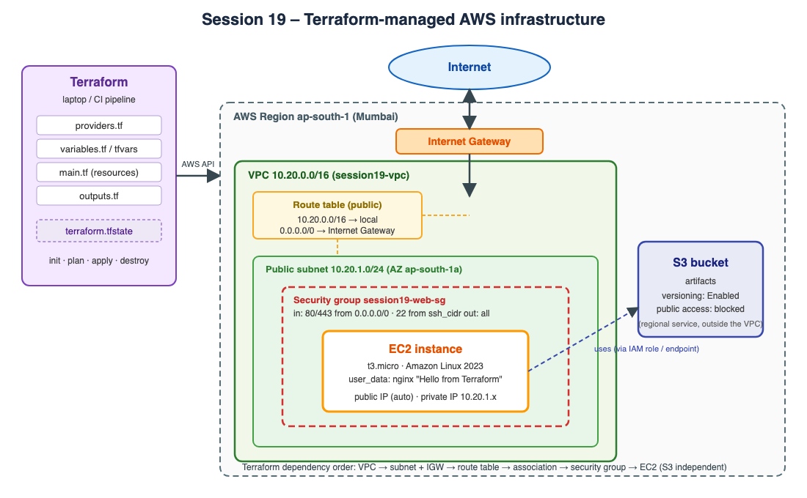

```text
Terraform
  ├── VPC 10.20.0.0/16
  │     ├── Public subnet 10.20.1.0/24 (ap-south-1a)
  │     ├── Internet Gateway  ──►  route table: 0.0.0.0/0 → IGW  (associated with the subnet)
  │     └── Security group: 80/443 from anywhere, 22 from var.ssh_cidr
  ├── EC2 t3.micro (Amazon Linux 2023, nginx via user_data) in the public subnet
  └── S3 bucket (versioning + public access blocked)
```
SVG source: [`diagrams/architecture.svg`](diagrams/architecture.svg)

> ## ⚠️ How the outputs in this README were produced
> The AWS access keys available while preparing this assignment were rejected by AWS (`InvalidClientTokenId`). Therefore the workflow was executed against **Moto, a local AWS API emulator in Docker** (`docker run -p 5555:5000 motoserver/moto`) by setting `use_local_emulator = true` (`-var-file=local-emulator.tfvars`, which also supplies an AMI id the emulator knows). The Terraform code, the plan, the dependency graph, the state and the CLI verification are real; **no real AWS resources or costs were involved, and the IDs/IPs shown belong to the emulator.** With valid credentials the same code runs on real AWS: `terraform apply` (uses `terraform.tfvars`, `use_local_emulator = false`, and looks up the latest Amazon Linux 2023 AMI).
> Emulator limitation seen: S3 **bucket tags** are not persisted by Moto, so a second `terraform plan` shows `1 to change` (the tags) – see "Idempotency" below. On AWS the second plan is expected to be empty.

## Project structure
```text
session19-terraform-cloud-infrastructure/
├── providers.tf          # terraform block, required provider (aws ~> 6.0), provider config, default tags
├── variables.tf          # input variables (region, CIDRs, instance type, AMI, ssh_cidr, bucket name…)
├── main.tf               # data sources + all resources
├── outputs.tf            # output values
├── terraform.tfvars      # values for real AWS
├── local-emulator.tfvars # values for the local emulator (used for the outputs below)
└── diagrams/             # architecture diagram (svg + png)
```

## What the project demonstrates
| Topic | In the code |
|---|---|
| **Terraform providers** | `required_providers { aws = { source = "hashicorp/aws", version = "~> 6.0" } }`, `provider "aws"` with `default_tags` |
| **Variables** | `variables.tf` – typed, documented, with defaults; values in `terraform.tfvars` |
| **Resources** | `aws_vpc`, `aws_subnet`, `aws_internet_gateway`, `aws_route_table`(+association), `aws_security_group`, `aws_instance`, `aws_s3_bucket`(+versioning, public-access-block) |
| **Data sources** | `aws_availability_zones` (picks the AZ), `aws_ami` (latest Amazon Linux 2023 when `ami_id` is empty) |
| **Outputs** | VPC/subnet/IGW/SG IDs, instance id + IPs, bucket name + ARN |
| **Dependencies** | *implicit* – `aws_subnet.public.vpc_id = aws_vpc.main.id` etc. build the graph (see `terraform graph` below); *explicit* – `depends_on = [aws_route_table_association.public]` on the instance so the route to the IGW exists before the server boots |
| **State** | `terraform.tfstate` records every resource (`terraform state list/show`); not committed (`.gitignore`) – use an S3 + DynamoDB remote backend in teams |
| **plan / apply / destroy** | below |

### Code
```hcl
# providers.tf
terraform {
  required_version = ">= 1.6.0"

  required_providers {
    aws = {
      source  = "hashicorp/aws"
      version = "~> 6.0"
    }
  }
}

provider "aws" {
  region = var.aws_region

  default_tags {
    tags = {
      Project   = var.project_name
      ManagedBy = "Terraform"
      Session   = "19"
    }
  }

  # ---- Optional: run the same code against a local AWS emulator (Moto) --------------
  # Default (use_local_emulator = false) talks to real AWS with your normal credentials.
  access_key                  = var.use_local_emulator ? "test" : null
  secret_key                  = var.use_local_emulator ? "test" : null
  skip_credentials_validation = var.use_local_emulator
  skip_requesting_account_id  = var.use_local_emulator
  skip_metadata_api_check     = var.use_local_emulator
  s3_use_path_style           = var.use_local_emulator

  endpoints {
    ec2 = var.use_local_emulator ? var.emulator_endpoint : null
    s3  = var.use_local_emulator ? var.emulator_endpoint : null
    sts = var.use_local_emulator ? var.emulator_endpoint : null
  }
}
```
```hcl
# variables.tf
variable "aws_region" {
  type        = string
  description = "AWS region for all resources."
  default     = "ap-south-1"
}

variable "project_name" {
  type        = string
  description = "Name prefix used for resource names and tags."
  default     = "session19"
}

variable "vpc_cidr" {
  type        = string
  description = "CIDR block of the VPC."
  default     = "10.20.0.0/16"
}

variable "public_subnet_cidr" {
  type        = string
  description = "CIDR block of the public subnet."
  default     = "10.20.1.0/24"
}

variable "instance_type" {
  type        = string
  description = "EC2 instance type."
  default     = "t3.micro"
}

variable "ami_id" {
  type        = string
  description = "AMI to launch. Empty = look up the latest Amazon Linux 2023 AMI (real AWS)."
  default     = ""
}

variable "ssh_cidr" {
  type        = string
  description = "CIDR allowed to SSH (port 22). Restrict this to your own IP, e.g. 203.0.113.10/32."
  default     = "10.0.0.0/8"
}

variable "bucket_name" {
  type        = string
  description = "Globally unique S3 bucket name for the application artifacts."
}

variable "use_local_emulator" {
  type        = bool
  description = "true = send API calls to a local AWS emulator (Moto) instead of real AWS."
  default     = false
}

variable "emulator_endpoint" {
  type        = string
  description = "URL of the local AWS emulator (only used when use_local_emulator = true)."
  default     = "http://localhost:5555"
}
```
```hcl
# main.tf
# ------------------------------------------------------------------ data sources
data "aws_availability_zones" "available" {
  state = "available"
}

# Latest Amazon Linux 2023 AMI (only looked up when no ami_id is given)
data "aws_ami" "al2023" {
  count       = var.ami_id == "" ? 1 : 0
  most_recent = true
  owners      = ["amazon"]

  filter {
    name   = "name"
    values = ["al2023-ami-2023*-x86_64"]
  }
}

locals {
  ami_id = var.ami_id != "" ? var.ami_id : data.aws_ami.al2023[0].id
  az     = data.aws_availability_zones.available.names[0]
}

# ------------------------------------------------------------------ networking
resource "aws_vpc" "main" {
  cidr_block           = var.vpc_cidr
  enable_dns_support   = true
  enable_dns_hostnames = true

  tags = { Name = "${var.project_name}-vpc" }
}

resource "aws_subnet" "public" {
  vpc_id                  = aws_vpc.main.id
  cidr_block              = var.public_subnet_cidr
  availability_zone       = local.az
  map_public_ip_on_launch = true

  tags = { Name = "${var.project_name}-public-subnet" }
}

resource "aws_internet_gateway" "igw" {
  vpc_id = aws_vpc.main.id

  tags = { Name = "${var.project_name}-igw" }
}

resource "aws_route_table" "public" {
  vpc_id = aws_vpc.main.id

  route {
    cidr_block = "0.0.0.0/0"
    gateway_id = aws_internet_gateway.igw.id
  }

  tags = { Name = "${var.project_name}-public-rt" }
}

resource "aws_route_table_association" "public" {
  subnet_id      = aws_subnet.public.id
  route_table_id = aws_route_table.public.id
}

# ------------------------------------------------------------------ security group
resource "aws_security_group" "web" {
  name        = "${var.project_name}-web-sg"
  description = "Allow HTTP/HTTPS from anywhere and SSH from a restricted CIDR"
  vpc_id      = aws_vpc.main.id

  ingress {
    description = "HTTP"
    from_port   = 80
    to_port     = 80
    protocol    = "tcp"
    cidr_blocks = ["0.0.0.0/0"]
  }

  ingress {
    description = "HTTPS"
    from_port   = 443
    to_port     = 443
    protocol    = "tcp"
    cidr_blocks = ["0.0.0.0/0"]
  }

  ingress {
    description = "SSH (restricted)"
    from_port   = 22
    to_port     = 22
    protocol    = "tcp"
    cidr_blocks = [var.ssh_cidr]
  }

  egress {
    description = "All outbound"
    from_port   = 0
    to_port     = 0
    protocol    = "-1"
    cidr_blocks = ["0.0.0.0/0"]
  }

  tags = { Name = "${var.project_name}-web-sg" }
}

# ------------------------------------------------------------------ compute
resource "aws_instance" "web" {
  ami                    = local.ami_id
  instance_type          = var.instance_type
  subnet_id              = aws_subnet.public.id
  vpc_security_group_ids = [aws_security_group.web.id]

  user_data = <<-EOT
    #!/bin/bash
    dnf install -y nginx
    echo "<h1>Hello from Terraform - Session 19</h1>" > /usr/share/nginx/html/index.html
    systemctl enable --now nginx
  EOT

  # the route to the Internet Gateway must exist before the instance boots
  depends_on = [aws_route_table_association.public]

  tags = { Name = "${var.project_name}-web" }
}

# ------------------------------------------------------------------ storage
resource "aws_s3_bucket" "artifacts" {
  bucket        = var.bucket_name
  force_destroy = true

  tags = { Name = var.bucket_name }
}

resource "aws_s3_bucket_versioning" "artifacts" {
  bucket = aws_s3_bucket.artifacts.id

  versioning_configuration {
    status = "Enabled"
  }
}

resource "aws_s3_bucket_public_access_block" "artifacts" {
  bucket                  = aws_s3_bucket.artifacts.id
  block_public_acls       = true
  block_public_policy     = true
  ignore_public_acls      = true
  restrict_public_buckets = true
}
```
```hcl
# outputs.tf
output "vpc_id" {
  description = "ID of the VPC."
  value       = aws_vpc.main.id
}

output "vpc_cidr" {
  description = "CIDR of the VPC."
  value       = aws_vpc.main.cidr_block
}

output "public_subnet_id" {
  description = "ID of the public subnet."
  value       = aws_subnet.public.id
}

output "internet_gateway_id" {
  description = "ID of the Internet Gateway."
  value       = aws_internet_gateway.igw.id
}

output "security_group_id" {
  description = "ID of the web security group."
  value       = aws_security_group.web.id
}

output "instance_id" {
  description = "ID of the EC2 instance."
  value       = aws_instance.web.id
}

output "instance_public_ip" {
  description = "Public IP of the EC2 instance."
  value       = aws_instance.web.public_ip
}

output "instance_private_ip" {
  description = "Private IP of the EC2 instance."
  value       = aws_instance.web.private_ip
}

output "bucket_name" {
  description = "Name of the S3 bucket."
  value       = aws_s3_bucket.artifacts.bucket
}

output "bucket_arn" {
  description = "ARN of the S3 bucket."
  value       = aws_s3_bucket.artifacts.arn
}
```

## Terraform commands and results
```bash
terraform init                 # download the aws provider, create .terraform.lock.hcl
terraform fmt -check           # formatting
terraform validate             # syntax / consistency
terraform plan  -out=s19.tfplan -var-file=local-emulator.tfvars   # (omit -var-file for real AWS)
terraform apply s19.tfplan
terraform output ; terraform state list ; terraform state show aws_instance.web
terraform destroy -var-file=local-emulator.tfvars
```

### init, fmt, validate
```text
$ ls -1
diagrams
local-emulator.tfvars
main.tf
outputs.tf
providers.tf
terraform.tfvars
variables.tf

$ terraform init -no-color 2>&1 | grep -vE "^$|lock file|Include this|selections|you run|Warning|Due to|calculate|darwin|these providers|platform|\(where"
Initializing the backend...
Initializing provider plugins...
- Finding hashicorp/aws versions matching "~> 6.0"...
- Installing hashicorp/aws v6.66.0...
- Installed hashicorp/aws v6.66.0 (unauthenticated)
  - hashicorp/aws
The current .terraform.lock.hcl file only includes checksums for
Terraform has been successfully initialized!

$ terraform fmt -check -diff -no-color; echo "terraform fmt exit code: $?"
terraform fmt exit code: 0

$ terraform validate -no-color
Success! The configuration is valid.
```
### plan – 10 resources to add
```text
$ terraform plan -no-color -var-file=local-emulator.tfvars -out=s19.tfplan 2>&1 | grep -E "^  # |^Plan:|^Changes|^  \+ (vpc|public|internet|security|instance|bucket)"
  # aws_instance.web will be created
  # aws_internet_gateway.igw will be created
  # aws_route_table.public will be created
  # aws_route_table_association.public will be created
  # aws_s3_bucket.artifacts will be created
  # aws_s3_bucket_public_access_block.artifacts will be created
  # aws_s3_bucket_versioning.artifacts will be created
  # aws_security_group.web will be created
  # aws_subnet.public will be created
  # aws_vpc.main will be created
Plan: 10 to add, 0 to change, 0 to destroy.
Changes to Outputs:
  + bucket_arn          = (known after apply)
  + bucket_name         = "subhan-rahiman-devops-s19-artifacts"
  + instance_id         = (known after apply)
  + instance_private_ip = (known after apply)
  + instance_public_ip  = (known after apply)
  + internet_gateway_id = (known after apply)
  + public_subnet_id    = (known after apply)
  + security_group_id   = (known after apply)
  + vpc_cidr            = "10.20.0.0/16"
  + vpc_id              = (known after apply)
```
### apply – created in dependency order
```text
$ terraform apply -no-color -auto-approve s19.tfplan
aws_vpc.main: Creating...
aws_s3_bucket.artifacts: Creating...
aws_vpc.main: Creation complete after 1s [id=vpc-a84a6db142676b864]
aws_internet_gateway.igw: Creating...
aws_subnet.public: Creating...
aws_security_group.web: Creating...
aws_internet_gateway.igw: Creation complete after 0s [id=igw-1a8edc5ab7b3debcb]
aws_route_table.public: Creating...
aws_s3_bucket.artifacts: Creation complete after 1s [id=subhan-rahiman-devops-s19-artifacts]
aws_s3_bucket_public_access_block.artifacts: Creating...
aws_s3_bucket_versioning.artifacts: Creating...
aws_s3_bucket_public_access_block.artifacts: Creation complete after 0s [id=subhan-rahiman-devops-s19-artifacts]
aws_route_table.public: Creation complete after 0s [id=rtb-39ca774a243b57823]
aws_security_group.web: Creation complete after 0s [id=sg-a93299f2280f75a09]
aws_s3_bucket_versioning.artifacts: Creation complete after 1s [id=subhan-rahiman-devops-s19-artifacts]
aws_subnet.public: Still creating... [00m10s elapsed]
aws_subnet.public: Creation complete after 10s [id=subnet-1f11aa5cf6f00c3f1]
aws_route_table_association.public: Creating...
aws_route_table_association.public: Creation complete after 0s [id=rtbassoc-a6267703870960732]
aws_instance.web: Creating...
aws_instance.web: Still creating... [00m10s elapsed]
aws_instance.web: Creation complete after 10s [id=i-9211b11922a00fb57]

Apply complete! Resources: 10 added, 0 changed, 0 destroyed.

Outputs:

bucket_arn = "arn:aws:s3:::subhan-rahiman-devops-s19-artifacts"
bucket_name = "subhan-rahiman-devops-s19-artifacts"
instance_id = "i-9211b11922a00fb57"
instance_private_ip = "10.20.1.4"
instance_public_ip = "54.214.107.225"
internet_gateway_id = "igw-1a8edc5ab7b3debcb"
public_subnet_id = "subnet-1f11aa5cf6f00c3f1"
security_group_id = "sg-a93299f2280f75a09"
vpc_cidr = "10.20.0.0/16"
vpc_id = "vpc-a84a6db142676b864"
```
VPC and S3 start in parallel (no dependency); the subnet, IGW and SG need the VPC; the route table needs the IGW; the association needs route table + subnet; the instance is created last.

### Outputs and state
```text
$ terraform output
bucket_arn = "arn:aws:s3:::subhan-rahiman-devops-s19-artifacts"
bucket_name = "subhan-rahiman-devops-s19-artifacts"
instance_id = "i-9211b11922a00fb57"
instance_private_ip = "10.20.1.4"
instance_public_ip = "54.214.107.225"
internet_gateway_id = "igw-1a8edc5ab7b3debcb"
public_subnet_id = "subnet-1f11aa5cf6f00c3f1"
security_group_id = "sg-a93299f2280f75a09"
vpc_cidr = "10.20.0.0/16"
vpc_id = "vpc-a84a6db142676b864"

$ terraform state list
data.aws_availability_zones.available
aws_instance.web
aws_internet_gateway.igw
aws_route_table.public
aws_route_table_association.public
aws_s3_bucket.artifacts
aws_s3_bucket_public_access_block.artifacts
aws_s3_bucket_versioning.artifacts
aws_security_group.web
aws_subnet.public
aws_vpc.main

$ terraform state show aws_instance.web | head -n 22
# aws_instance.web:
resource "aws_instance" "web" {
    ami                                  = "ami-12c6146b"
    arn                                  = "arn:aws:ec2:ap-south-1::instance/i-9211b11922a00fb57"
    associate_public_ip_address          = true
    availability_zone                    = "ap-south-1a"
    disable_api_stop                     = false
    disable_api_termination              = false
    ebs_optimized                        = false
    force_destroy                        = false
    get_password_data                    = false
    hibernation                          = false
    host_id                              = null
    iam_instance_profile                 = null
    id                                   = "i-9211b11922a00fb57"
    instance_initiated_shutdown_behavior = "stop"
    instance_lifecycle                   = null
    instance_state                       = "running"
    instance_type                        = "t3.micro"
    ipv6_address_count                   = 0
    ipv6_addresses                       = []
    key_name                             = null
```
### Independent verification with the AWS CLI
```text
$ AWS_ACCESS_KEY_ID=test AWS_SECRET_ACCESS_KEY=test AWS_DEFAULT_REGION=ap-south-1 aws --endpoint-url http://localhost:5555 ec2 describe-vpcs --filters Name=tag:Name,Values=session19-vpc --query 'Vpcs[].[VpcId,CidrBlock,State]' --output table
--------------------------------------------------------
|                     DescribeVpcs                     |
+------------------------+----------------+------------+
|  vpc-a84a6db142676b864 |  10.20.0.0/16  |  available |
+------------------------+----------------+------------+

$ AWS_ACCESS_KEY_ID=test AWS_SECRET_ACCESS_KEY=test AWS_DEFAULT_REGION=ap-south-1 aws --endpoint-url http://localhost:5555 ec2 describe-subnets --filters Name=tag:Name,Values=session19-public-subnet --query 'Subnets[].[SubnetId,CidrBlock,AvailabilityZone,MapPublicIpOnLaunch]' --output table
---------------------------------------------------------------------
|                          DescribeSubnets                          |
+---------------------------+---------------+--------------+--------+
|  subnet-1f11aa5cf6f00c3f1 |  10.20.1.0/24 |  ap-south-1a |  True  |
+---------------------------+---------------+--------------+--------+

$ AWS_ACCESS_KEY_ID=test AWS_SECRET_ACCESS_KEY=test AWS_DEFAULT_REGION=ap-south-1 aws --endpoint-url http://localhost:5555 ec2 describe-route-tables --filters Name=tag:Name,Values=session19-public-rt --query 'RouteTables[].Routes[].[DestinationCidrBlock,GatewayId]' --output table
-------------------------------------------
|           DescribeRouteTables           |
+---------------+-------------------------+
|  10.20.0.0/16 |  local                  |
|  0.0.0.0/0    |  igw-1a8edc5ab7b3debcb  |
+---------------+-------------------------+

$ AWS_ACCESS_KEY_ID=test AWS_SECRET_ACCESS_KEY=test AWS_DEFAULT_REGION=ap-south-1 aws --endpoint-url http://localhost:5555 ec2 describe-security-groups --filters Name=group-name,Values=session19-web-sg --query 'SecurityGroups[].IpPermissions[].[FromPort,ToPort,IpProtocol,IpRanges[0].CidrIp]' --output table
-------------------------------------
|      DescribeSecurityGroups       |
+-----+------+------+---------------+
|  22 |  22  |  tcp |  10.0.0.0/8   |
|  80 |  80  |  tcp |  0.0.0.0/0    |
|  443|  443 |  tcp |  0.0.0.0/0    |
+-----+------+------+---------------+

$ AWS_ACCESS_KEY_ID=test AWS_SECRET_ACCESS_KEY=test AWS_DEFAULT_REGION=ap-south-1 aws --endpoint-url http://localhost:5555 ec2 describe-instances --filters Name=tag:Name,Values=session19-web --query 'Reservations[].Instances[].[InstanceId,InstanceType,State.Name,PublicIpAddress,PrivateIpAddress,SubnetId]' --output table
-----------------------------------------------------------------------------------------------------------
|                                            DescribeInstances                                            |
+---------------------+-----------+----------+-----------------+------------+-----------------------------+
|  i-9211b11922a00fb57|  t3.micro |  running |  54.214.107.225 |  10.20.1.4 |  subnet-1f11aa5cf6f00c3f1   |
+---------------------+-----------+----------+-----------------+------------+-----------------------------+

$ AWS_ACCESS_KEY_ID=test AWS_SECRET_ACCESS_KEY=test AWS_DEFAULT_REGION=ap-south-1 aws --endpoint-url http://localhost:5555 s3 ls; AWS_ACCESS_KEY_ID=test AWS_SECRET_ACCESS_KEY=test AWS_DEFAULT_REGION=ap-south-1 aws --endpoint-url http://localhost:5555 s3api get-bucket-versioning --bucket subhan-rahiman-devops-s19-artifacts
2026-10-08 00:43:55 subhan-rahiman-devops-s19-artifacts
{
    "Status": "Enabled"
}
```
Every resource exists with the intended settings: VPC `10.20.0.0/16`, subnet `10.20.1.0/24` in `ap-south-1a` with `MapPublicIpOnLaunch=True`, route `0.0.0.0/0 → igw-…`, security-group rules 22/80/443, a `running` t3.micro in the subnet with public and private IP, and a versioned bucket.

### Idempotency and the dependency graph
```text
$ terraform plan -no-color -var-file=local-emulator.tfvars 2>&1 | sed -n "/will be updated/,\$p" | head -n 22
  # aws_s3_bucket.artifacts will be updated in-place
  ~ resource "aws_s3_bucket" "artifacts" {
        id                          = "subhan-rahiman-devops-s19-artifacts"
      ~ tags                        = {
          + "Name" = "subhan-rahiman-devops-s19-artifacts"
        }
      ~ tags_all                    = {
          + "ManagedBy" = "Terraform"
          + "Name"      = "subhan-rahiman-devops-s19-artifacts"
          + "Project"   = "session19"
          + "Session"   = "19"
        }
        # (14 unchanged attributes hidden)

        # (2 unchanged blocks hidden)
    }

Plan: 0 to add, 1 to change, 0 to destroy.

$ terraform graph | grep -E "\->" | grep -v "provider\[" | head -n 14
  "aws_instance.web" -> "data.aws_ami.al2023";
  "aws_instance.web" -> "aws_route_table_association.public";
  "aws_instance.web" -> "aws_security_group.web";
  "aws_internet_gateway.igw" -> "aws_vpc.main";
  "aws_route_table.public" -> "aws_internet_gateway.igw";
  "aws_route_table_association.public" -> "aws_route_table.public";
  "aws_route_table_association.public" -> "aws_subnet.public";
  "aws_s3_bucket_public_access_block.artifacts" -> "aws_s3_bucket.artifacts";
  "aws_s3_bucket_versioning.artifacts" -> "aws_s3_bucket.artifacts";
  "aws_security_group.web" -> "aws_vpc.main";
  "aws_subnet.public" -> "data.aws_availability_zones.available";
  "aws_subnet.public" -> "aws_vpc.main";
```
The diff is only the S3 bucket **tags** (emulator limitation, see the note at the top). `terraform graph` lists the dependency edges Terraform derived from the references: e.g. `aws_instance.web → aws_security_group.web / aws_route_table_association.public`, `aws_route_table.public → aws_internet_gateway.igw → aws_vpc.main`.

### destroy
```text
$ terraform destroy -no-color -auto-approve -var-file=local-emulator.tfvars 2>&1 | grep -E "Destroying|Destruction complete|Destroy complete"
aws_s3_bucket_public_access_block.artifacts: Destroying... [id=subhan-rahiman-devops-s19-artifacts]
aws_s3_bucket_versioning.artifacts: Destroying... [id=subhan-rahiman-devops-s19-artifacts]
aws_instance.web: Destroying... [id=i-9211b11922a00fb57]
aws_s3_bucket_versioning.artifacts: Destruction complete after 0s
aws_s3_bucket_public_access_block.artifacts: Destruction complete after 0s
aws_s3_bucket.artifacts: Destroying... [id=subhan-rahiman-devops-s19-artifacts]
aws_s3_bucket.artifacts: Destruction complete after 0s
aws_instance.web: Destruction complete after 10s
aws_route_table_association.public: Destroying... [id=rtbassoc-a6267703870960732]
aws_security_group.web: Destroying... [id=sg-a93299f2280f75a09]
aws_route_table_association.public: Destruction complete after 0s
aws_subnet.public: Destroying... [id=subnet-1f11aa5cf6f00c3f1]
aws_route_table.public: Destroying... [id=rtb-39ca774a243b57823]
aws_subnet.public: Destruction complete after 0s
aws_security_group.web: Destruction complete after 0s
aws_route_table.public: Destruction complete after 1s
aws_internet_gateway.igw: Destroying... [id=igw-1a8edc5ab7b3debcb]
aws_internet_gateway.igw: Destruction complete after 0s
aws_vpc.main: Destroying... [id=vpc-a84a6db142676b864]
aws_vpc.main: Destruction complete after 0s
Destroy complete! Resources: 10 destroyed.

$ terraform state list; echo '(empty state)'; AWS_ACCESS_KEY_ID=test AWS_SECRET_ACCESS_KEY=test AWS_DEFAULT_REGION=ap-south-1 aws --endpoint-url http://localhost:5555 ec2 describe-instances --filters Name=tag:Name,Values=session19-web --query 'Reservations[].Instances[].State.Name' --output text; AWS_ACCESS_KEY_ID=test AWS_SECRET_ACCESS_KEY=test AWS_DEFAULT_REGION=ap-south-1 aws --endpoint-url http://localhost:5555 ec2 describe-vpcs --filters Name=tag:Name,Values=session19-vpc --query 'Vpcs[].VpcId' --output text; echo '(no VPC / instance left)'
(empty state)
terminated
(no VPC / instance left)
```
Resources are destroyed in the **reverse** dependency order (instance first, VPC last); afterwards the state is empty and the emulator reports no VPC and the instance as `terminated`.

## Real-AWS notes
* Run `aws sts get-caller-identity` first to confirm your credentials; the bucket name must be globally unique; set `ssh_cidr` to `<your-ip>/32`.
* Costs: the t3.micro instance and public IPv4 address are billed while running (free-tier eligible in many accounts); always finish with `terraform destroy`.
* AWS Console screenshots (VPC / EC2 / S3 pages) require a real account login and are therefore not included; the terminal screenshots below show the same facts (Terraform + AWS CLI output).


## Attempt on real AWS (blocked by the account's organisation policy)

The same project was also run against **real AWS** (region `ap-south-1`, IAM user with `AdministratorAccess` in an AWS Organizations member account). The account's policies block the services this project needs: Terraform's data sources failed with **HTTP 403** (`ec2:DescribeAvailabilityZones`, `ec2:DescribeImages`), so the plan could not be completed, and even a read-only `aws ec2 describe-vpcs` returns *UnauthorizedOperation*; S3 is explicitly denied by a Service Control Policy (see Session 18). Terraform therefore refused to apply (`Cannot apply incomplete plan`): **no resources were created on AWS, no cost was incurred and `terraform destroy` had nothing to remove**. The account ID is redacted. All other results in this README come from the local emulator.

```text
$ terraform plan -no-color -out=s19.tfplan 2>&1 | grep -E "^  # |^Plan:|^Changes|^  \+ (vpc|public|internet|security|instance|bucket)|Error"
  # aws_internet_gateway.igw will be created
  # aws_route_table.public will be created
  # aws_s3_bucket.artifacts will be created
  # aws_s3_bucket_public_access_block.artifacts will be created
  # aws_s3_bucket_versioning.artifacts will be created
  # aws_security_group.web will be created
  # aws_vpc.main will be created
Plan: 7 to add, 0 to change, 0 to destroy.
Changes to Outputs:
  + bucket_arn          = (known after apply)
  + bucket_name         = "subhan-rahiman-s19-24bcs10095"
  + internet_gateway_id = (known after apply)
  + security_group_id   = (known after apply)
  + vpc_cidr            = "10.20.0.0/16"
  + vpc_id              = (known after apply)
Error: fetching Availability Zones: operation error EC2: DescribeAvailabilityZones, https response error StatusCode: 403, RequestID: <id>, api error UnauthorizedOperation: You are not authorized to perform this operation. User: arn:aws:iam::<ACCOUNT_ID>:user/terraform-training is not authorized to perform: ec2:DescribeAvailabilityZones with an explicit deny in a service control policy: arn:aws:organizations::<ORG_MGM
Error: reading EC2 AMIs: operation error EC2: DescribeImages, https response error StatusCode: 403, RequestID: <id>, api error UnauthorizedOperation: You are not authorized to perform this operation. User: arn:aws:iam::<ACCOUNT_ID>:user/terraform-training is not authorized to perform: ec2:DescribeImages with an explicit deny in a service control policy: arn:aws:organizations::<ORG_MGMT_ACCOUNT_ID>:policy/<ORG_ID>/ser

$ terraform apply -no-color -auto-approve s19.tfplan
Error: Cannot apply incomplete plan - Terraform encountered an error when generating this plan, so it cannot be applied.

$ aws ec2 describe-vpcs --filters Name=tag:Name,Values=session19-vpc
aws: [ERROR]: An error occurred (UnauthorizedOperation) when calling the DescribeVpcs operation: You are not authorized to perform this operation. User: arn:aws:iam::<ACCOUNT_ID>:user/terraform-training is not authorized to perform: ec2:DescribeVpcs with an explicit deny in a service control policy: arn:aws:organizations::<ORG_MGMT_ACCOUNT_ID>:policy/<ORG_ID>/service_control_policy/<POLICY_ID>
```

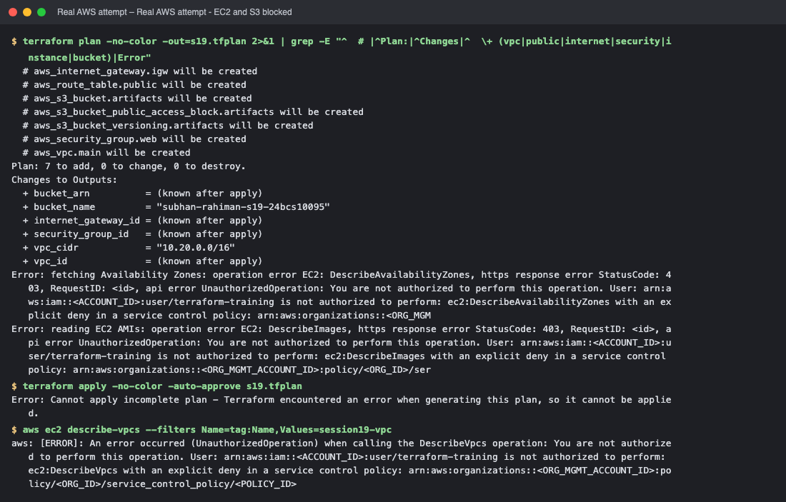

<!-- real-aws:end -->
<!-- screenshots:start -->


## Screenshots (terminal output of the live run)

> Each image shows the real output of the commands run for this task (rendered from the captured terminal output of the actual run).

### init, fmt, validate

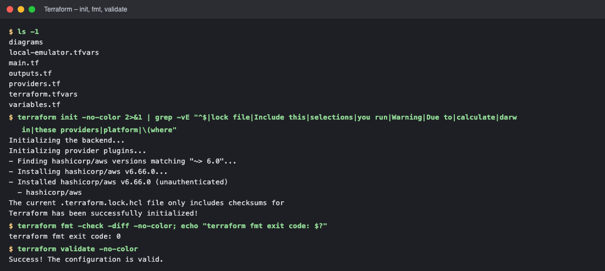

*Commands: `ls -1` · `terraform init -no-color 2>&1 | grep -vE "^$|lock file|Include this|se` · `terraform fmt -check -diff -no-color` · `terraform validate -no-color`*

### plan

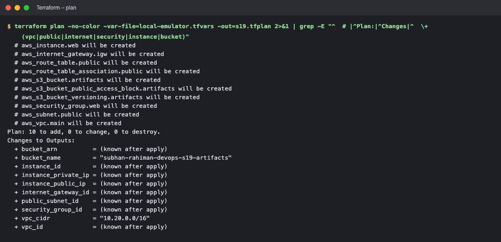

*Commands: `terraform plan -no-color -var-file=local-emulator.tfvars -out=s19.tfpl`*

### apply

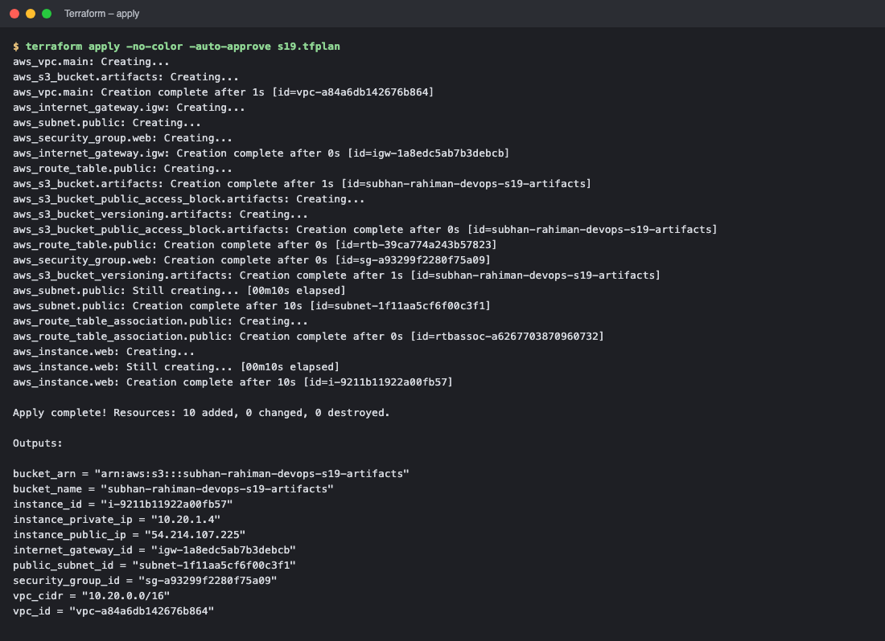

*Commands: `terraform apply -no-color -auto-approve s19.tfplan`*

### outputs and state

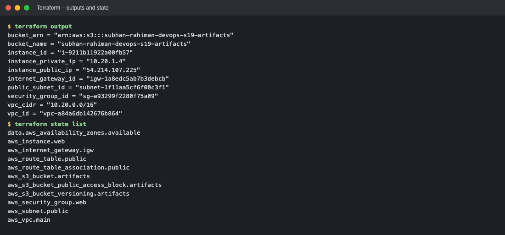

*Commands: `terraform output` · `terraform state list`*

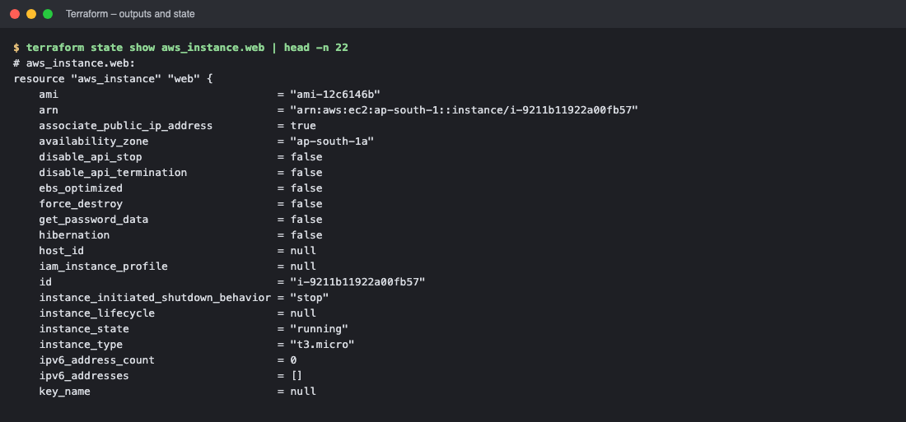

*Commands: `terraform state show aws_instance.web | head -n 22`*

### verify with the AWS CLI

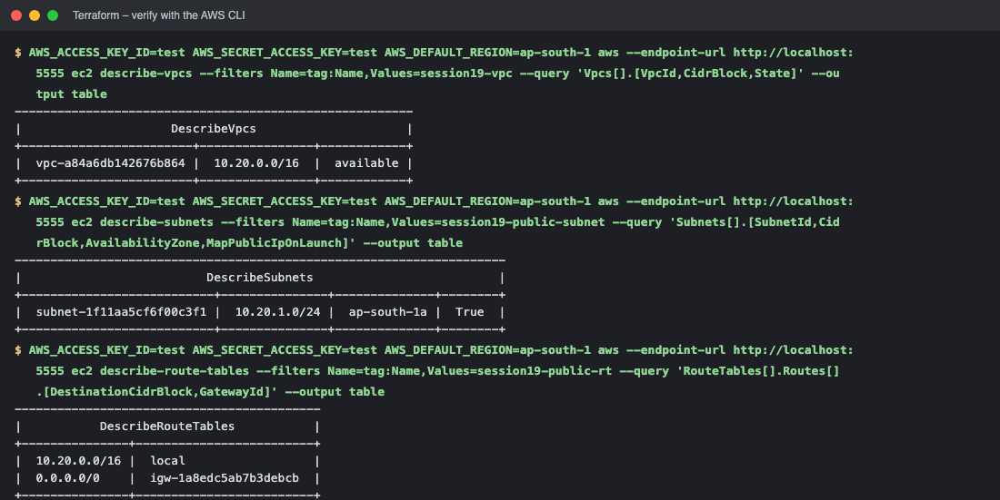

*Commands: `AWS_ACCESS_KEY_ID=test AWS_SECRET_ACCESS_KEY=test AWS_DEFAULT_REGION=a` · `AWS_ACCESS_KEY_ID=test AWS_SECRET_ACCESS_KEY=test AWS_DEFAULT_REGION=a` · `AWS_ACCESS_KEY_ID=test AWS_SECRET_ACCESS_KEY=test AWS_DEFAULT_REGION=a`*

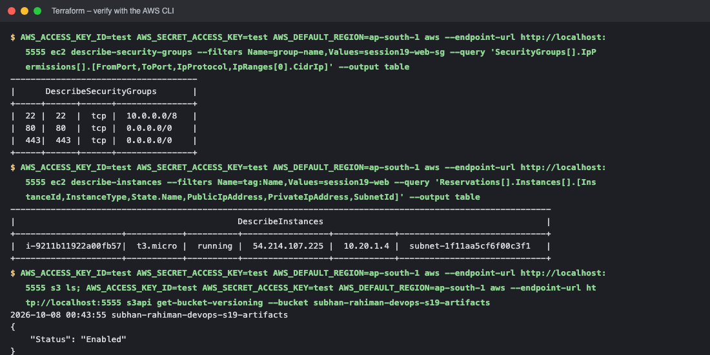

*Commands: `AWS_ACCESS_KEY_ID=test AWS_SECRET_ACCESS_KEY=test AWS_DEFAULT_REGION=a` · `AWS_ACCESS_KEY_ID=test AWS_SECRET_ACCESS_KEY=test AWS_DEFAULT_REGION=a` · `AWS_ACCESS_KEY_ID=test AWS_SECRET_ACCESS_KEY=test AWS_DEFAULT_REGION=a`*

### idempotency and dependency graph

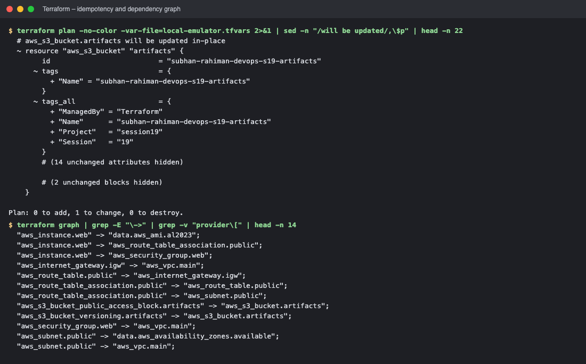

*Commands: `terraform plan -no-color -var-file=local-emulator.tfvars 2>&1 | sed -n` · `terraform graph | grep -E "\->" | grep -v "provider\[" | head -n 14`*

### destroy

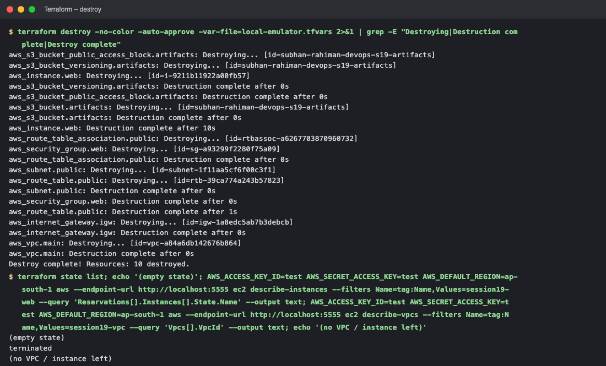

*Commands: `terraform destroy -no-color -auto-approve -var-file=local-emulator.tfv` · `terraform state list`*

<!-- screenshots:end -->

