# GitOps with Argo CD (Session 20 – Task 3)

## What is GitOps?
**GitOps** is a way of operating infrastructure and applications where **Git is the single source of truth** for the *desired state* of the system, and an automated agent **continuously reconciles** the real environment to match Git.

```text
Developer ── git push / pull request ──► Git repository (desired state, YAML)
                                              ▲   │ pulled
                       reports drift/health   │   ▼
                                 Argo CD (agent in the cluster) ── apply ──► Kubernetes (actual state)
                                      └── compares desired vs actual continuously and fixes differences
```

### Core principles
| Principle | Meaning | In this demo |
|---|---|---|
| **Declarative** | the system is described as desired state (YAML), not as a list of commands | `app/deployment.yaml`, `service.yaml`, `namespace.yaml` |
| **Versioned & immutable (Git as source of truth)** | every change is a commit: history, review, approval, audit, easy rollback | `git log`, `git revert` |
| **Pulled automatically** | an agent *inside* the cluster pulls from Git – no CI system needs cluster credentials | Argo CD polls the repo |
| **Continuously reconciled** | the agent detects **drift** (manual changes) and self-heals | `selfHeal: true` reverted `kubectl scale` |

### GitOps workflow
1. Change the YAML in a branch → pull request → review → merge to `main`.
2. Argo CD notices the new commit (polling every ~3 min or via webhook).
3. It renders the manifests, **diffs** them with the live cluster (OutOfSync) and **syncs** (automated sync).
4. It keeps watching: manual edits in the cluster are detected and reverted; deleted resources are recreated; removed-from-Git resources are pruned.
5. Rollback = `git revert` – the cluster follows.

### Push vs pull deployment
| | CI/CD push (Sessions 16–17: `kubectl apply` from the pipeline) | GitOps pull (Argo CD / Flux) |
|---|---|---|
| Who applies | the pipeline, from outside | an agent inside the cluster |
| Cluster credentials | stored in the CI system | stay in the cluster |
| Drift | not noticed until next deploy | detected and corrected continuously |
| Audit / rollback | pipeline logs | Git history |

### Kubernetes + GitOps tools
**Argo CD** (UI + CRD `Application`), **Flux** (toolkit of controllers), Argo Rollouts / Flagger for progressive delivery, Kustomize / Helm as the manifest formats, Sealed Secrets / External Secrets / SOPS for secrets in Git. CI still builds and tests the image and then only **updates the image tag in the Git repo**.

## This demo
* Git repo (this repository), path watched by Argo CD: [`app/`](app/) = `namespace.yaml`, `deployment.yaml` (2 replicas, `nginx:1.26-alpine`), `service.yaml`.
* The Argo CD **Application** [`argocd/application.yaml`](argocd/application.yaml) is applied **once by hand** and kept outside the synced path:
```yaml
# Applied ONCE by hand (kubectl apply -f). It tells Argo CD where the desired state lives in Git.
# Keep it OUTSIDE the synced path (app/) so Argo CD does not try to manage itself.
apiVersion: argoproj.io/v1alpha1
kind: Application
metadata:
  name: gitops-demo
  namespace: argocd
spec:
  project: default
  source:
    repoURL: https://github.com/SubhanRahiman7/devops-assignment-1-20.git
    targetRevision: main
    path: session20-monitoring-observability-gitops/gitops-demo/app
  destination:
    server: https://kubernetes.default.svc
    namespace: gitops-demo
  syncPolicy:
    automated:
      prune: true        # delete resources that were removed from Git
      selfHeal: true     # revert manual changes made directly in the cluster
    syncOptions:
      - CreateNamespace=true
```
* Cluster: Minikube; Argo CD v3.1.0 installed with `kubectl apply -n argocd -f https://raw.githubusercontent.com/argoproj/argo-cd/v3.1.0/manifests/install.yaml` (for the UI screenshots the demo server runs with authentication disabled – local use only).

### 1. Install
```text
$ kubectl get pods -n argocd
NAME                                                READY   STATUS    RESTARTS   AGE
argocd-application-controller-0                     1/1     Running   0          2m31s
argocd-applicationset-controller-7d5cf5f467-cfz5s   1/1     Running   0          2m32s
argocd-dex-server-74cbc87bdd-9tdjl                  1/1     Running   0          2m32s
argocd-notifications-controller-6b98897fc7-4wlz4    1/1     Running   0          2m32s
argocd-redis-6978799577-d2n8p                       1/1     Running   0          2m32s
argocd-repo-server-5c59b6545d-5s2sb                 1/1     Running   0          2m32s
argocd-server-b6665c98d-pz4gc                       1/1     Running   0          41s

$ kubectl get crd | grep argoproj.io
applications.argoproj.io      Namespaced   v1alpha1(storage)   2026-10-07T19:31:26Z
applicationsets.argoproj.io   Namespaced   v1alpha1(storage)   2026-10-07T19:31:26Z
appprojects.argoproj.io       Namespaced   v1alpha1(storage)   2026-10-07T19:31:27Z
```
### 2. Create the Application → the cluster is built from Git
```text
$ cat argocd/application.yaml
# Applied ONCE by hand (kubectl apply -f). It tells Argo CD where the desired state lives in Git.
# Keep it OUTSIDE the synced path (app/) so Argo CD does not try to manage itself.
apiVersion: argoproj.io/v1alpha1
kind: Application
metadata:
  name: gitops-demo
  namespace: argocd
spec:
  project: default
  source:
    repoURL: https://github.com/SubhanRahiman7/devops-assignment-1-20.git
    targetRevision: main
    path: session20-monitoring-observability-gitops/gitops-demo/app
  destination:
    server: https://kubernetes.default.svc
    namespace: gitops-demo
  syncPolicy:
    automated:
      prune: true        # delete resources that were removed from Git
      selfHeal: true     # revert manual changes made directly in the cluster
    syncOptions:
      - CreateNamespace=true

$ kubectl apply -f argocd/application.yaml
application.argoproj.io/gitops-demo created

$ kubectl get applications -n argocd
NAME          SYNC STATUS   HEALTH STATUS
gitops-demo   Synced        Healthy

$ kubectl get all -n gitops-demo
NAME                              READY   STATUS    RESTARTS   AGE
pod/gitops-web-6c849db454-9sl27   1/1     Running   0          19s
pod/gitops-web-6c849db454-bcb8n   1/1     Running   0          19s

NAME                 TYPE        CLUSTER-IP      EXTERNAL-IP   PORT(S)   AGE
service/gitops-web   ClusterIP   10.111.114.47   <none>        80/TCP    19s

NAME                         READY   UP-TO-DATE   AVAILABLE   AGE
deployment.apps/gitops-web   2/2     2            2           19s

NAME                                    DESIRED   CURRENT   READY   AGE
replicaset.apps/gitops-web-6c849db454   2         2         2       19s

$ kubectl get deploy gitops-web -n gitops-demo   # replicas / image from Git v1
replicas=2 image=nginx:1.26-alpine
```
### 3. Change the desired state in Git (replicas 3, nginx 1.27)
```text
$ edit app/deployment.yaml:  replicas 2 -> 3, image nginx:1.26-alpine -> nginx:1.27-alpine
 .../gitops-demo/app/deployment.yaml                                   | 4 ++--
 1 file changed, 2 insertions(+), 2 deletions(-)
-  replicas: 2
+  replicas: 3
-          image: nginx:1.26-alpine
+          image: nginx:1.27-alpine

$ git log --oneline -3   # the change is a Git commit
b9a494d GitOps demo: scale to 3 replicas and upgrade nginx to 1.27
5aa4a00 Session 20 GitOps demo: application manifests v1 (replicas 2, nginx 1.26)
a5f5981 Session 19: README, architecture diagram and screenshots

$ kubectl get applications -n argocd   # synced automatically
NAME          SYNC STATUS   HEALTH STATUS
gitops-demo   Synced        Healthy

$ kubectl get pods,deploy -n gitops-demo   # now 3 replicas on nginx 1.27
deployment "gitops-web" successfully rolled out
NAME                          READY   STATUS      RESTARTS   AGE
gitops-web-6c849db454-sjx84   0/1     Completed   0          4s
gitops-web-7cfb44c767-rq6cv   1/1     Running     0          2s
gitops-web-7cfb44c767-t4fwx   1/1     Running     0          3s
gitops-web-7cfb44c767-vbzhk   1/1     Running     0          4s
replicas=3 image=nginx:1.27-alpine
```
The only action was a `git commit` + `git push`; Argo CD synced the cluster to 3 replicas on nginx 1.27 (a new ReplicaSet; the old Pod shows `Completed` while the rolling update finishes).

### 4. Drift: a manual change is reverted (self-heal)
```text
$ kubectl scale deploy gitops-web -n gitops-demo --replicas=6   # someone changes the cluster by hand
deployment.apps/gitops-web scaled

$ kubectl get deploy gitops-web -n gitops-demo   # right after the manual change
replicas now: 3

$ kubectl get deploy,pods,applications   # Argo CD put it back to the value in Git
replicas now: 3
       6
NAME          SYNC STATUS   HEALTH STATUS
gitops-demo   Synced        Healthy
```
`kubectl scale … --replicas=6` was undone by Argo CD within a couple of seconds (the Deployment already reads 3 again in the next command; the extra Pods were terminated).

### 5. Rollback = `git revert`
```text
$ git revert --no-edit HEAD   # undo the change in Git
[main f3cde1e] Revert "GitOps demo: scale to 3 replicas and upgrade nginx to 1.27"
 Date: Thu Oct 8 01:09:47 2026 +0530
 1 file changed, 2 insertions(+), 2 deletions(-)

$ git log --oneline -4
f3cde1e Revert "GitOps demo: scale to 3 replicas and upgrade nginx to 1.27"
b9a494d GitOps demo: scale to 3 replicas and upgrade nginx to 1.27
5aa4a00 Session 20 GitOps demo: application manifests v1 (replicas 2, nginx 1.26)
a5f5981 Session 19: README, architecture diagram and screenshots

$ kubectl get applications -n argocd; kubectl get deploy gitops-web -n gitops-demo   # back to v1
NAME          SYNC STATUS   HEALTH STATUS
gitops-demo   Synced        Healthy
replicas=2 image=nginx:1.26-alpine
```

## Screenshots (Argo CD UI)
**Argo CD – applications list: gitops-demo Synced + Healthy**

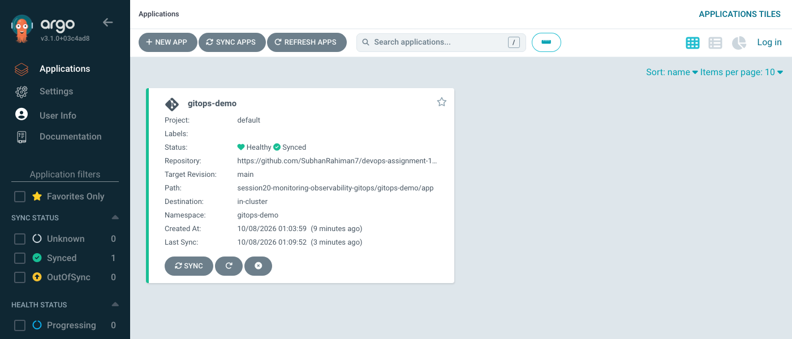

**Argo CD – resource tree for Git v1 (2 replicas, nginx 1.26): Namespace, Service, Deployment, ReplicaSets**


**Argo CD – pods view for v1 (2 pods)**

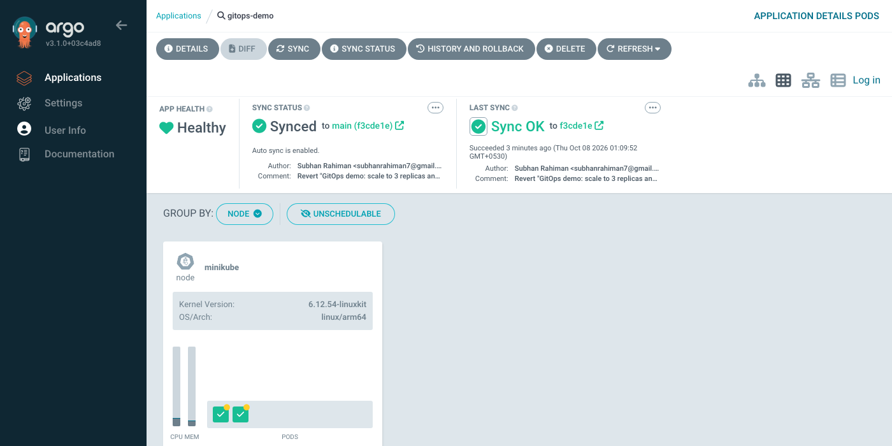

**Argo CD – after the Git commit: 3 replicas, nginx 1.27, Synced + Healthy (new ReplicaSet revision)**

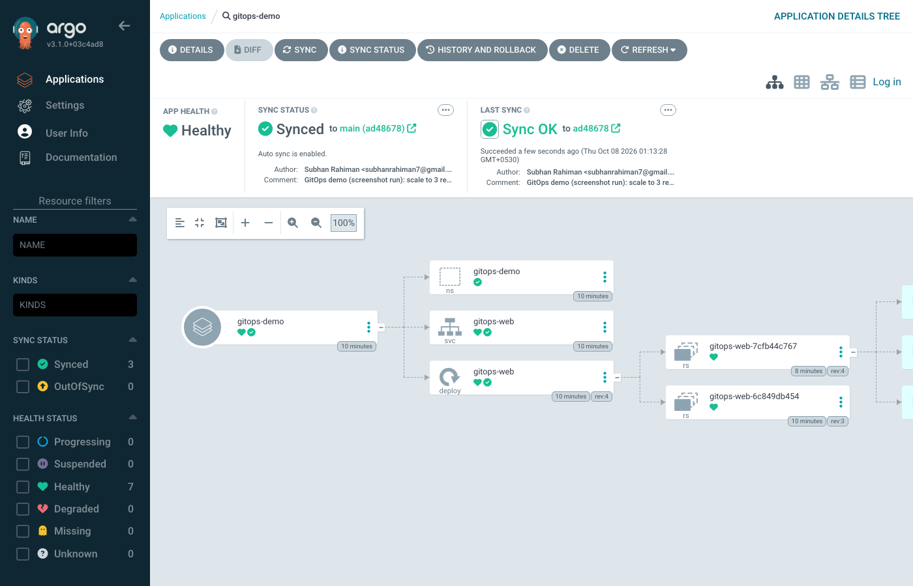

**Argo CD – pods view for v2 (3 pods)**

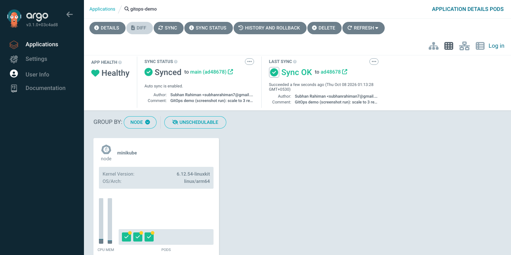

**Argo CD – after "git revert" the cluster is back to 2 replicas / nginx 1.26 (Git history is the rollback)**

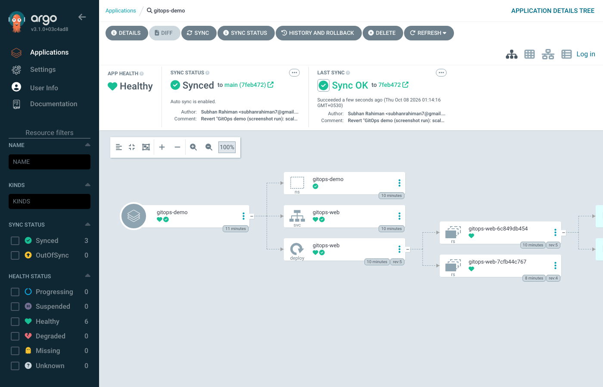


## Summary
Git (desired state) → Argo CD (reconciler) → Kubernetes (actual state): deploy by commit, audit by `git log`, roll back by `git revert`, and the cluster cannot silently drift away from Git.

<!-- screenshots:start -->


## Screenshots (terminal output of the live run)

> Each image shows the real output of the commands run for this task (rendered from the captured terminal output of the actual run).

### 1 Argo CD is installed

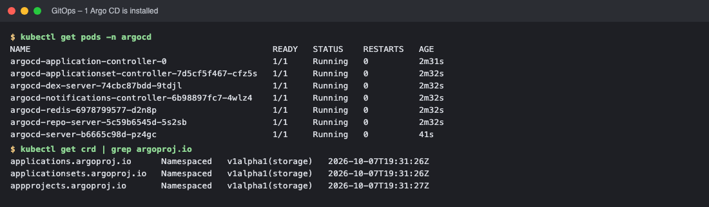

*Commands: `kubectl get pods -n argocd` · `kubectl get crd | grep argoproj.io`*

### 2 Create the Application (Git -> Kubernetes)

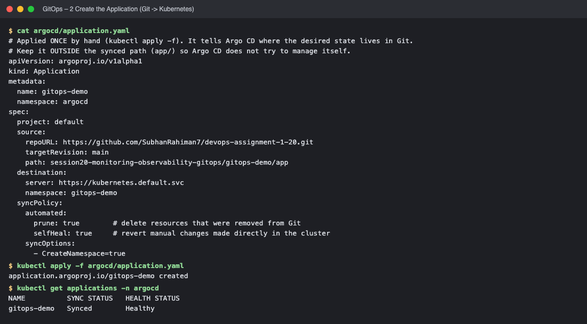

*Commands: `cat argocd/application.yaml` · `kubectl apply -f argocd/application.yaml` · `kubectl get applications -n argocd`*

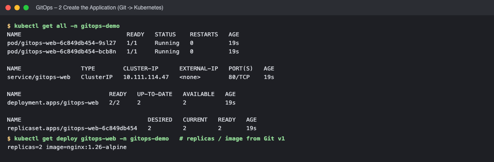

*Commands: `kubectl get all -n gitops-demo` · `kubectl get deploy gitops-web -n gitops-demo   # replicas / image from`*

### 3 Change the desired state in Git (replicas 3, nginx 1.27)

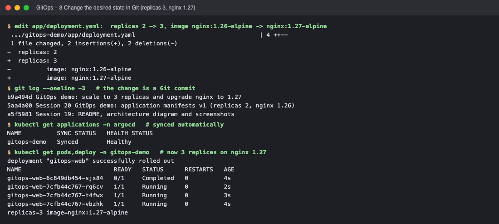

*Commands: `edit app/deployment.yaml:  replicas 2 -> 3, image nginx:1.26-alpine ->` · `git log --oneline -3   # the change is a Git commit` · `kubectl get applications -n argocd   # synced automatically` · `kubectl get pods,deploy -n gitops-demo   # now 3 replicas on nginx 1.2`*

### 4 Drift: a manual change in the cluster is reverted (self-heal)

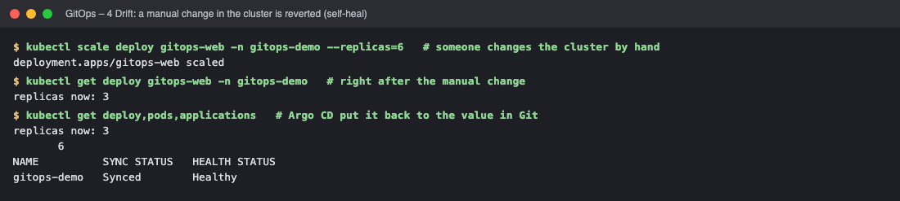

*Commands: `kubectl scale deploy gitops-web -n gitops-demo --replicas=6   # someon` · `kubectl get deploy gitops-web -n gitops-demo   # right after the manua` · `kubectl get deploy,pods,applications   # Argo CD put it back to the va`*

### 5 Rollback = git revert

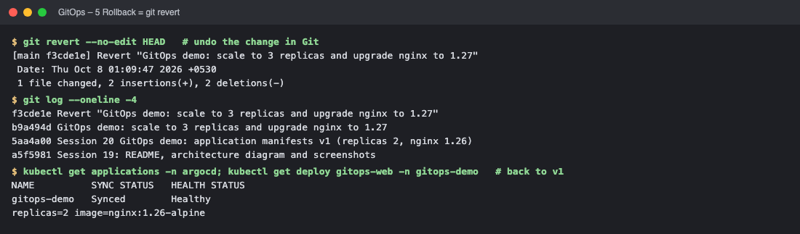

*Commands: `git revert --no-edit HEAD   # undo the change in Git` · `git log --oneline -4` · `kubectl get applications -n argocd`*

<!-- screenshots:end -->

