# Monitoring demo – Prometheus, Grafana, Loki, Alertmanager (Session 20 – Task 1)

A complete local monitoring stack (Docker Compose) watching a demo web application. It demonstrates the six topics of the task: **metrics, logs, alerts, CPU utilisation, memory utilisation, application health**.

```text
 demo-app (nginx) ──logs──► Promtail ──► Loki ───────────┐
        ▲                                                 ▼
 blackbox exporter (HTTP probe = app health) ─┐        Grafana  (dashboards + log panel)
 node-exporter  (CPU, memory of the host)  ───┼─► Prometheus ──► alert rules ──► Alertmanager
 cAdvisor       (container metrics)        ───┘       ▲
                                                      └── Grafana queries it with PromQL
```
| Component | Role | URL |
|---|---|---|
| **Prometheus** | scrapes and stores **metrics**, evaluates **alert rules** | http://localhost:9090 |
| **Alertmanager** | receives firing alerts, groups/routes them | http://localhost:9093 |
| **Grafana** | dashboards (metrics from Prometheus, logs from Loki) | http://localhost:3030 |
| **node-exporter** | host **CPU / memory / disk** metrics | – |
| **cAdvisor** | per-container resource metrics | – |
| **blackbox exporter** | probes the app over HTTP → `probe_success` = **application health** | – |
| **Loki + Promtail** | collects and stores **logs** of the containers | – |
| **demo-app** | the monitored nginx application | http://localhost:8090 |

Files: [`docker-compose.yml`](docker-compose.yml) · [`prometheus.yml`](prometheus.yml) · [`alert-rules.yml`](alert-rules.yml) · [`alertmanager.yml`](alertmanager.yml) · [`blackbox.yml`](blackbox.yml) · [`loki.yml`](loki.yml) · [`promtail.yml`](promtail.yml) · [`grafana/`](grafana/) (provisioned data sources and the dashboard JSON).

## Run it
```bash
cd monitoring-demo
docker compose up -d
# Grafana http://localhost:3030 (dashboard "Session 20 – Monitoring overview", no login in this local demo)
# Prometheus http://localhost:9090   Alertmanager http://localhost:9093
docker compose down            # stop
```

## What is monitored (the six topics)
| Topic | How it is collected | PromQL / query used |
|---|---|---|
| **Metrics** | Prometheus pulls `/metrics` from exporters every 5 s | any series, e.g. `up` |
| **Logs** | Promtail ships container logs to Loki; viewed in Grafana | `{container="s20-demo-app"}` (LogQL) |
| **Alerts** | Prometheus rules → Alertmanager | see `alert-rules.yml` |
| **CPU utilisation** | node-exporter | `100 - (avg(rate(node_cpu_seconds_total{mode="idle"}[30s])) * 100)` |
| **Memory utilisation** | node-exporter | `(1 - node_memory_MemAvailable_bytes / node_memory_MemTotal_bytes) * 100` |
| **Application health** | blackbox HTTP probe | `probe_success{job="app-health"}` (1 = healthy, 0 = down) |

### Alert rules
```yaml
groups:
  - name: session20-alerts
    rules:
      - alert: TargetDown
        expr: up == 0
        for: 10s
        labels: { severity: critical }
        annotations:
          summary: "Target {{ $labels.job }} ({{ $labels.instance }}) is down"

      - alert: AppUnhealthy
        expr: probe_success{job="app-health"} == 0
        for: 10s
        labels: { severity: critical }
        annotations:
          summary: "Application {{ $labels.instance }} failed its HTTP health check"

      - alert: HighCpuUsage
        expr: 100 - (avg(rate(node_cpu_seconds_total{mode="idle"}[30s])) * 100) > 60
        for: 10s
        labels: { severity: warning }
        annotations:
          summary: "CPU utilisation is above 60% ({{ $value | printf \"%.0f\" }}%)"

      - alert: HighMemoryUsage
        expr: (1 - node_memory_MemAvailable_bytes / node_memory_MemTotal_bytes) * 100 > 90
        for: 10s
        labels: { severity: warning }
        annotations:
          summary: "Memory utilisation is above 90%"
```

## Terminal evidence
### 1. Stack, targets, metrics and logs (healthy state)
```text
$ docker compose ps --format "table {{.Name}}\t{{.Status}}\t{{.Ports}}" | sed -E "s/, \[::\]:[0-9]+->[0-9]+\/tcp//"
NAME                STATUS                    PORTS
s20-alertmanager    Up 57 seconds             0.0.0.0:9093->9093/tcp
s20-blackbox        Up 57 seconds             9115/tcp
s20-cadvisor        Up 57 seconds (healthy)   8080/tcp
s20-demo-app        Up 57 seconds             0.0.0.0:8090->80/tcp
s20-grafana         Up 46 seconds             0.0.0.0:3030->3000/tcp
s20-loki            Up 57 seconds             3100/tcp
s20-node-exporter   Up 46 seconds             9100/tcp
s20-prometheus      Up 46 seconds             0.0.0.0:9090->9090/tcp
s20-promtail        Up 46 seconds             

$ curl -s localhost:9090/api/v1/targets | python3 -c "import sys,json; [print(f\"{t[\"labels\"][\"job\"]:<14} {t[\"health\"]:<5} {t[\"scrapeUrl\"][:62]}\") for t in json.load(sys.stdin)[\"data\"][\"activeTargets\"]]"
app-health     up    http://blackbox:9115/probe?module=http_2xx&target=http%3A%2F%2
cadvisor       up    http://cadvisor:8080/metrics
node-exporter  up    http://node-exporter:9100/metrics
prometheus     up    http://prometheus:9090/metrics

$ q "100 - (avg(rate(node_cpu_seconds_total{mode=\"idle\"}[30s])) * 100)"
 => 4.011

$ q "(1 - node_memory_MemAvailable_bytes / node_memory_MemTotal_bytes) * 100"
node-exporter:9100 => 37.15

$ q "probe_success{job=\"app-health\"}"
http://demo-app:80/ => 1.0

$ q "sum by (name) (container_memory_working_set_bytes{name=~\"s20-.+\"}) / 1024 / 1024"
(no data)

$ for i in $(seq 1 25); do curl -s -o /dev/null localhost:8090/page-$i; done; curl -s -o /dev/null localhost:8090/; echo "25 requests sent to the demo app"
25 requests sent to the demo app

$ docker logs --tail 4 s20-demo-app
192.168.65.1 - - [07/Oct/2026:19:22:23 +0000] "GET /page-24 HTTP/1.1" 404 153 "-" "curl/8.7.1" "-"
2026/10/07 19:22:23 [error] 32#32: *34 open() "/usr/share/nginx/html/page-25" failed (2: No such file or directory), client: 192.168.65.1, server: localhost, request: "GET /page-25 HTTP/1.1", host: "localhost:8090"
192.168.65.1 - - [07/Oct/2026:19:22:23 +0000] "GET /page-25 HTTP/1.1" 404 153 "-" "curl/8.7.1" "-"
192.168.65.1 - - [07/Oct/2026:19:22:23 +0000] "GET / HTTP/1.1" 200 615 "-" "curl/8.7.1" "-"

$ curl -s -G localhost:3030/api/datasources/proxy/uid/loki/loki/api/v1/query_range --data-urlencode "query={container=\"s20-demo-app\"}" --data-urlencode "limit=4" | python3 -c "import sys,json; [print(v[1][:110]) for s in json.load(sys.stdin)[\"data\"][\"result\"] for v in s[\"values\"]][:4]"
172.19.0.4 - - [07/Oct/2026:19:22:27 +0000] "GET / HTTP/1.1" 200 615 "-" "Blackbox Exporter/0.27.0" "-"
192.168.65.1 - - [07/Oct/2026:19:22:23 +0000] "GET / HTTP/1.1" 200 615 "-" "curl/8.7.1" "-"
192.168.65.1 - - [07/Oct/2026:19:22:23 +0000] "GET /page-25 HTTP/1.1" 404 153 "-" "curl/8.7.1" "-"
2026/10/07 19:22:23 [error] 32#32: *34 open() "/usr/share/nginx/html/page-25" failed (2: No such file or direc
```
> `docker compose ps` shows all containers up; the 4 Prometheus targets are `up`; CPU ≈ 4 %, memory ≈ 37 %, `probe_success = 1`. (The per-container-memory query returned no data because cAdvisor on Docker Desktop for Mac identifies containers only by id, not by name – the dashboard therefore shows container ids.) The Loki query returns the demo-app's nginx access log lines.

### 2. Incident: the application goes down → alert fires
```text
$ docker stop s20-demo-app   # simulate an application outage
s20-demo-app

$ curl -s localhost:9090/api/v1/alerts   # active alerts
AppUnhealthy   firing   Application http://demo-app:80/ failed its HTTP health check

$ probe_success{job="app-health"}
probe_success = 0
```
### 3. Recovery
```text
$ docker start s20-demo-app   # fix: restart the application
s20-demo-app

$ curl -s localhost:9090/api/v1/alerts   # alert resolved
(no active alerts)
```
### 4. Incident: high CPU → alert fires (CPU stress container with 16 busy loops)
```text
$ docker run -d --rm --name s20-stress alpine ...   # 16 busy loops = CPU load
7836f89b93710f7c70d2fba3b9a7476af60ae4cccbaa48c63f27f63cf03d6a18

$ PromQL: CPU utilisation %
CPU utilisation % = 100.0

$ curl -s localhost:9090/api/v1/alerts   # active alerts
HighCpuUsage   firing   CPU utilisation is above 60% (100%)

$ docker stop s20-stress   # stop the load
s20-stress

$ curl -s localhost:9090/api/v1/alerts   # CPU alert resolved
(no active alerts)
```

## Screenshots (live browser views)
**Grafana dashboard – everything healthy (health HEALTHY, CPU/memory graphs, live logs from Loki)**

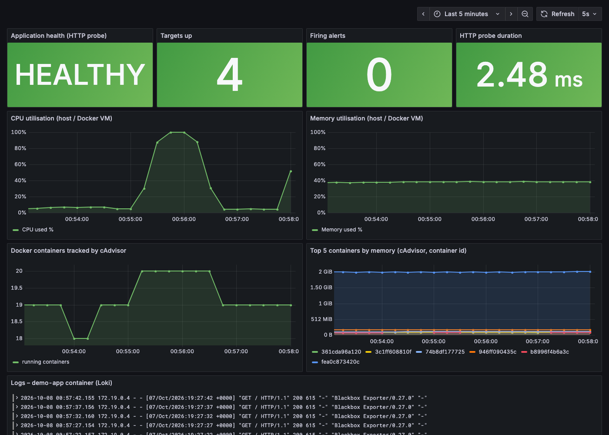

**Prometheus – all scrape targets UP**

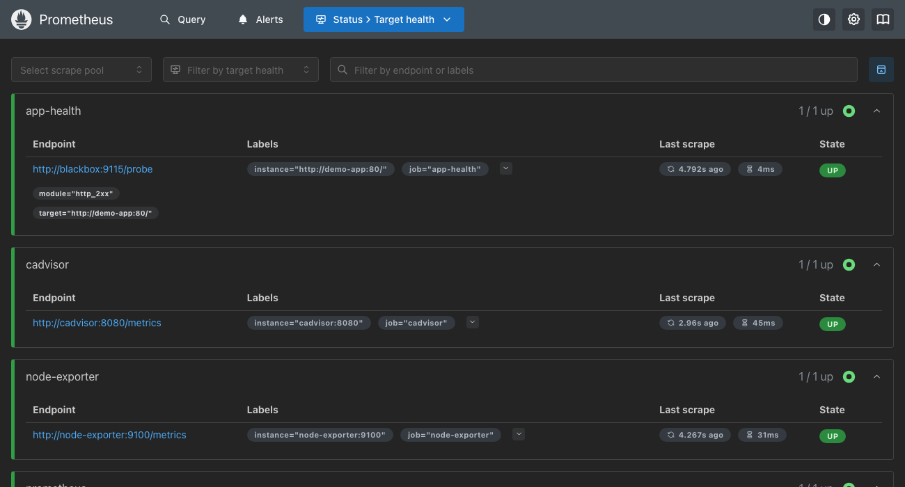

**Prometheus – CPU utilisation query (PromQL)**

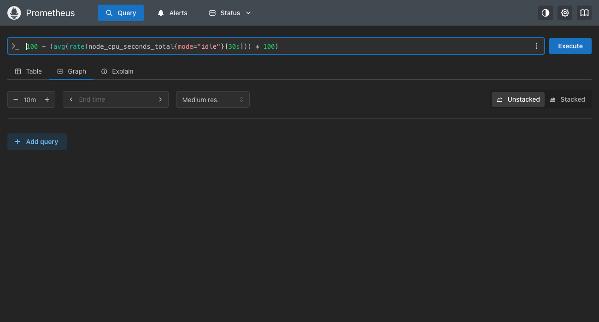

**Prometheus – alert rules (all inactive)**

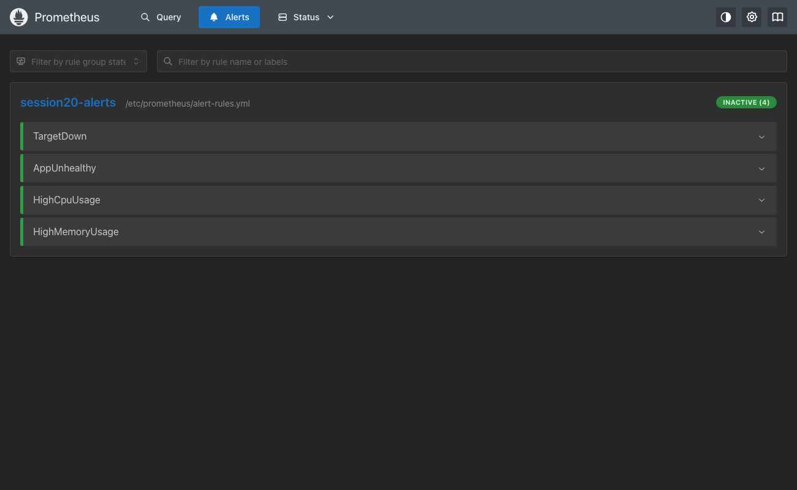

**Prometheus – AppUnhealthy is FIRING**

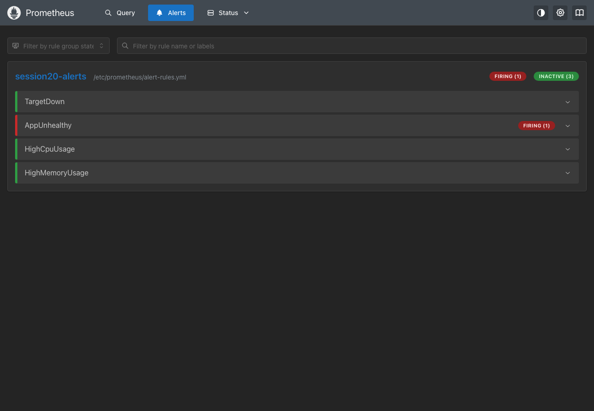

**Alertmanager – the alert received from Prometheus**

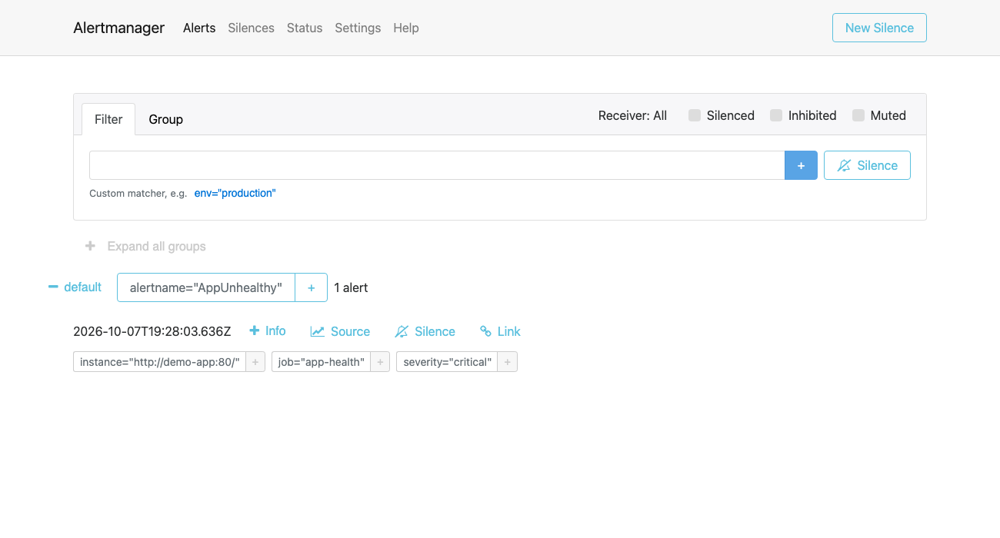

**Grafana dashboard during the outage – application health DOWN, firing alerts = 1**

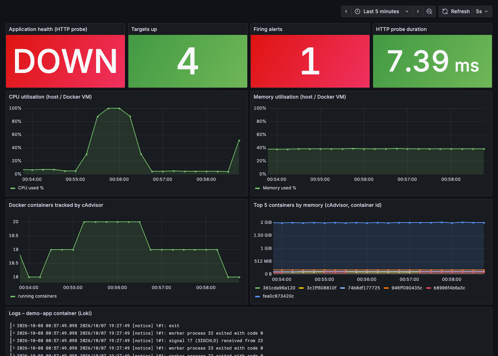

**Grafana dashboard after recovery – application HEALTHY again**

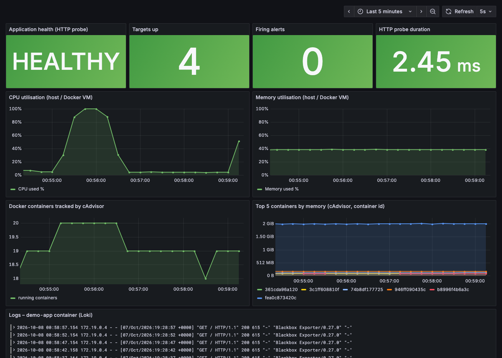

**Prometheus – HighCpuUsage FIRING while the CPU stress test runs**

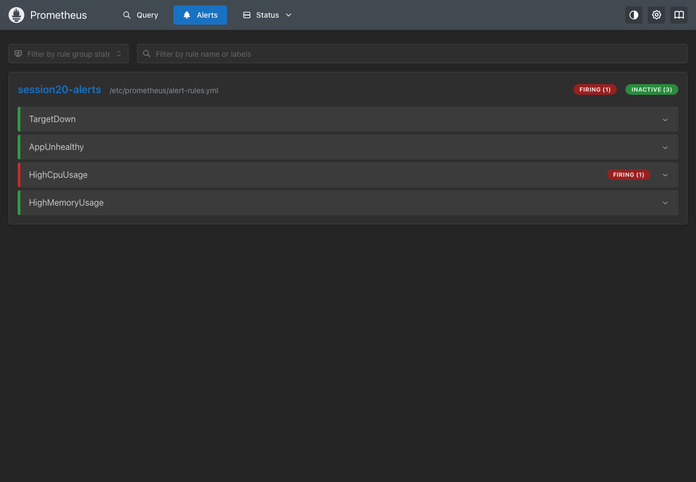

**Grafana dashboard – CPU utilisation spike**

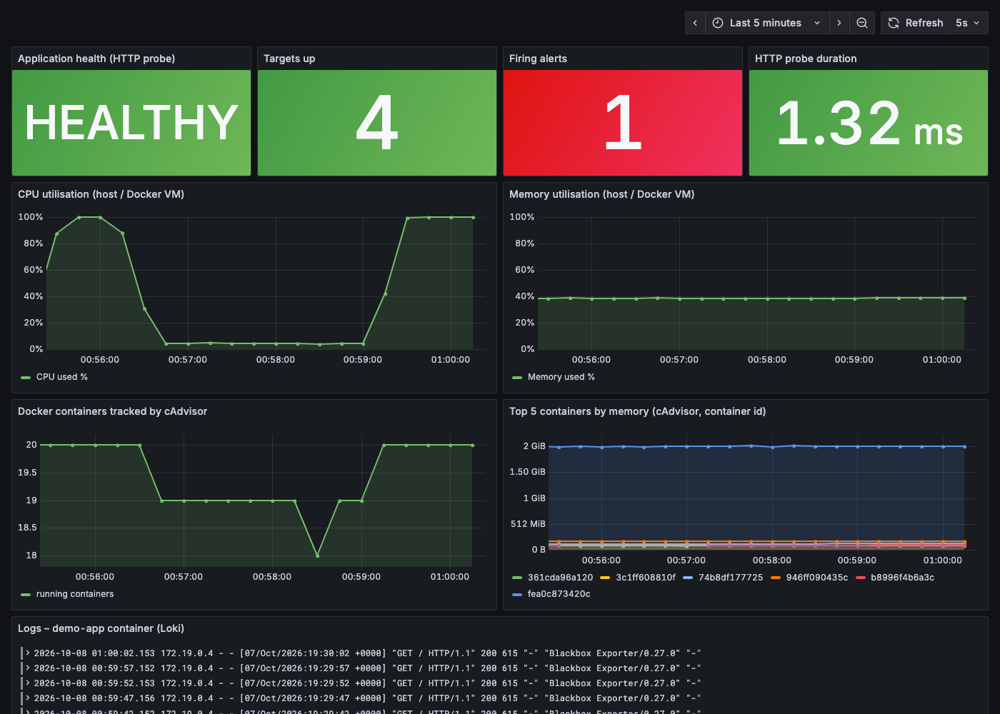


## What I observed
* Healthy: all targets UP, application health **HEALTHY**, 0 firing alerts.
* `docker stop s20-demo-app` → the HTTP probe fails (`probe_success = 0`) → after the rule's `for: 10s` the alert **AppUnhealthy goes FIRING** in Prometheus, appears in Alertmanager and the Grafana tile turns **DOWN / 1 firing alert**; the Loki log panel shows nginx's shutdown messages.
* `docker start s20-demo-app` → probe succeeds → alert resolves, dashboard returns to HEALTHY.
* CPU stress → CPU utilisation jumps to ~100 % in Grafana and **HighCpuUsage fires**; after stopping the stress container it resolves.
* Memory utilisation stayed ~37 % (no memory alert).

<!-- screenshots:start -->


## Screenshots (terminal output of the live run)

> Each image shows the real output of the commands run for this task (rendered from the captured terminal output of the actual run).

### 1 Stack is running

![docker compose ps --format "table {{.Name}}\t{{.Status}}\t{{.Ports}}" | sed -E "s/, \[::\]:[0-9]+->[0-9]+\/tcp](screenshots/1-stack-is-running-01.png)

*Commands: `docker compose ps --format "table {{.Name}}\t{{.Status}}\t{{.Ports}}" ` · `curl -s localhost:9090/api/v1/targets | python3 -c "import sys,json`*

### 2 Metrics (PromQL)

![q "100 - (avg(rate(node_cpu_seconds_total{mode=\"idle\"}[30s])) * 100)"](screenshots/2-metrics-promql-01.png)

*Commands: `q "100 - (avg(rate(node_cpu_seconds_total{mode=\"idle\"}[30s])) * 100)` · `q "(1 - node_memory_MemAvailable_bytes / node_memory_MemTotal_bytes) *` · `q "probe_success{job=\"app-health\"}"` · `q "sum by (name) (container_memory_working_set_bytes{name=~\"s20-.+\"}`*

### 3 Logs (Loki)

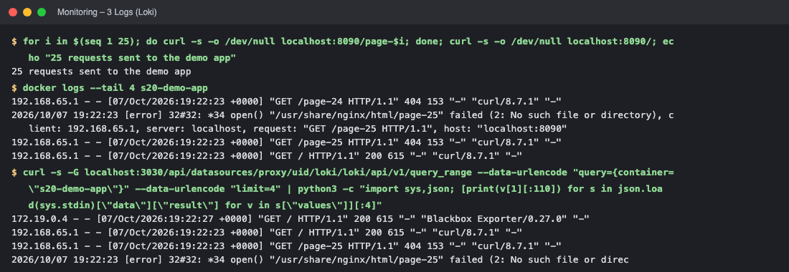

*Commands: `for i in $(seq 1 25)` · `docker logs --tail 4 s20-demo-app` · `curl -s -G localhost:3030/api/datasources/proxy/uid/loki/loki/api/v1/q`*

### 4 Alert: application down

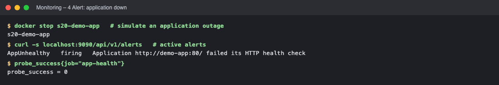

*Commands: `docker stop s20-demo-app   # simulate an application outage` · `curl -s localhost:9090/api/v1/alerts   # active alerts` · `probe_success{job="app-health"}`*

### 5 Recovery

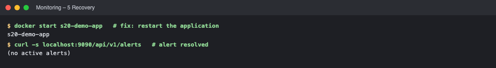

*Commands: `docker start s20-demo-app   # fix: restart the application` · `curl -s localhost:9090/api/v1/alerts   # alert resolved`*

### 6 Alert: high CPU

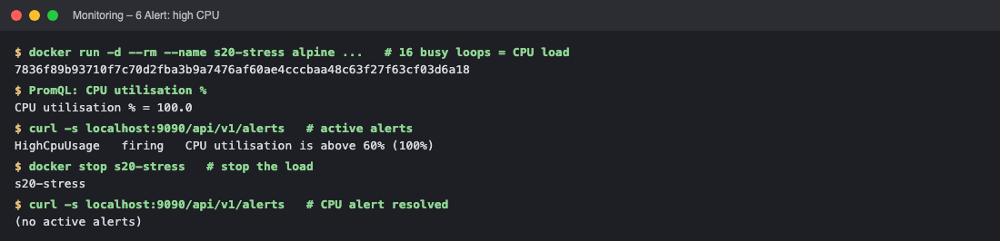

*Commands: `docker run -d --rm --name s20-stress alpine ...   # 16 busy loops = CP` · `PromQL: CPU utilisation %` · `curl -s localhost:9090/api/v1/alerts   # active alerts` · `docker stop s20-stress   # stop the load`*

<!-- screenshots:end -->

